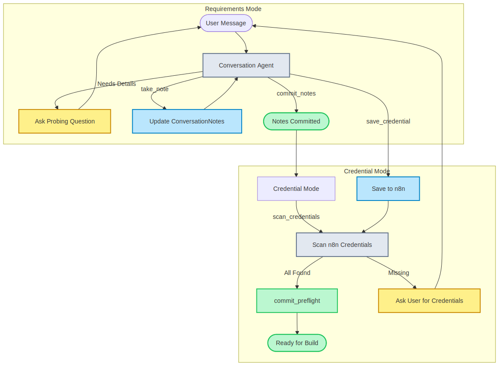
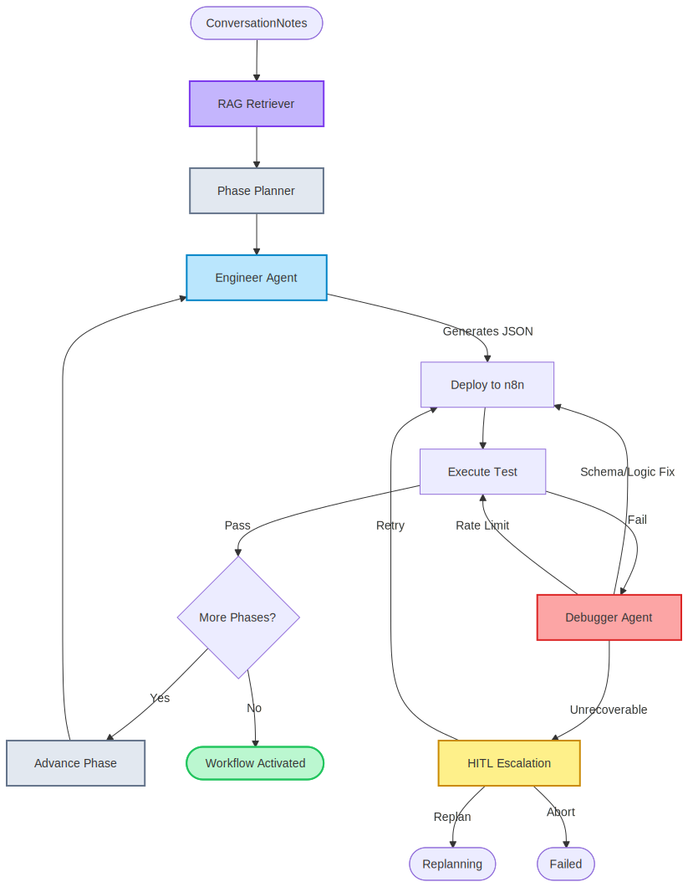
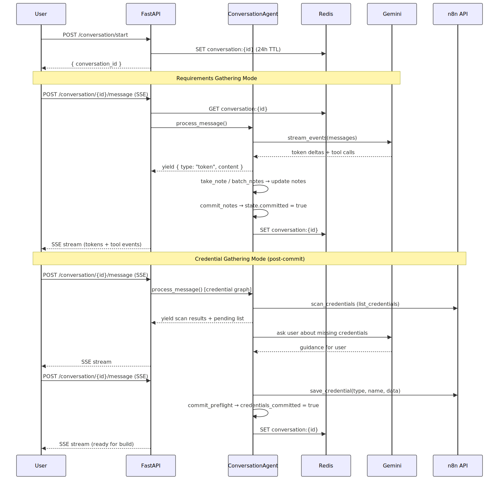
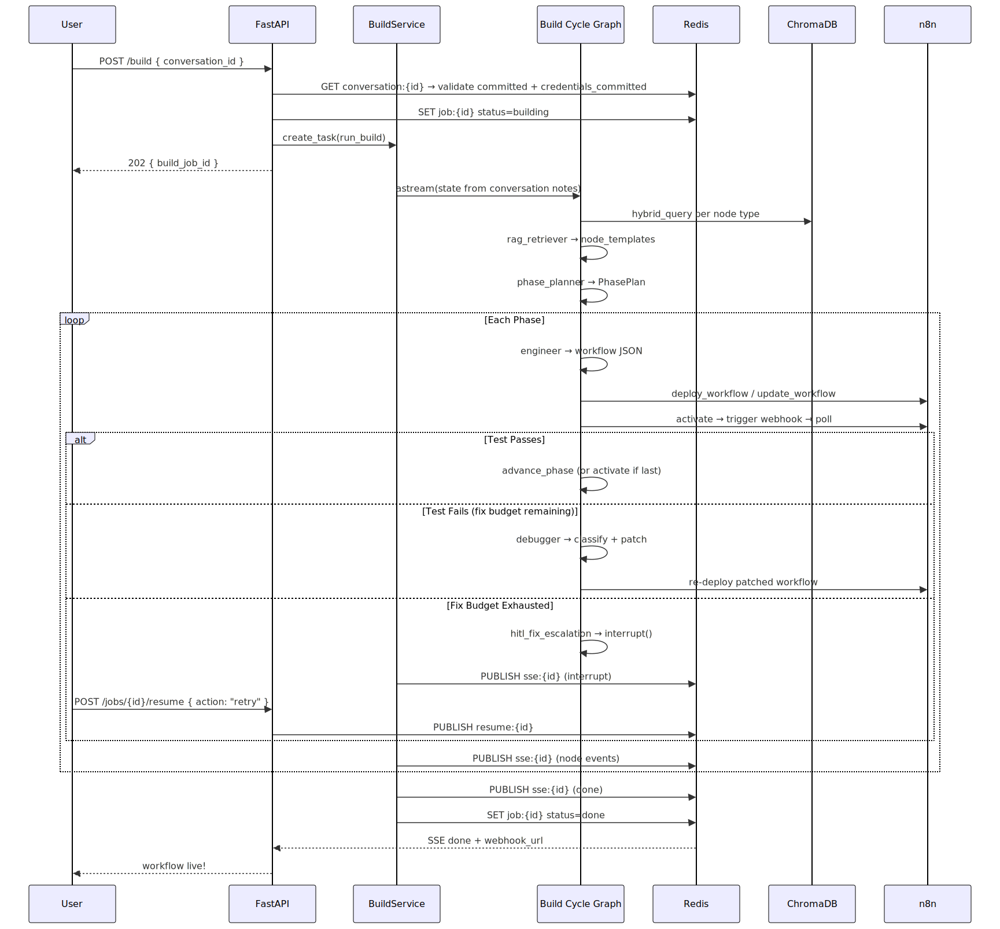
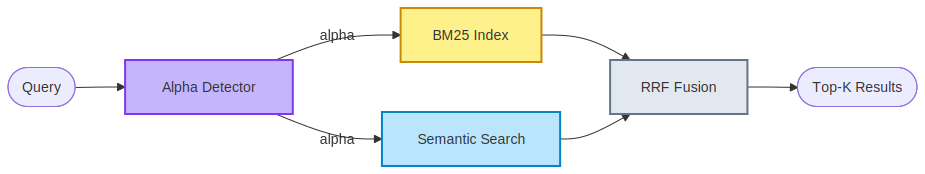

# ARIA — Agentic Real-time Intelligence Architect

> Natural language in → live n8n workflow out.

**Status:** Core pipeline verified · React frontend integration complete

---

## Table of Contents

- [The Problem \& ARIA's Solution](#the-problem--arias-solution)
- [Pipeline Architecture](#pipeline-architecture)
  - [Phase 0 — Conversation](#phase-0--conversation-requirements--credentials)
  - [Phase 1 — Build Cycle](#phase-1--build-cycle-execution--self-healing)
- [Tech Stack \& Services](#tech-stack--services)
- [Source Map — `src/` Module Guide](#source-map--src-module-guide)
  - [`agentic_system/`](#agentic_system--the-intelligence-engine)
  - [`api/`](#api--the-fastapi-layer)
  - [`services/`](#services--orchestration-layer)
  - [`boundary/`](#boundary--external-adapters)
  - [`core/` \& `jobs/`](#core--jobs--reserved-stubs)
  - [`streamlit_app/`](#streamlit_app--legacy-dev-console)
- [Data Flow Walkthrough](#data-flow-walkthrough)
  - [Conversation Flow](#conversation-flow)
  - [Build Cycle Flow](#build-cycle-flow)
- [State Schema — `ARIAState`](#state-schema--ariastate)
- [Redis Key Schema](#redis-key-schema)
- [API Endpoints](#api-endpoints)
- [Human-in-the-Loop (HITL)](#human-in-the-loop-hitl)
- [RAG \& Hybrid Search](#rag--hybrid-search)
- [Quick Start](#quick-start)

---

## The Problem & ARIA's Solution

Building automation workflows in n8n typically requires deep knowledge of node types, JSON schemas, credential mapping, and webhook configuration. When workflows fail during testing, it often requires manual digging into payload schemas and execution logs.

ARIA abstracts this complexity away by turning plain English into fully deployed, tested, and self-healing n8n workflows.

| The Friction        | ARIA's Automation                                                                                                            |
| ------------------- | ---------------------------------------------------------------------------------------------------------------------------- |
| **Discovery**       | Maps your natural language intent to the exact n8n node types required.                                                      |
| **Credentials**     | Scans live n8n state; asks for missing credentials conversationally and saves them in-chat.                                   |
| **Build Stability** | Phase-based sequential building prevents massive single-shot generation failures.                                            |
| **Self-Healing**    | On test failure, an AI Debugger automatically classifies the error, patches the node schema, and re-deploys (up to 3 times). |
| **Observability**   | Real-time SSE streaming to the frontend provides granular visibility into the AI's thought process.                          |

---

## Pipeline Architecture

ARIA's engine is split into two execution phases. Phase 0 is a standalone conversational agent that gathers requirements and resolves credentials in a single chat session. Phase 1 is a LangGraph build cycle that deploys, tests, and self-heals the workflow.

```
User ──► Phase 0: Conversation ──► Phase 1: Build Cycle ──► Live Workflow
         (requirements + creds)    (build + test + fix)
```

### Phase 0 — Conversation (Requirements + Credentials)

The Conversation phase is a free-form chat powered by a Gemini-backed agent. It operates in two sequential modes within a single chat session:

1. **Requirements Gathering** — Probes the user for workflow details (trigger type, integrations, data transformations, constraints) and structures them into `ConversationNotes`. When the agent has enough context, it calls `commit_notes` to finalize the summary.
2. **Credential Gathering** — After notes are committed, the agent automatically uses a 5-step credential resolver (aliases → hardcoded map → convention guess → LLM fallback → skip) to discover required credential types, then scans n8n for existing credentials via `scan_credentials`, identifies gaps, and guides the user through saving missing credentials in-chat via `save_credential`. Once all credentials are resolved, `commit_preflight` marks the conversation as build-ready.

The agent creates a **per-request agent graph** when in credential mode (post-commit). This avoids mutating the singleton agent and adds credential tools (`scan_credentials`, `get_credential_schema`, `save_credential`, `commit_preflight`) alongside the base conversation tools.

<!-- mermaid-source-file:.mermaid/README_1772311073_133.mmd-->



#### Credential Resolution Chain

Once `commit_notes` is called, the agent enters credential mode and immediately uses a **5-step dynamic resolver** to discover what credential types are needed for the integration(s) the user specified. This resolver translates natural language integration names (e.g., "Zendesk", "Gmail") to the exact n8n credential type names, with fallback strategies for unknown integrations.

<!-- mermaid-source-file:.mermaid/README_credential_resolver.mmd-->


| Step | Source | Latency | Example | File |
|------|--------|---------|---------|------|
| **1. Aliases** | `_INTEGRATION_ALIASES` dict (51 entries) | Instant | "google sheets" → `googleSheets` | `credential_resolver.py:26-51` |
| **2. Hardcoded Map** | `NODE_CREDENTIAL_MAP` (30 n8n nodes) | Instant | `telegram` → `["telegramApi"]` | `node_credential_map.py` |
| **3. Convention Guess** | Generate `{name}Api`, `{name}OAuth2Api` → validate against n8n `/credentials/schema/` | ~50ms per candidate | "zendesk" → `zendeskApi` (validated) | `credential_resolver.py:65-100` |
| **4. LLM Fallback** | `BaseAgent[CredentialMatch]` structured output (when steps 1-3 fail) | ~1-2s | Unknown integration → LLM matches to saved types | `credential_llm_fallback.py` |
| **5. Skip** | Warning logged, return empty list | Instant | Integration with no n8n equivalent | `credential_resolver.py:145-148` |

Results from steps 3 and 4 are cached in a runtime dictionary and merged back into `NODE_CREDENTIAL_MAP` for the server's lifetime. This avoids re-resolving the same integrations on subsequent conversations.

**Key files:**

| File                                                | Responsibility                                                                              |
| --------------------------------------------------- | ------------------------------------------------------------------------------------------- |
| `agentic_system/conversation/agent.py`              | `ConversationAgent` — streams LLM responses, manages tool calls, per-request credential graph |
| `agentic_system/conversation/state.py`              | `ConversationState` — messages, notes, committed flag; Redis persistence with 24h TTL        |
| `agentic_system/conversation/schemas.py`            | `ConversationNotes` — structured output: trigger, destination, transforms, constraints, credential fields |
| `agentic_system/conversation/tools.py`              | `take_note`, `batch_notes`, `commit_notes` + re-exports credential tools                     |
| `agentic_system/conversation/tools/credential_tools.py`   | `scan_credentials`, `get_credential_schema`, `save_credential`, `commit_preflight` |
| `agentic_system/conversation/schema_helpers.py`     | `is_secret_field`, `fields_from_schema`, `fetch_pending_details` — credential schema parsing |
| `agentic_system/conversation/prompts.py`            | System prompt with taxonomy of note keys, probing rules, and credential gathering section    |
| `agentic_system/conversation/notes_updater.py`      | State mutation helpers for all tools                                                         |
| `agentic_system/conversation/event_handlers.py`     | SSE event handling, tool_call_id tracking                                                    |
| `agentic_system/conversation/message_builders.py`   | LangChain message construction                                                               |
| `agentic_system/shared/credential_resolver.py`      | `resolve_credential_types` — 5-step resolution chain with runtime caching and LLM fallback  |
| `agentic_system/shared/credential_llm_fallback.py`  | `llm_resolve` — BaseAgent-powered fallback for unknown integrations                          |
| `agentic_system/shared/credential_utils.py`         | Helper utilities for credential validation and parsing                                      |
| `agentic_system/shared/node_credential_map.py`      | `NODE_CREDENTIAL_MAP` — hardcoded mapping of 30 n8n node types to credential types           |

### Phase 1 — Build Cycle (Execution & Self-Healing)

Once the conversation is fully committed (both `committed` and `credentials_committed` are true), the Build Cycle takes over. It reads the `ConversationNotes` from the `conversation:{id}` Redis key and builds the workflow **phase-by-phase** (e.g., Trigger → Data Processing → Output), testing and self-healing at each step.

<!-- mermaid-source-file:.mermaid/README_1772311073_134.mmd-->



**Graph nodes and their roles:**

| Node                  | Agent                       | What It Does                                                                                   |
| --------------------- | --------------------------- | ---------------------------------------------------------------------------------------------- |
| `rag_retriever`       | _(no LLM)_                  | Runs hybrid BM25+semantic queries on ChromaDB per node type → `node_templates`                 |
| `phase_planner`       | `BaseAgent[PhasePlan]`      | Decomposes the topology into ordered build phases with dependency tracking                     |
| `engineer`            | `BaseAgent[EngineerOutput]` | Generates n8n workflow JSON for the current phase; merges into existing workflow on phase > 0  |
| `deploy`              | _(no LLM)_                  | `POST` or `PUT` the workflow JSON to n8n via `N8nClient`                                       |
| `test`                | _(no LLM)_                  | Activates workflow → triggers webhook → polls execution (30s timeout)                          |
| `debugger`            | `BaseAgent[DebuggerOutput]` | Classifies error type + generates fix in a single LLM call; patches `workflow_json` if fixable |
| `activate`            | _(no LLM)_                  | Ensures workflow is active; constructs final `webhook_url`                                     |
| `hitl_fix_escalation` | _(no LLM)_                  | Calls `interrupt()` when fix budget (3 attempts) is exhausted; routes user decision            |

**Key files:**

| File                                                    | Responsibility                                                               |
| ------------------------------------------------------- | ---------------------------------------------------------------------------- |
| `agentic_system/build_cycle/graph.py`                   | `build_build_cycle_graph()` — full graph wiring with conditional edges       |
| `agentic_system/build_cycle/nodes/rag_retriever.py`     | Fetches up to 3 templates per node type + 1 broad intent query               |
| `agentic_system/build_cycle/nodes/phase_planner.py`     | Converts `PhasePlan` → `list[PhaseEntry]` with internal and entry edges      |
| `agentic_system/build_cycle/nodes/engineer.py`          | Phase-aware prompt; calls `to_n8n_payload()` and `merge_into_existing()`     |
| `agentic_system/build_cycle/nodes/_engineer_helpers.py` | Pure functions: `to_n8n_payload`, `build_connections`, `merge_into_existing` |
| `agentic_system/build_cycle/nodes/deploy.py`            | n8n API create/update (strips `id` field on PUT)                             |
| `agentic_system/build_cycle/nodes/test.py`              | Activate → trigger webhook → poll → extract error from `runData`             |
| `agentic_system/build_cycle/nodes/debugger.py`          | Unified classify+fix; applies fix via `_apply_fix()` on fixable errors       |
| `agentic_system/build_cycle/nodes/hitl_escalation.py`   | `interrupt()` with retry/replan/abort options                                |

---

## Tech Stack & Services

<!-- mermaid-source-file:.mermaid/README_1772311073_135.mmd-->


| Component        | Role                                                                                                   |
| ---------------- | ------------------------------------------------------------------------------------------------------ |
| **React / Vite** | Frontend with real-time graph visualization, event feeds, and inline HITL prompts.                     |
| **FastAPI**      | Async API layer — routes, DI, SSE broadcasting, CORS. Zero business logic.                             |
| **Redis**        | Job state storage (24h TTL) and Pub/Sub channels for SSE events and HITL resume signals.               |
| **LangGraph**    | Orchestrates the Build Cycle graph with checkpointed state and `interrupt()` support.                  |
| **Gemini**       | Powers the Conversation Agent (requirements + credentials), Engineer, Phase Planner, and Debugger.     |
| **ChromaDB**     | Vector store for hybrid search (BM25 + semantic RRF fusion) over 559+ n8n node docs.                   |
| **n8n**          | Target runtime — workflows are deployed, activated, webhook-triggered, and tested here.                |
| **W&B Weave**    | LLM call observability and tracing (auto-initialized by `BaseAgent`).                                  |

---

## Source Map — `src/` Module Guide

```
src/
├── agentic_system/           # All LangGraph agents and graphs
│   ├── conversation/         # Phase 0: requirements gathering + credential resolution
│   ├── build_cycle/          # Phase 1: RAG → plan → build → deploy → test → fix
│   └── shared/               # ARIAState, BaseAgent, errors, utilities
├── api/                      # FastAPI HTTP layer
│   ├── routers/              # Endpoint handlers per domain
│   ├── lifespan/             # Singleton lifecycle (Redis, Chroma, N8n, Pipeline, Conversation)
│   ├── main.py               # App factory, CORS, router mounting
│   ├── settings.py           # Pydantic Settings (.env)
│   └── schemas.py            # All request/response Pydantic models
├── services/                 # Use-case orchestration (bridges API → agents)
│   ├── pipeline/             # Build service + SSE helpers
│   └── rag/                  # Ingestion + retrieval services
├── boundary/                 # External I/O adapters (no business logic)
│   ├── n8n/                  # n8n REST client
│   ├── chroma/               # ChromaDB vector store + BM25 + hybrid search
│   └── scraper/              # n8n docs scraper + API spec parser
├── core/                     # Reserved — future business logic stubs
├── jobs/                     # Reserved — future job queue stubs

```

---

### `agentic_system/` — The Intelligence Engine

The core of ARIA. Contains all LLM-powered agents, graph definitions, and the shared state schema.

#### `shared/` — Cross-cutting concerns

| File                     | What It Provides                                                                                                                                                                         |
| ------------------------ | ---------------------------------------------------------------------------------------------------------------------------------------------------------------------------------------- |
| `state.py`               | `ARIAState` TypedDict — the master state object shared across all graph nodes. Also defines `WorkflowTopology`, `BuildBlueprint`, `ClassifiedError`, `ExecutionResult`, `PhaseEntry`.    |
| `base_agent.py`          | `BaseAgent[S]` — generic wrapper around `ChatGoogleGenerativeAI` (Gemini). Handles structured output extraction, streaming, retry with exponential backoff (3 attempts), and Weave init. |
| `errors.py`              | Exception hierarchy: `AgentError` → `ExtractionError`, `CredentialError`, `DeployError`, `ExecutionError`, `FixExhaustedError`, `ClassificationError`.                                   |
| `node_credential_map.py` | Static map of 30 n8n node types → credential type names. Used as step 2 of the credential resolver.                                                                                        |
| `weave_logger.py`        | Singleton W&B Weave initializer for LLM observability.                                                                                                                                   |

#### `conversation/` — Phase 0

A standalone agent (not a LangGraph graph) that handles both requirements gathering and credential resolution in a single chat session. Streams token-by-token over SSE. In requirements mode, uses `take_note` / `batch_notes` / `commit_notes` tools to structure requirements into `ConversationNotes`. After commit, switches to credential mode with a per-request agent graph that adds `scan_credentials`, `get_credential_schema`, `save_credential`, and `commit_preflight` tools. State persisted to Redis with 24h TTL and in-memory `OrderedDict` fallback.

#### `build_cycle/` — Phase 1

A LangGraph `StateGraph` with conditional routing for the fix loop. Eight nodes total: RAG retriever → phase planner → engineer → deploy → test → debugger → HITL escalation → activate. Max 3 fix attempts per phase.

#### `graph.py` — `ARIAPipeline`

The top-level entry point for the Build Cycle. Compiles the build cycle as an independent LangGraph graph with a `MemorySaver` checkpointer. Exposes `run_build_cycle()` and `resume_build_cycle()`.

---

### `api/` — The FastAPI Layer

Strictly an interface layer — validation, routing, DI, response formatting. Zero business logic.

#### `main.py`

Creates the `FastAPI` app. Lifespan initializes singletons in order: ChromaStore → Redis → N8nClient → ConversationAgent → ARIAPipeline. CORS allows `localhost:3000` and `3001`. Mounts 5 routers.

#### `settings.py`

`Settings(BaseSettings)` reads `.env`: `n8n_base_url`, `n8n_api_key`, `chroma_host/port`, `redis_url`, `google_api_key`, `gemini_model`, `embedding_model`.

#### `schemas.py`

All Pydantic models grouped by domain:

| Group            | Models                                                                                                                              |
| ---------------- | ----------------------------------------------------------------------------------------------------------------------------------- |
| **Ingestion**    | `IngestN8nResponse`, `IngestApiSpecRequest/Response`                                                                                |
| **Jobs**         | `JobState` (job_id, status, aria_state, error), `JobStatusResponse`, `ResumeRequest` (HITL: retry/replan/abort)                     |
| **SSE**          | `SSEEvent` (type: node/interrupt/done/error/ping, stage, node_name, message, payload, aria_state)                                   |
| **Conversation** | `StartConversationResponse`, `MessageRequest`, `ErrorDetail/Response`                                                               |
| **Build**        | `BuildRequest` (conversation_id), `BuildResponse` (build_job_id)                                                                    |
| **Credentials**  | `SaveCredentialRequest` (credential_type, name, data), `SaveCredentialResponse`                                                     |

#### `lifespan/` — Singleton Lifecycle

Each module follows the same pattern: `startup()` / `shutdown()` / `get_X(request)` FastAPI dependency.

| Module            | Singleton            | Description                                                        |
| ----------------- | -------------------- | ------------------------------------------------------------------ |
| `redis.py`        | `Redis` async client | Connection to `redis://localhost:6379`                             |
| `chroma.py`       | `ChromaStore`        | Manages Chroma connection lifecycle                                |
| `n8n.py`          | `N8nClient`          | Async HTTP client for n8n REST API                                 |
| `pipeline.py`     | `ARIAPipeline`       | Compiles the Build Cycle LangGraph graph with `MemorySaver`        |
| `conversation.py` | `ConversationAgent`  | The Phase 0 chat agent (requirements + credentials)                |

#### `routers/`

| Router            | Endpoints                                                                       | Purpose                                              |
| ----------------- | ------------------------------------------------------------------------------- | ---------------------------------------------------- |
| `conversation.py` | `POST /conversation/start`, `POST /conversation/{id}/message` (SSE)             | Phase 0 chat with token-by-token streaming           |
| `build.py`        | `POST /build` (202), `GET /build/{id}/stream` (SSE)                             | Kicks off Phase 1 build from a completed conversation |
| `jobs.py`         | `GET /jobs/{id}`, `POST /jobs/{id}/resume` (204)                                | Job status polling and HITL resume via Redis pub/sub |
| `credentials.py`  | `POST /credentials`                                                             | Direct credential saving to n8n (bypasses agent)     |
| `ingestion.py`    | `POST /ingest/n8n/nodes`, `POST /ingest/n8n/workflows`, `POST /ingest/api-spec` | Populates ChromaDB collections                       |

---

### `services/` — Orchestration Layer

Bridges API routers to the agentic system. Contains all background-task logic, SSE publishing, and interrupt handling.

| File                          | Responsibility                                                                                                              |
| ----------------------------- | --------------------------------------------------------------------------------------------------------------------------- |
| `pipeline/build.py`           | `validate_conversation_for_build()` + `run_build()` — reads from `conversation:{id}`, validates `committed` AND `credentials_committed`, runs build cycle with HITL interrupt loop |
| `pipeline/_sse_helpers.py`    | Shared utilities: `apply_build_chunk()`, `detect_interrupt()`, `publish()`, `write_job()`, `wait_resume()`, `coerce_state()` |
| `pipeline/_node_events.py`    | Node-level SSE event generation during build cycle                                                                          |
| `rag/ingestion.py`            | `ingest_n8n_nodes()`, `ingest_n8n_workflow_templates()`, `ingest_api_spec()` — scrapes and upserts docs into ChromaDB       |
| `rag/retrieval.py`            | Search functions: semantic and hybrid (BM25+RRF) for nodes, templates, and API endpoints                                     |

**Interrupt Loop Pattern** (used by build service):

```
while True:
    async for chunk in pipeline.astream(state, config):
        apply_chunk(chunk)            # merge into state, publish SSE
    if GraphInterrupt caught:
        detect_interrupt(state)       # classify: fix_exhausted escalation
        publish(interrupt SSE event)
        write_job(status="interrupted")
        resume_value = await wait_resume(redis, job_id)  # blocks on pub/sub
        state = Command(resume=resume_value)
        continue
    break  # clean exit
```

---

### `boundary/` — External Adapters

Pure I/O layer. No business logic — just protocol translation.

#### `n8n/client.py` — `N8nClient`

Async HTTP client wrapping the n8n REST API via `httpx.AsyncClient`.

| Method Category | Methods                                                                                                                               |
| --------------- | ------------------------------------------------------------------------------------------------------------------------------------- |
| **Workflows**   | `deploy_workflow`, `activate_workflow`, `deactivate_workflow`, `update_workflow`, `delete_workflow`, `get_workflow`, `list_workflows` |
| **Executions**  | `trigger_webhook(path, payload, test_mode)`, `poll_execution(workflow_id, timeout=30s)`                                               |
| **Credentials** | `list_credentials`, `get_credential_schema(type)`, `list_credential_types`, `save_credential(type, name, data)`                       |

**n8n API gotchas handled internally:**

- Webhook nodes MUST have a `webhookId` (UUID) — auto-generated by the engineer helpers
- All nodes MUST have an `id` (UUID) — auto-generated
- `PUT /workflows/{id}` rejects body containing an `id` field — stripped by deploy node
- Workflow must be activated before webhooks can receive requests

#### `chroma/store.py` — `ChromaStore`

Two LangChain Chroma collections (`n8n_documents`, `api_specs`) with Google Generative AI embeddings.

| Method                                                  | Description                                                                 |
| ------------------------------------------------------- | --------------------------------------------------------------------------- |
| `upsert_n8n_documents(docs)`                            | Deduplicates by ID, adds to `n8n_documents` collection                      |
| `query_n8n_documents(query, n, doc_type)`               | Pure semantic similarity search with relevance scores                       |
| `hybrid_query_n8n_documents(query, n, doc_type, alpha)` | BM25 + semantic → RRF fusion (default alpha auto-detected)                  |
| Same pattern for `api_specs`                            | `upsert_api_endpoints`, `query_api_endpoints`, `hybrid_query_api_endpoints` |

**Hybrid search internals** (in `chroma/_internals/`):

| File            | What It Does                                                                                                                                                              |
| --------------- | ------------------------------------------------------------------------------------------------------------------------------------------------------------------------- |
| `bm25.py`       | `BM25Index` — wraps `BM25Retriever` with custom tokenizer preserving compound tokens like `n8n-nodes-base.slack`                                                          |
| `hybrid.py`     | `_detect_alpha(query)` — dynamic alpha: full node IDs → 1.0 (pure semantic), technical terms → 0.3, natural language → 0.7. `rrf_fuse()` — Reciprocal Rank Fusion scoring |
| `serializer.py` | `n8n_doc_to_langchain()`, `api_endpoint_to_langchain()` — domain models → LangChain `Document`                                                                            |

#### `scraper/`

| File                       | What It Does                                                                                                                                                                                              |
| -------------------------- | --------------------------------------------------------------------------------------------------------------------------------------------------------------------------------------------------------- |
| `n8n_scraper.py`           | `scrape_all_nodes()` — discovers URLs from `docs.n8n.io`, fetches with concurrency limit (5). `scrape_workflow_templates(limit)` — pages `api.n8n.io` with concurrency limit (20). BeautifulSoup parsing. |
| `api_parser.py`            | `parse_api_spec(spec, source_name)` — auto-detects OpenAPI 3.x, Swagger 2.x, or Postman v2.x → produces `ApiEndpoint` dataclass                                                                           |
| `_internals/normalizer.py` | `N8nDocument` dataclass + `normalize_node()` / `normalize_workflow_template()` — builds searchable text representations                                                                                   |

---

### `core/` & `jobs/` — Reserved Stubs

| Module  | Contents                                          | Purpose                                                         |
| ------- | ------------------------------------------------- | --------------------------------------------------------------- |
| `core/` | `intent_parser.py`, `subflow_composer.py` (stubs) | Reserved for future extracted business logic                    |
| `jobs/` | `models.py`, `queue.py`, `worker.py` (stubs)      | Reserved for a future job queue replacing `asyncio.create_task` |

---

## Data Flow Walkthrough

### Conversation Flow

<!-- mermaid-source-file:.mermaid/README_1772311073_136.mmd-->



### Build Cycle Flow

<!-- mermaid-source-file:.mermaid/README_1772311073_137.mmd-->



---

## State Schema — `ARIAState`

The `ARIAState` TypedDict (defined in `agentic_system/shared/state.py`) is the single source of truth shared across all build cycle graph nodes. Conversation state is stored separately in `ConversationState` (Redis).

**ConversationState fields** (stored in `conversation:{uuid}`):

| Field                      | Type             | Set By                          |
| -------------------------- | ---------------- | ------------------------------- |
| `messages`                 | `list[dict]`     | Each conversation turn          |
| `committed`                | `bool`           | `commit_notes` tool             |
| `notes.summary`            | `str`            | `commit_notes` tool             |
| `notes.trigger`            | `str`            | `take_note` / `batch_notes`     |
| `notes.destination`        | `str`            | `take_note` / `batch_notes`     |
| `notes.required_integrations` | `list[str]`   | `take_note` / `batch_notes`     |
| `notes.constraints`        | `list[str]`      | `take_note` / `batch_notes`     |
| `notes.required_nodes`     | `list[str]`      | `scan_credentials`              |
| `notes.resolved_credential_ids` | `dict[str, str]` | `scan_credentials` / `save_credential` |
| `notes.pending_credential_types` | `list[str]` | `scan_credentials`              |
| `notes.credentials_committed` | `bool`        | `commit_preflight`              |

**ARIAState fields** (used by Build Cycle graph):

| Group            | Field                      | Type                             | Set By                           |
| ---------------- | -------------------------- | -------------------------------- | -------------------------------- |
| **Messages**     | `messages`                 | `list[AnyMessage]` (add-reducer) | All nodes that interact with LLM |
| **Blueprint**    | `intent`                   | `str`                            | Build service (from notes)       |
| **Build Cycle**  | `node_templates`           | `list[dict]`                     | RAG Retriever                    |
|                  | `workflow_json`            | `dict`                           | Engineer / Debugger              |
|                  | `n8n_workflow_id`          | `str`                            | Deploy                           |
|                  | `n8n_execution_id`         | `str`                            | Test                             |
|                  | `execution_result`         | `ExecutionResult`                | Test                             |
|                  | `classified_error`         | `ClassifiedError`                | Debugger                         |
|                  | `fix_attempts`             | `int`                            | Debugger                         |
|                  | `webhook_url`              | `str`                            | Activate                         |
|                  | `status`                   | `str`                            | Various                          |
|                  | `build_phase`              | `int`                            | Phase Planner / Advance          |
|                  | `total_phases`             | `int`                            | Phase Planner                    |
|                  | `phase_node_map`           | `list[PhaseEntry]`               | Phase Planner                    |
| **HITL**         | `paused_for_input`         | `bool`                           | Interrupt nodes                  |

---

## Redis Key Schema

| Key Pattern           | Value                                                                                           | TTL      | Used By                                 |
| --------------------- | ----------------------------------------------------------------------------------------------- | -------- | --------------------------------------- |
| `job:{uuid}`          | `JobState` JSON (job_id, status, aria_state, error)                                             | 24 hours | Build service, job router               |
| `conversation:{uuid}` | `ConversationState` JSON (messages, notes with credential fields, committed, credentials_committed) | 24 hours | Conversation agent, build service       |
| `sse:{uuid}`          | Pub/Sub channel                                                                                 | Ephemeral | Services publish, SSE routers subscribe |
| `resume:{uuid}`       | Pub/Sub channel                                                                                 | Ephemeral | Job router publishes, services subscribe |

---

## API Endpoints

| Method | Path                         | Status | Description                                                      |
| ------ | ---------------------------- | ------ | ---------------------------------------------------------------- |
| `POST` | `/conversation/start`        | 200    | Initialize a new conversation session                            |
| `POST` | `/conversation/{id}/message` | SSE    | Send a message, receive streamed response (requirements + creds) |
| `POST` | `/build`                     | 202    | Start build cycle from a completed conversation                  |
| `GET`  | `/build/{id}/stream`         | SSE    | Stream build cycle events in real-time                           |
| `GET`  | `/jobs/{id}`                 | 200    | Poll job status and current state                                |
| `POST` | `/jobs/{id}/resume`          | 204    | Resume an interrupted job with user input                        |
| `POST` | `/credentials`               | 200    | Save a credential directly to n8n (bypasses agent)               |
| `POST` | `/ingest/n8n/nodes`          | 200    | Scrape and ingest all n8n node documentation                     |
| `POST` | `/ingest/n8n/workflows`      | 200    | Scrape and ingest n8n workflow templates                         |
| `POST` | `/ingest/api-spec`           | 200    | Parse and ingest an OpenAPI/Swagger/Postman spec                 |

---

## Human-in-the-Loop (HITL)

ARIA uses two HITL mechanisms:

1. **Conversational HITL** (Phase 0) — The Conversation Agent asks the user for missing credentials directly in chat. No `interrupt()` or resume endpoint needed; the user simply replies with the required information and the agent calls `save_credential`.
2. **Graph HITL** (Phase 1 Build Cycle) — LangGraph's `interrupt()` primitive pauses execution when the fix budget is exhausted. All graph HITL interactions flow through `POST /jobs/{id}/resume`.

| Interrupt Type    | Triggered By                       | Resume Action | Payload                          |
| ----------------- | ---------------------------------- | ------------- | -------------------------------- |
| `fix_exhausted`   | Debugger exceeded 3 fix attempts   | `retry`       | _(empty — resets fix budget)_   |
| `fix_exhausted`   | User wants to start over           | `replan`      | _(clears build state)_          |
| `fix_exhausted`   | User wants to stop                 | `abort`       | _(marks job as failed)_         |

---

## RAG & Hybrid Search

ARIA's RAG pipeline combines BM25 keyword search with semantic similarity for robust retrieval over n8n documentation.

<!-- mermaid-source-file:.mermaid/README_1772311073_138.mmd-->



**Alpha detection** dynamically weights the two retrieval methods:

- Full n8n node IDs (e.g., `n8n-nodes-base.slack`) → `alpha = 1.0` (pure semantic)
- Technical terms with dots/hyphens → `alpha = 0.3` (BM25-heavy)
- Natural language queries → `alpha = 0.7` (semantic-heavy)

**Collections:**

- `n8n_documents` — scraped node docs + workflow templates (559+ documents)
- `api_specs` — parsed OpenAPI/Swagger/Postman endpoints

---

## Quick Start

### 1. Start Infrastructure

Start the required background services (n8n, ChromaDB, Redis) via Docker:

```bash
docker compose up -d
```

### 2. Configure Environment

Create a `.env` file in the root directory:

```env
GOOGLE_API_KEY=your_gemini_api_key
N8N_BASE_URL=http://localhost:5678
N8N_API_KEY=your_n8n_api_key
CHROMA_HOST=localhost
CHROMA_PORT=8001
REDIS_URL=redis://localhost:6379
```

### 3. Run the Backend API

Use `uv` (or standard pip) to sync dependencies and run the FastAPI server:

```bash
uv sync
uv run uvicorn src.api.main:app --reload --port 8000
```

### 4. Run the Frontend

In a new terminal, start the Vite development server:

```bash
cd frontend
npm install
npm run dev
```

Visit `http://localhost:3000` to interact with ARIA.

### 5. Seed the RAG Database (First Run)

Populate ChromaDB with n8n documentation:

```bash
# From a Python shell or via the API
curl -X POST http://localhost:8000/ingest/n8n/nodes
curl -X POST http://localhost:8000/ingest/n8n/workflows
```
