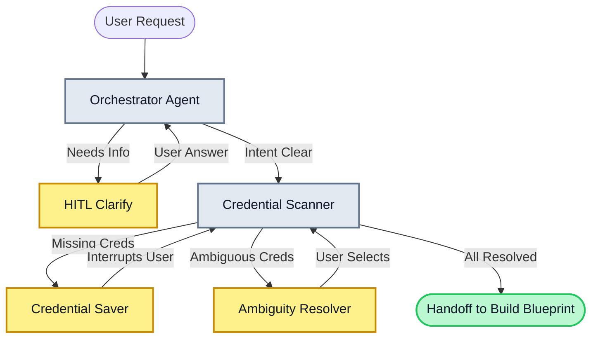
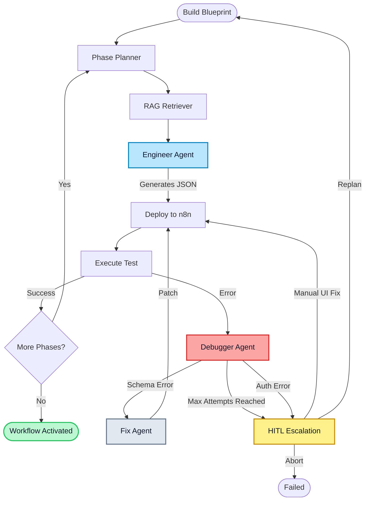
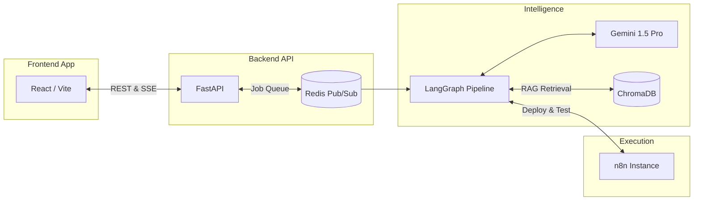

# ARIA — Agentic Real-time Intelligence Architect

> Natural language in → live n8n workflow out.

**Status:** Core pipeline verified · React frontend integration complete

---

## The Problem & ARIA's Solution

Building automation workflows in n8n typically requires deep knowledge of node types, JSON schemas, credential mapping, and webhook configuration. When workflows fail during testing, it often requires manual digging into payload schemas and execution logs.

ARIA abstracts this complexity away by turning plain English into fully deployed, tested, and self-healing n8n workflows.

| The Friction | ARIA's Automation |
|--------------|-------------------|
| **Discovery** | Maps your natural language intent to the exact n8n node types required. |
| **Credentials** | Scans live n8n state; only interrupts to ask for missing credentials (OAuth2, API keys). |
| **Build Stability** | Phase-based sequential building prevents massive single-shot generation failures. |
| **Self-Healing** | On test failure, an AI Debugger automatically classifies the error, patches the node schema, and re-deploys (up to 3 times). |
| **Observability** | Real-time SSE streaming to the frontend provides granular visibility into the AI's thought process. |

---

## Pipeline Architecture

ARIA's engine is built on LangGraph and is split into two distinct execution phases to prevent context bloat and ensure reliable Human-in-the-Loop (HITL) interruptions.

### 1. Preflight Phase (Planning & Auth)

The Preflight phase orchestrates the initial conversation, ensuring ARIA completely understands the user's intent and that all required integration credentials exist in n8n before writing any code.



### 2. Build Cycle Phase (Execution & Self-Healing)

Once the blueprint is finalized, the Build Cycle takes over. It builds the workflow phase-by-phase (e.g., Trigger → Data Processing → Output), testing and self-healing at each step.



---

## Tech Stack & Services

ARIA utilizes a decoupled service architecture, separating the conversational UI from the intelligence engine.



| Component | Role |
|-----------|------|
| **React / Vite** | Modern frontend offering real-time graph visualization, event feeds, and inline HITL prompts. |
| **FastAPI** | High-performance async API layer managing jobs and SSE broadcasting. |
| **Redis** | In-memory datastore for job states and Pub/Sub event streaming between the engine and API. |
| **LangGraph** | Orchestrates the multi-agent pipeline and manages the complex state transitions. |
| **Gemini** | Powers the core reasoning (Orchestrator, Engineer, Debugger). |
| **ChromaDB** | Vector database for RAG, performing hybrid search over n8n node documentation. |
| **n8n** | The target runtime where workflows are actually deployed, tested, and activated. |

---

## Quick Start

### 1. Start Infrastructure
Start the required background services (n8n, ChromaDB, Redis) via Docker:
```bash
docker compose up -d
```

### 2. Configure Environment
Create a `.env` file in the root directory:
```env
GOOGLE_API_KEY=your_gemini_api_key
N8N_BASE_URL=http://localhost:5678
N8N_API_KEY=your_n8n_api_key
CHROMA_HOST=localhost
CHROMA_PORT=8001
REDIS_URL=redis://localhost:6379
```

### 3. Run the Backend API
Use `uv` (or standard pip) to sync dependencies and run the FastAPI server:
```bash
uv sync
uv run uvicorn src.api.main:app --reload --port 8000
```

### 4. Run the Frontend
In a new terminal, start the Vite development server:
```bash
cd frontend
npm install
npm run dev
```

Visit `http://localhost:3000` to interact with ARIA.
