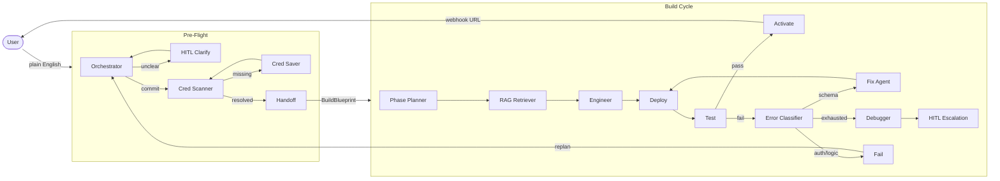
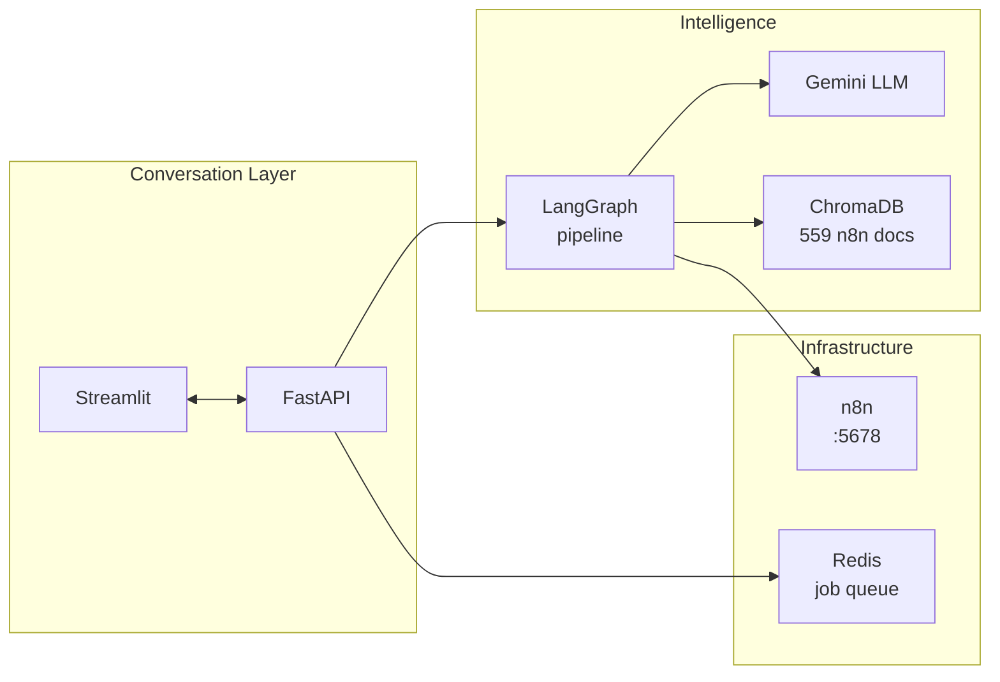

# ARIA — Agentic Real-time Intelligence Architect

> Natural language in → live n8n workflow out.

**Status:** Core pipeline verified · Conversation layer + integration reliability in progress

---

## Problem → Solution

| Problem | Solution |
|---------|----------|
| Building n8n workflows requires knowing node types, JSON schemas, credential IDs, and webhook setup | ARIA takes plain English and handles all of it |
| Workflows break on first deploy — wrong fields, missing auth, bad connections | Fix loop: classify error → patch node → re-deploy (up to 3 rounds) |
| Credentials must be wired manually for every integration | Credential scanner diffs against live n8n; interrupts to collect only what's missing |
| Complex workflows fail all-at-once with no clear failure point | Phase-based build: one node at a time, test after each phase |
| No feedback during the build | Conversational UI streams progress and surfaces interrupts inline |

---

## Pipeline



---

## Services



| Service | Role |
|---------|------|
| LangGraph | Pipeline orchestration — all agent nodes |
| Gemini | Orchestrator, Engineer, Error Classifier, Fix Agent, Debugger |
| ChromaDB | RAG store — hybrid BM25 + semantic search over n8n node docs |
| n8n | Workflow runtime — deploy, activate, webhook, execution polling |
| FastAPI | API surface — pipeline trigger, job management, doc ingestion |
| Redis | Async job queue for background pipeline runs |
| Streamlit | Conversational UI — chat, progress streaming, interrupt handling |

---

## Current Focus

```
[1] BUG-6 ── FIXED. ARIAPipeline sequential runner replaces nested subgraph.
              Each stage compiled independently with MemorySaver.

[2] Integrations ── phase-based build: wired (phase_planner → advance_phase loop)
                    HITL escalation: wired (debugger → hitl_fix_escalation → route)
                    credential ambiguity: FIXED — interrupt() when >1 saved cred of same type

[3] Conversation ── interrupt-resume: wired (clarify, credential, escalation, ambiguity)
                    build progress streaming: FIXED — stream_build_cycle per-node events
                    post-build re-plan: FIXED — replanning status re-runs preflight

Remaining:
  · Rate limit backoff (exponential delay — low priority)
  · Execution timeout config (hardcoded 30s — low priority)
  · Formal pytest suite (test scripts exist, no pytest wrappers)
  · LangFuse tracing / structured logging
```

---

## Quick Start

```bash
uv sync
docker compose up -d        # n8n + ChromaDB
cp .env.example .env        # fill in keys
python scripts/demo_agentic_system.py
```

```env
GOOGLE_API_KEY=
N8N_BASE_URL=http://localhost:5678
N8N_API_KEY=
CHROMA_HOST=localhost
CHROMA_PORT=8001
REDIS_URL=redis://localhost:6379
```

---

## Structure

```
src/
├── agentic_system/     LangGraph pipeline (preflight + build_cycle + shared)
├── api/                FastAPI (workflows, jobs, ingestion)
├── boundary/           n8n client, ChromaDB store
├── streamlit_app/      Conversational UI
└── jobs/               Async job runner
docs/
├── architecture.md     Component diagrams · state shape · bug log
└── main.md             Product spec
```
