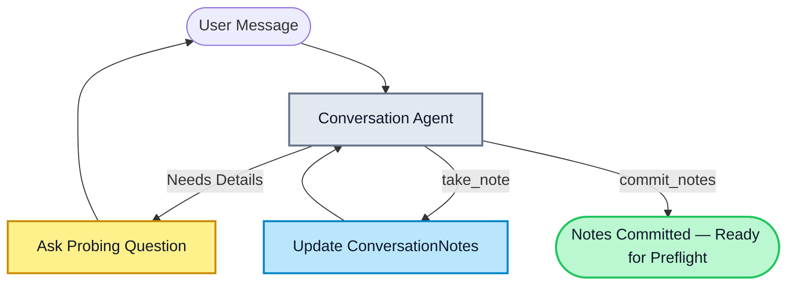
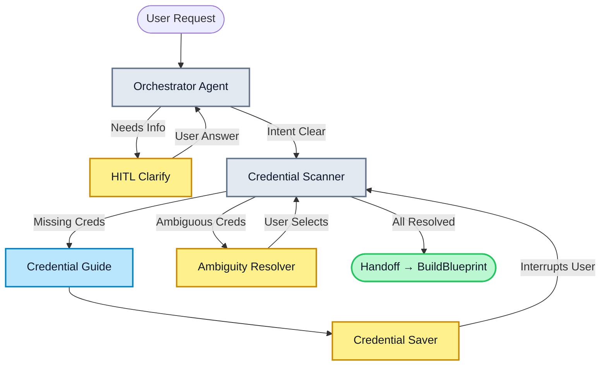
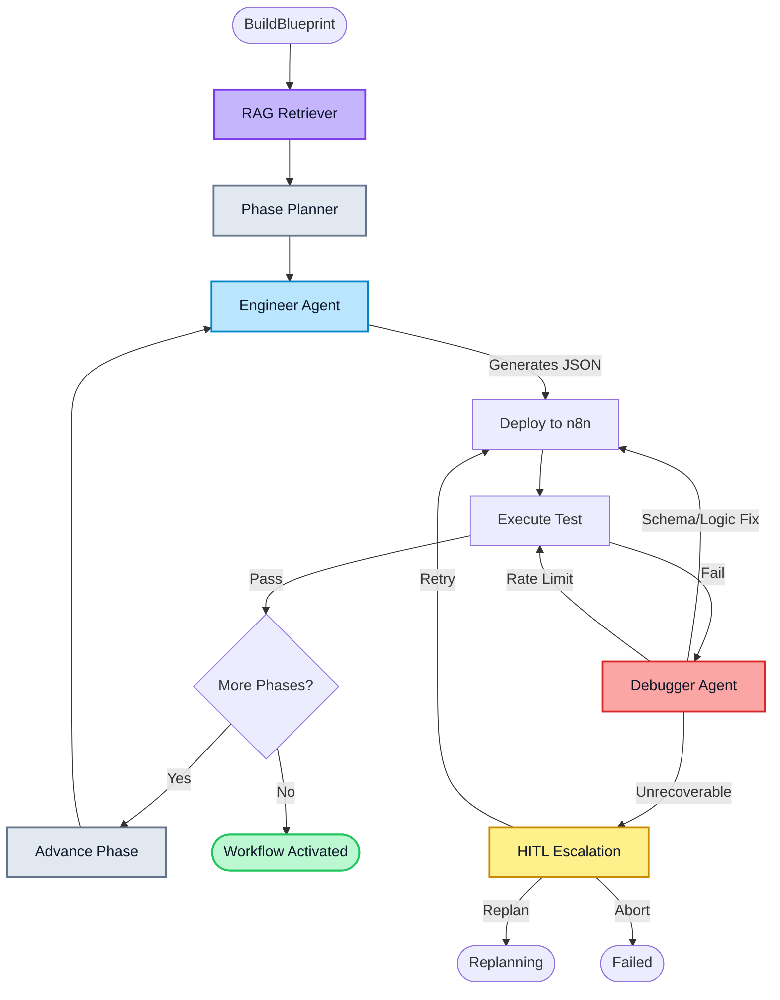
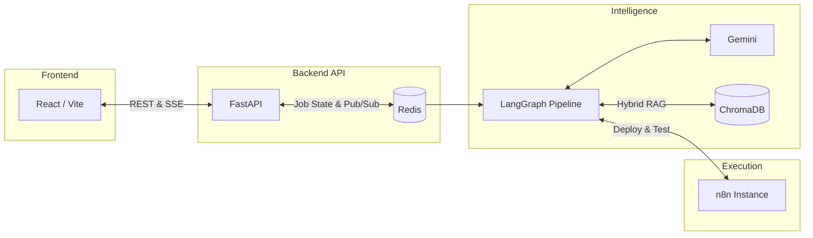
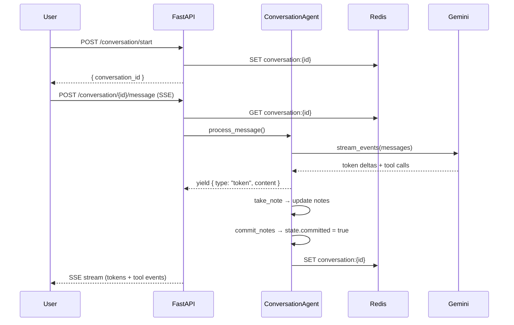
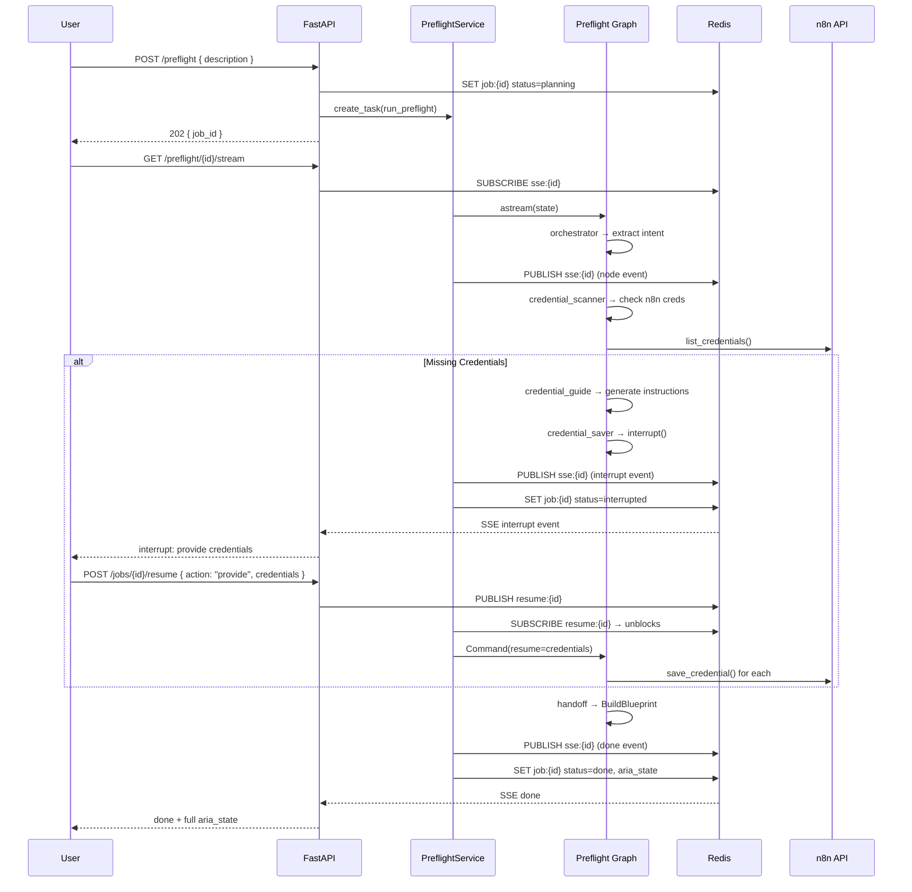
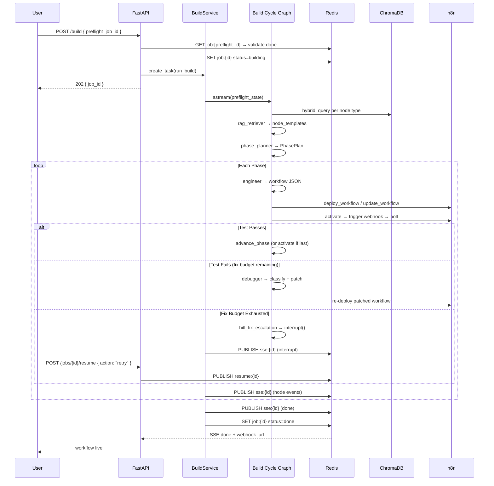
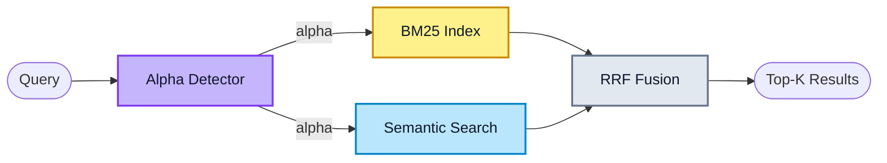

# ARIA — Agentic Real-time Intelligence Architect

> Natural language in → live n8n workflow out.

**Status:** Core pipeline verified · React frontend integration complete

---

## Table of Contents

- [The Problem \& ARIA's Solution](#the-problem--arias-solution)
- [Pipeline Architecture](#pipeline-architecture)
  - [Phase 0 — Conversation](#phase-0--conversation-requirements-gathering)
  - [Phase 1 — Preflight](#phase-1--preflight-planning--auth)
  - [Phase 2 — Build Cycle](#phase-2--build-cycle-execution--self-healing)
- [Tech Stack \& Services](#tech-stack--services)
- [Source Map — `src/` Module Guide](#source-map--src-module-guide)
  - [`agentic_system/`](#agentic_system--the-intelligence-engine)
  - [`api/`](#api--the-fastapi-layer)
  - [`services/`](#services--orchestration-layer)
  - [`boundary/`](#boundary--external-adapters)
  - [`core/` \& `jobs/`](#core--jobs--reserved-stubs)
  - [`streamlit_app/`](#streamlit_app--legacy-dev-console)
- [Data Flow Walkthrough](#data-flow-walkthrough)
  - [Conversation Flow](#conversation-flow)
  - [Preflight Flow](#preflight-flow)
  - [Build Cycle Flow](#build-cycle-flow)
- [State Schema — `ARIAState`](#state-schema--ariastate)
- [Redis Key Schema](#redis-key-schema)
- [API Endpoints](#api-endpoints)
- [Human-in-the-Loop (HITL)](#human-in-the-loop-hitl)
- [RAG \& Hybrid Search](#rag--hybrid-search)
- [Quick Start](#quick-start)

---

## The Problem & ARIA's Solution

Building automation workflows in n8n typically requires deep knowledge of node types, JSON schemas, credential mapping, and webhook configuration. When workflows fail during testing, it often requires manual digging into payload schemas and execution logs.

ARIA abstracts this complexity away by turning plain English into fully deployed, tested, and self-healing n8n workflows.

| The Friction        | ARIA's Automation                                                                                                            |
| ------------------- | ---------------------------------------------------------------------------------------------------------------------------- |
| **Discovery**       | Maps your natural language intent to the exact n8n node types required.                                                      |
| **Credentials**     | Scans live n8n state; only interrupts to ask for missing credentials (OAuth2, API keys).                                     |
| **Build Stability** | Phase-based sequential building prevents massive single-shot generation failures.                                            |
| **Self-Healing**    | On test failure, an AI Debugger automatically classifies the error, patches the node schema, and re-deploys (up to 3 times). |
| **Observability**   | Real-time SSE streaming to the frontend provides granular visibility into the AI's thought process.                          |

---

## Pipeline Architecture

ARIA's engine is built on **LangGraph** and is split into three distinct execution phases to prevent context bloat and ensure reliable Human-in-the-Loop (HITL) interruptions. Each phase is a separate compiled graph with its own checkpointer.

```
User ──► Phase 0: Conversation ──► Phase 1: Preflight ──► Phase 2: Build Cycle ──► Live Workflow
            (requirements)          (plan + creds)         (build + test + fix)
```

### Phase 0 — Conversation (Requirements Gathering)

The Conversation phase is a free-form chat powered by a Gemini-backed agent. It probes the user for workflow details — trigger type, integrations, data transformations, constraints — and structures them into `ConversationNotes`. When the agent has enough context, it calls `commit_notes` to finalize the summary.



**Key files:**

| File                                     | Responsibility                                                                         |
| ---------------------------------------- | -------------------------------------------------------------------------------------- |
| `agentic_system/conversation/agent.py`   | `ConversationAgent` — streams LLM responses, manages tool calls, saves state to Redis  |
| `agentic_system/conversation/state.py`   | `ConversationState` — messages list, notes, committed flag; Redis persistence          |
| `agentic_system/conversation/schemas.py` | `ConversationNotes` — structured output: trigger, destination, transforms, constraints |
| `agentic_system/conversation/tools.py`   | `take_note(key, value)`, `commit_notes(summary)` — LangChain tools                     |
| `agentic_system/conversation/prompts.py` | System prompt with taxonomy of note keys and probing rules                             |

### Phase 1 — Preflight (Planning & Auth)

The Preflight phase orchestrates intent extraction and credential resolution. It ensures ARIA completely understands what to build and that all required n8n credentials exist before writing any workflow JSON.



**Graph nodes and their roles:**

| Node                 | Agent                              | What It Does                                                                                                  |
| -------------------- | ---------------------------------- | ------------------------------------------------------------------------------------------------------------- |
| `orchestrator`       | `BaseAgent[OrchestratorOutput]`    | Parses `ConversationNotes` → extracts `intent_summary`, `required_nodes`, `topology`, `user_description`      |
| `credential_scanner` | `BaseAgent[ScannerOutput]`         | Compares required node types against live n8n credentials → produces `resolved`, `pending`, `ambiguous` lists |
| `credential_guide`   | `BaseAgent[CredentialGuideOutput]` | For each pending credential type, researches the schema and generates human-readable setup instructions       |
| `credential_saver`   | _(no LLM)_                         | Calls `interrupt()` to pause for user input → saves credentials to n8n via `N8nClient.save_credential()`      |
| `handoff`            | _(pure function)_                  | Assembles `BuildBlueprint` from the finalized state → sets `status="building"`                                |

**Key files:**

| File                                                   | Responsibility                                                                       |
| ------------------------------------------------------ | ------------------------------------------------------------------------------------ |
| `agentic_system/preflight/graph.py`                    | `build_preflight_graph()` — wires nodes into a LangGraph `StateGraph`                |
| `agentic_system/preflight/nodes/orchestrator.py`       | Intent extraction with `search_n8n_nodes` and `lookup_node_credential_types` tools   |
| `agentic_system/preflight/nodes/credential_scanner.py` | Credential diffing with `list_saved_credentials`, `check_credentials_resolved` tools |
| `agentic_system/preflight/nodes/credential_guide.py`   | Guide generation with `get_credential_schema`, `search_n8n_nodes` tools              |
| `agentic_system/preflight/nodes/credential_saver.py`   | HITL interrupt → `N8nClient.save_credential()` for each provided credential          |
| `agentic_system/preflight/tools/n8n_tools.py`          | Four `@tool` functions wrapping `N8nClient` and the static credential map            |
| `agentic_system/preflight/tools/rag_tools.py`          | `search_n8n_nodes(query)` — hybrid retrieval from ChromaDB                           |

### Phase 2 — Build Cycle (Execution & Self-Healing)

Once the blueprint is finalized, the Build Cycle takes over. It builds the workflow **phase-by-phase** (e.g., Trigger → Data Processing → Output), testing and self-healing at each step.



**Graph nodes and their roles:**

| Node                  | Agent                       | What It Does                                                                                   |
| --------------------- | --------------------------- | ---------------------------------------------------------------------------------------------- |
| `rag_retriever`       | _(no LLM)_                  | Runs hybrid BM25+semantic queries on ChromaDB per node type → `node_templates`                 |
| `phase_planner`       | `BaseAgent[PhasePlan]`      | Decomposes the topology into ordered build phases with dependency tracking                     |
| `engineer`            | `BaseAgent[EngineerOutput]` | Generates n8n workflow JSON for the current phase; merges into existing workflow on phase > 0  |
| `deploy`              | _(no LLM)_                  | `POST` or `PUT` the workflow JSON to n8n via `N8nClient`                                       |
| `test`                | _(no LLM)_                  | Activates workflow → triggers webhook → polls execution (30s timeout)                          |
| `debugger`            | `BaseAgent[DebuggerOutput]` | Classifies error type + generates fix in a single LLM call; patches `workflow_json` if fixable |
| `activate`            | _(no LLM)_                  | Ensures workflow is active; constructs final `webhook_url`                                     |
| `hitl_fix_escalation` | _(no LLM)_                  | Calls `interrupt()` when fix budget (3 attempts) is exhausted; routes user decision            |

**Key files:**

| File                                                    | Responsibility                                                               |
| ------------------------------------------------------- | ---------------------------------------------------------------------------- |
| `agentic_system/build_cycle/graph.py`                   | `build_build_cycle_graph()` — full graph wiring with conditional edges       |
| `agentic_system/build_cycle/nodes/rag_retriever.py`     | Fetches up to 3 templates per node type + 1 broad intent query               |
| `agentic_system/build_cycle/nodes/phase_planner.py`     | Converts `PhasePlan` → `list[PhaseEntry]` with internal and entry edges      |
| `agentic_system/build_cycle/nodes/engineer.py`          | Phase-aware prompt; calls `to_n8n_payload()` and `merge_into_existing()`     |
| `agentic_system/build_cycle/nodes/_engineer_helpers.py` | Pure functions: `to_n8n_payload`, `build_connections`, `merge_into_existing` |
| `agentic_system/build_cycle/nodes/deploy.py`            | n8n API create/update (strips `id` field on PUT)                             |
| `agentic_system/build_cycle/nodes/test.py`              | Activate → trigger webhook → poll → extract error from `runData`             |
| `agentic_system/build_cycle/nodes/debugger.py`          | Unified classify+fix; applies fix via `_apply_fix()` on fixable errors       |
| `agentic_system/build_cycle/nodes/hitl_escalation.py`   | `interrupt()` with retry/replan/abort options                                |

---

## Tech Stack & Services



| Component        | Role                                                                                                 |
| ---------------- | ---------------------------------------------------------------------------------------------------- |
| **React / Vite** | Frontend with real-time graph visualization, event feeds, and inline HITL prompts.                   |
| **FastAPI**      | Async API layer — routes, DI, SSE broadcasting, CORS. Zero business logic.                           |
| **Redis**        | Job state storage (24h TTL) and Pub/Sub channels for SSE events and HITL resume signals.             |
| **LangGraph**    | Orchestrates multi-agent graphs with checkpointed state and `interrupt()` support.                   |
| **Gemini**       | Powers Orchestrator, Engineer, Phase Planner, Debugger, Credential Scanner, and Conversation agents. |
| **ChromaDB**     | Vector store for hybrid search (BM25 + semantic RRF fusion) over 559+ n8n node docs.                 |
| **n8n**          | Target runtime — workflows are deployed, activated, webhook-triggered, and tested here.              |
| **W&B Weave**    | LLM call observability and tracing (auto-initialized by `BaseAgent`).                                |

---

## Source Map — `src/` Module Guide

```
src/
├── agentic_system/           # All LangGraph agents and graphs
│   ├── conversation/         # Phase 0: requirements gathering
│   ├── preflight/            # Phase 1: intent + credential resolution
│   ├── build_cycle/          # Phase 2: RAG → plan → build → deploy → test → fix
│   └── shared/               # ARIAState, BaseAgent, errors, utilities
├── api/                      # FastAPI HTTP layer
│   ├── routers/              # Endpoint handlers per domain
│   ├── lifespan/             # Singleton lifecycle (Redis, Chroma, Pipeline, Conversation)
│   ├── main.py               # App factory, CORS, router mounting
│   ├── settings.py           # Pydantic Settings (.env)
│   └── schemas.py            # All request/response Pydantic models
├── services/                 # Use-case orchestration (bridges API → agents)
├── boundary/                 # External I/O adapters (no business logic)
│   ├── n8n/                  # n8n REST client
│   ├── chroma/               # ChromaDB vector store + BM25 + hybrid search
│   └── scraper/              # n8n docs scraper + API spec parser
├── core/                     # Reserved — future business logic stubs
├── jobs/                     # Reserved — future job queue stubs
└── streamlit_app/            # Legacy dev console (Streamlit)
```

---

### `agentic_system/` — The Intelligence Engine

The core of ARIA. Contains all LLM-powered agents, graph definitions, and the shared state schema.

#### `shared/` — Cross-cutting concerns

| File                     | What It Provides                                                                                                                                                                         |
| ------------------------ | ---------------------------------------------------------------------------------------------------------------------------------------------------------------------------------------- |
| `state.py`               | `ARIAState` TypedDict — the master state object shared across all graph nodes. Also defines `WorkflowTopology`, `BuildBlueprint`, `ClassifiedError`, `ExecutionResult`, `PhaseEntry`.    |
| `base_agent.py`          | `BaseAgent[S]` — generic wrapper around `ChatGoogleGenerativeAI` (Gemini). Handles structured output extraction, streaming, retry with exponential backoff (3 attempts), and Weave init. |
| `errors.py`              | Exception hierarchy: `AgentError` → `ExtractionError`, `CredentialError`, `DeployError`, `ExecutionError`, `FixExhaustedError`, `ClassificationError`.                                   |
| `node_credential_map.py` | Static map of 30 n8n node types → credential type names. Used by preflight tools.                                                                                                        |
| `weave_logger.py`        | Singleton W&B Weave initializer for LLM observability.                                                                                                                                   |

#### `conversation/` — Phase 0

A standalone agent (not a LangGraph graph). Streams token-by-token over SSE. Uses `take_note` / `commit_notes` tools to structure requirements into `ConversationNotes`. State persisted to Redis with in-memory fallback.

#### `preflight/` — Phase 1

A LangGraph `StateGraph` compiled with `MemorySaver` checkpointer. Four agent nodes + one pure-function handoff. Uses `interrupt()` for HITL credential collection and ambiguity resolution.

#### `build_cycle/` — Phase 2

A LangGraph `StateGraph` with conditional routing for the fix loop. Eight nodes total: RAG retriever → phase planner → engineer → deploy → test → debugger → HITL escalation → activate. Max 3 fix attempts per phase.

#### `graph.py` — `ARIAPipeline`

The top-level entry point. Compiles preflight and build cycle as **independent graphs** (not nested — this was a deliberate architectural decision to avoid BUG-6 where a combined master graph caused checkpointer hangs). Exposes `run_preflight()`, `run_build_cycle()`, `resume_preflight()`, `resume_build_cycle()`.

---

### `api/` — The FastAPI Layer

Strictly an interface layer — validation, routing, DI, response formatting. Zero business logic.

#### `main.py`

Creates the `FastAPI` app. Lifespan initializes singletons in order: ChromaStore → Redis → ConversationAgent → ARIAPipeline. CORS allows `localhost:3000` and `3001`. Mounts 5 routers.

#### `settings.py`

`Settings(BaseSettings)` reads `.env`: `n8n_base_url`, `n8n_api_key`, `chroma_host/port`, `redis_url`, `google_api_key`, `gemini_model`, `embedding_model`.

#### `schemas.py`

All Pydantic models grouped by domain:

| Group            | Models                                                                                                                                         |
| ---------------- | ---------------------------------------------------------------------------------------------------------------------------------------------- |
| **Ingestion**    | `IngestN8nResponse`, `IngestApiSpecRequest/Response`                                                                                           |
| **Jobs**         | `JobState` (job_id, status, aria_state, error), `JobStatusResponse`, `ResumeRequest` (unified HITL: clarify/provide/select/retry/replan/abort) |
| **SSE**          | `SSEEvent` (type: node/interrupt/done/error/ping, stage, node_name, message, payload, aria_state)                                              |
| **Conversation** | `StartConversationResponse`, `MessageRequest`, `ErrorDetail/Response`                                                                          |
| **Phases**       | `PreflightRequest/Response`, `BuildRequest/Response`                                                                                           |

#### `lifespan/` — Singleton Lifecycle

Each module follows the same pattern: `startup()` / `shutdown()` / `get_X(request)` FastAPI dependency.

| Module            | Singleton            | Description                                                        |
| ----------------- | -------------------- | ------------------------------------------------------------------ |
| `redis.py`        | `Redis` async client | Connection to `redis://localhost:6379`                             |
| `chroma.py`       | `ChromaStore`        | Manages Chroma connection lifecycle                                |
| `pipeline.py`     | `ARIAPipeline`       | Compiles both LangGraph subgraphs with `MemorySaver` checkpointers |
| `conversation.py` | `ConversationAgent`  | The Phase 0 chat agent                                             |

#### `routers/`

| Router            | Endpoints                                                                       | Purpose                                              |
| ----------------- | ------------------------------------------------------------------------------- | ---------------------------------------------------- |
| `preflight.py`    | `POST /preflight` (202), `GET /preflight/{id}/stream` (SSE)                     | Kicks off Phase 1 as background task; streams events |
| `build.py`        | `POST /build` (202), `GET /build/{id}/stream` (SSE)                             | Kicks off Phase 2 from a completed preflight job     |
| `jobs.py`         | `GET /jobs/{id}`, `POST /jobs/{id}/resume` (204)                                | Job status polling and HITL resume via Redis pub/sub |
| `conversation.py` | `POST /conversation/start`, `POST /conversation/{id}/message` (SSE)             | Phase 0 chat with token-by-token streaming           |
| `ingestion.py`    | `POST /ingest/n8n/nodes`, `POST /ingest/n8n/workflows`, `POST /ingest/api-spec` | Populates ChromaDB collections                       |

---

### `services/` — Orchestration Layer

Bridges API routers to the agentic system. Contains all background-task logic, SSE publishing, and interrupt handling.

| File                   | Responsibility                                                                                                                      |
| ---------------------- | ----------------------------------------------------------------------------------------------------------------------------------- |
| `preflight_service.py` | `run_preflight()` — background task that streams preflight graph, handles `GraphInterrupt`, publishes SSE events, manages job state |
| `build_service.py`     | `load_preflight_state()` + `run_build()` — validates preflight completion, runs build cycle with same interrupt loop                |
| `ingestion_service.py` | `ingest_n8n_nodes()`, `ingest_n8n_workflow_templates()`, `ingest_api_spec()` — scrapes and upserts docs into ChromaDB               |
| `retrieval_service.py` | Six search functions: semantic and hybrid (BM25+RRF) for nodes, templates, and API endpoints                                        |
| `pipeline_service.py`  | Legacy monolithic runner (sequential preflight→build in one function). Kept for backward compatibility.                             |
| `_sse_helpers.py`      | Shared utilities: `build_initial_state()`, `detect_interrupt()`, `publish()`, `write_job()`, `wait_resume()`, `apply_chunk()`       |

**Interrupt Loop Pattern** (used by both preflight and build services):

```
while True:
    async for chunk in pipeline.astream(state, config):
        apply_chunk(chunk)            # merge into state, publish SSE
    if GraphInterrupt caught:
        detect_interrupt(state)       # classify: credential / clarify / ambiguity / escalation
        publish(interrupt SSE event)
        write_job(status="interrupted")
        resume_value = await wait_resume(redis, job_id)  # blocks on pub/sub
        state = Command(resume=resume_value)
        continue
    break  # clean exit
```

---

### `boundary/` — External Adapters

Pure I/O layer. No business logic — just protocol translation.

#### `n8n/client.py` — `N8nClient`

Async HTTP client wrapping the n8n REST API via `httpx.AsyncClient`.

| Method Category | Methods                                                                                                                               |
| --------------- | ------------------------------------------------------------------------------------------------------------------------------------- |
| **Workflows**   | `deploy_workflow`, `activate_workflow`, `deactivate_workflow`, `update_workflow`, `delete_workflow`, `get_workflow`, `list_workflows` |
| **Executions**  | `trigger_webhook(path, payload, test_mode)`, `poll_execution(workflow_id, timeout=30s)`                                               |
| **Credentials** | `list_credentials`, `get_credential_schema(type)`, `list_credential_types`, `save_credential(type, name, data)`                       |

**n8n API gotchas handled internally:**

- Webhook nodes MUST have a `webhookId` (UUID) — auto-generated by the engineer helpers
- All nodes MUST have an `id` (UUID) — auto-generated
- `PUT /workflows/{id}` rejects body containing an `id` field — stripped by deploy node
- Workflow must be activated before webhooks can receive requests

#### `chroma/store.py` — `ChromaStore`

Two LangChain Chroma collections (`n8n_documents`, `api_specs`) with Google Generative AI embeddings.

| Method                                                  | Description                                                                 |
| ------------------------------------------------------- | --------------------------------------------------------------------------- |
| `upsert_n8n_documents(docs)`                            | Deduplicates by ID, adds to `n8n_documents` collection                      |
| `query_n8n_documents(query, n, doc_type)`               | Pure semantic similarity search with relevance scores                       |
| `hybrid_query_n8n_documents(query, n, doc_type, alpha)` | BM25 + semantic → RRF fusion (default alpha auto-detected)                  |
| Same pattern for `api_specs`                            | `upsert_api_endpoints`, `query_api_endpoints`, `hybrid_query_api_endpoints` |

**Hybrid search internals** (in `chroma/_internals/`):

| File            | What It Does                                                                                                                                                              |
| --------------- | ------------------------------------------------------------------------------------------------------------------------------------------------------------------------- |
| `bm25.py`       | `BM25Index` — wraps `BM25Retriever` with custom tokenizer preserving compound tokens like `n8n-nodes-base.slack`                                                          |
| `hybrid.py`     | `_detect_alpha(query)` — dynamic alpha: full node IDs → 1.0 (pure semantic), technical terms → 0.3, natural language → 0.7. `rrf_fuse()` — Reciprocal Rank Fusion scoring |
| `serializer.py` | `n8n_doc_to_langchain()`, `api_endpoint_to_langchain()` — domain models → LangChain `Document`                                                                            |

#### `scraper/`

| File                       | What It Does                                                                                                                                                                                              |
| -------------------------- | --------------------------------------------------------------------------------------------------------------------------------------------------------------------------------------------------------- |
| `n8n_scraper.py`           | `scrape_all_nodes()` — discovers URLs from `docs.n8n.io`, fetches with concurrency limit (5). `scrape_workflow_templates(limit)` — pages `api.n8n.io` with concurrency limit (20). BeautifulSoup parsing. |
| `api_parser.py`            | `parse_api_spec(spec, source_name)` — auto-detects OpenAPI 3.x, Swagger 2.x, or Postman v2.x → produces `ApiEndpoint` dataclass                                                                           |
| `_internals/normalizer.py` | `N8nDocument` dataclass + `normalize_node()` / `normalize_workflow_template()` — builds searchable text representations                                                                                   |

---

### `core/` & `jobs/` — Reserved Stubs

| Module  | Contents                                          | Purpose                                                         |
| ------- | ------------------------------------------------- | --------------------------------------------------------------- |
| `core/` | `intent_parser.py`, `subflow_composer.py` (stubs) | Reserved for future extracted business logic                    |
| `jobs/` | `models.py`, `queue.py`, `worker.py` (stubs)      | Reserved for a future job queue replacing `asyncio.create_task` |

---

### `streamlit_app/` — Legacy Dev Console

A Streamlit-based developer UI that predates the React frontend. Uses synchronous wrappers around the async pipeline via `threading + asyncio.new_event_loop()`.

| File                 | What It Does                                                                  |
| -------------------- | ----------------------------------------------------------------------------- |
| `app.py`             | 5-tab layout: Chat, Blueprint, Phases, State, Logs                            |
| `state_manager.py`   | `SessionState` — wraps `st.session_state` with typed properties               |
| `pipeline_runner.py` | `PipelineRunner` — runs async coroutines in dedicated threads                 |
| `design_tokens.py`   | CSS color tokens and status-to-color mappings                                 |
| `components/`        | Six render functions: sidebar, chat, blueprint, phases, raw state, log viewer |

---

## Data Flow Walkthrough

### Conversation Flow



### Preflight Flow



### Build Cycle Flow



---

## State Schema — `ARIAState`

The `ARIAState` TypedDict (defined in `agentic_system/shared/state.py`) is the single source of truth shared across all graph nodes. Fields are grouped by phase:

| Group            | Field                      | Type                             | Set By                           |
| ---------------- | -------------------------- | -------------------------------- | -------------------------------- |
| **Conversation** | `messages`                 | `list[AnyMessage]` (add-reducer) | All nodes that interact with LLM |
| **Preflight**    | `intent`                   | `str`                            | User input                       |
|                  | `required_nodes`           | `list[str]`                      | Orchestrator                     |
|                  | `resolved_credential_ids`  | `dict[str, str]`                 | Credential Scanner / Saver       |
|                  | `pending_credential_types` | `list[str]`                      | Credential Scanner               |
|                  | `credential_guide_payload` | `dict`                           | Credential Guide                 |
|                  | `build_blueprint`          | `BuildBlueprint`                 | Handoff                          |
|                  | `topology`                 | `WorkflowTopology`               | Orchestrator                     |
|                  | `user_description`         | `str`                            | Orchestrator                     |
|                  | `intent_summary`           | `str`                            | Orchestrator                     |
|                  | `conversation_notes`       | `dict`                           | Router (from Redis)              |
| **Build Cycle**  | `node_templates`           | `list[dict]`                     | RAG Retriever                    |
|                  | `workflow_json`            | `dict`                           | Engineer / Debugger              |
|                  | `n8n_workflow_id`          | `str`                            | Deploy                           |
|                  | `n8n_execution_id`         | `str`                            | Test                             |
|                  | `execution_result`         | `ExecutionResult`                | Test                             |
|                  | `classified_error`         | `ClassifiedError`                | Debugger                         |
|                  | `fix_attempts`             | `int`                            | Debugger                         |
|                  | `webhook_url`              | `str`                            | Activate                         |
|                  | `status`                   | `str`                            | Various                          |
|                  | `build_phase`              | `int`                            | Phase Planner / Advance          |
|                  | `total_phases`             | `int`                            | Phase Planner                    |
|                  | `phase_node_map`           | `list[PhaseEntry]`               | Phase Planner                    |
| **HITL**         | `paused_for_input`         | `bool`                           | Interrupt nodes                  |

---

## Redis Key Schema

| Key Pattern           | Value                                                 | TTL                  | Used By                                  |
| --------------------- | ----------------------------------------------------- | -------------------- | ---------------------------------------- |
| `job:{uuid}`          | `JobState` JSON (job_id, status, aria_state, error)   | 24 hours             | All services, job router                 |
| `conversation:{uuid}` | `ConversationState` JSON (messages, notes, committed) | None (Redis default) | Conversation agent, preflight router     |
| `sse:{uuid}`          | Pub/Sub channel                                       | Ephemeral            | Services publish, SSE routers subscribe  |
| `resume:{uuid}`       | Pub/Sub channel                                       | Ephemeral            | Job router publishes, services subscribe |

---

## API Endpoints

| Method | Path                         | Status | Description                                              |
| ------ | ---------------------------- | ------ | -------------------------------------------------------- |
| `POST` | `/conversation/start`        | 200    | Initialize a new conversation session                    |
| `POST` | `/conversation/{id}/message` | SSE    | Send a message, receive streamed response                |
| `POST` | `/preflight`                 | 202    | Start preflight (accepts description or conversation_id) |
| `GET`  | `/preflight/{id}/stream`     | SSE    | Stream preflight events in real-time                     |
| `POST` | `/build`                     | 202    | Start build cycle from a completed preflight job         |
| `GET`  | `/build/{id}/stream`         | SSE    | Stream build cycle events in real-time                   |
| `GET`  | `/jobs/{id}`                 | 200    | Poll job status and current state                        |
| `POST` | `/jobs/{id}/resume`          | 204    | Resume an interrupted job with user input                |
| `POST` | `/ingest/n8n/nodes`          | 200    | Scrape and ingest all n8n node documentation             |
| `POST` | `/ingest/n8n/workflows`      | 200    | Scrape and ingest n8n workflow templates                 |
| `POST` | `/ingest/api-spec`           | 200    | Parse and ingest an OpenAPI/Swagger/Postman spec         |

---

## Human-in-the-Loop (HITL)

ARIA uses LangGraph's `interrupt()` primitive to pause graph execution and wait for user input. All HITL interactions flow through a unified `POST /jobs/{id}/resume` endpoint with a `ResumeRequest` body.

| Interrupt Type         | Triggered By                                       | Resume Action | Payload                                        |
| ---------------------- | -------------------------------------------------- | ------------- | ---------------------------------------------- |
| `credential_ambiguity` | Credential Scanner finds multiple matches          | `select`      | `{ selections: { node_type: credential_id } }` |
| `credential_request`   | Credential Saver needs user to provide credentials | `provide`     | `{ credentials: { type: { name, data } } }`    |
| `credential_request`   | User configured credentials in n8n UI directly     | `resume`      | _(empty)_                                      |
| `fix_exhausted`        | Debugger exceeded 3 fix attempts                   | `retry`       | _(empty — resets fix budget)_                  |
| `fix_exhausted`        | User wants to start over                           | `replan`      | _(clears build state)_                         |
| `fix_exhausted`        | User wants to stop                                 | `abort`       | _(marks job as failed)_                        |

---

## RAG & Hybrid Search

ARIA's RAG pipeline combines BM25 keyword search with semantic similarity for robust retrieval over n8n documentation.



**Alpha detection** dynamically weights the two retrieval methods:

- Full n8n node IDs (e.g., `n8n-nodes-base.slack`) → `alpha = 1.0` (pure semantic)
- Technical terms with dots/hyphens → `alpha = 0.3` (BM25-heavy)
- Natural language queries → `alpha = 0.7` (semantic-heavy)

**Collections:**

- `n8n_documents` — scraped node docs + workflow templates (559+ documents)
- `api_specs` — parsed OpenAPI/Swagger/Postman endpoints

---

## Quick Start

### 1. Start Infrastructure

Start the required background services (n8n, ChromaDB, Redis) via Docker:

```bash
docker compose up -d
```

### 2. Configure Environment

Create a `.env` file in the root directory:

```env
GOOGLE_API_KEY=your_gemini_api_key
N8N_BASE_URL=http://localhost:5678
N8N_API_KEY=your_n8n_api_key
CHROMA_HOST=localhost
CHROMA_PORT=8001
REDIS_URL=redis://localhost:6379
```

### 3. Run the Backend API

Use `uv` (or standard pip) to sync dependencies and run the FastAPI server:

```bash
uv sync
uv run uvicorn src.api.main:app --reload --port 8000
```

### 4. Run the Frontend

In a new terminal, start the Vite development server:

```bash
cd frontend
npm install
npm run dev
```

Visit `http://localhost:3000` to interact with ARIA.

### 5. Seed the RAG Database (First Run)

Populate ChromaDB with n8n documentation:

```bash
# From a Python shell or via the API
curl -X POST http://localhost:8000/ingest/n8n/nodes
curl -X POST http://localhost:8000/ingest/n8n/workflows
```
