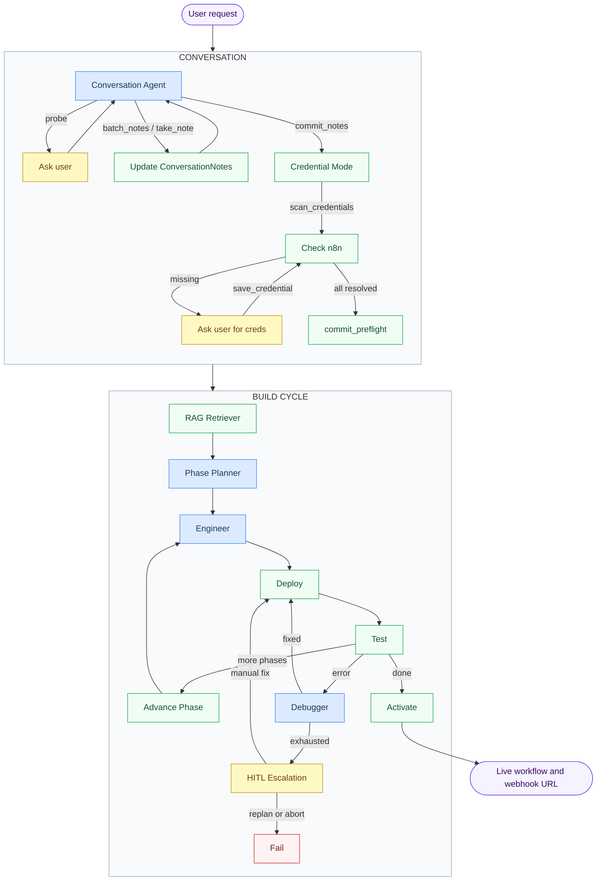
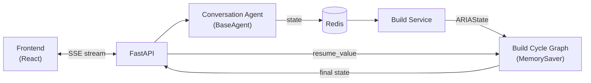

# ARIA Agentic System

A conversational agent plus a LangGraph build cycle that turn a plain-English request into a live, activated n8n workflow.

---

## End-to-end flow



**Blue = Agentic (LLM)** | **Yellow = Pauses for user** | **Green = Deterministic / API call**

---

## Conversation Agent + Build Cycle Graph

The system has two execution layers:

1. **Conversation Agent** — a `BaseAgent` (not a LangGraph graph) that handles requirements gathering and credential resolution in a single streaming chat. State persisted to Redis.
2. **Build Cycle Graph** — a LangGraph `StateGraph` compiled with `MemorySaver` that builds, deploys, tests, and self-heals the workflow.



The build service reads the committed `ConversationState` from Redis (`conversation:{id}`), converts it to `ARIAState`, and streams the build cycle graph.

---

## Conversation Agent — two modes

The `ConversationAgent` operates in two sequential modes within the same chat session:

### Mode 1: Requirements Gathering

Tools: `batch_notes`, `take_note`, `commit_notes`

The agent probes the user for workflow details (trigger, actions, destinations, constraints, integrations) and structures them into `ConversationNotes`. When requirements are complete, it calls `commit_notes` to finalize.

### Mode 2: Credential Gathering

Tools: `scan_credentials`, `get_credential_schema`, `save_credential`, `commit_preflight`

After `commit_notes`, the agent creates a **per-request agent graph** with credential tools bound to the required node types (no singleton mutation). It scans n8n for existing credentials, asks the user for missing ones, saves them, and calls `commit_preflight` when all are resolved.

| Tool | What It Does |
|---|---|
| `scan_credentials` | Checks n8n for saved credentials matching required node types |
| `get_credential_schema` | Fetches the field schema for a credential type from n8n |
| `save_credential` | Saves a credential to n8n with user-provided data |
| `commit_preflight` | Marks credentials as committed; enables build |

**Key files:**

```
conversation/
├── agent.py              # ConversationAgent — streaming, per-request credential graph
├── credential_tools.py   # scan_credentials (factory), get_credential_schema, save_credential, commit_preflight
├── schema_helpers.py     # is_secret_field, fields_from_schema, fetch_pending_details
├── schemas.py            # ConversationNotes (requirements + credential fields)
├── state.py              # ConversationState — Redis persistence with bounded fallback
├── tools.py              # batch_notes, take_note, commit_notes
├── prompts.py            # CONVERSATION_SYSTEM_PROMPT (base + credential section)
├── notes_updater.py      # State mutation helpers for all tool results
├── event_handlers.py     # SSE event dispatch, tool_call_id tracking
└── message_builders.py   # LangChain message construction from state
```

---

## Where user interaction happens

| Interaction | Phase | Trigger | User Action |
|---|---|---|---|
| Probing questions | Conversation | Agent needs clarification | Answer in chat |
| Credential request | Conversation | `scan_credentials` found missing creds | Provide API key / token in chat |
| `fix_exhausted` | Build Cycle | Debugger hit 3 fix attempts | Choose: retry / replan / abort |

---

## What streams to the UI and when

### Conversation

Token-by-token SSE streaming via `process_message()`. Tool events are emitted for each tool call:

```
token        → "What service triggers this workflow?"
tool_event   → { tool: "batch_notes", data: { count: 3, notes: [...] } }
tool_event   → { tool: "commit_notes", data: { summary: "..." } }
tool_event   → { tool: "scan_credentials", data: { resolved: [...], pending: [...] } }
tool_event   → { tool: "save_credential", data: { credential_type: "...", success: true } }
tool_event   → { tool: "commit_preflight", data: { committed: true } }
```

### Build Cycle

Per-node progress updates via SSE:

```
rag_retriever   →  "Retrieved 14 templates for 3 nodes"
phase_planner   →  "Linear pipeline → 3 phases: [GitHub Trigger], [IF], [Slack]"
engineer        →  "Phase 0: built 1 node (GitHub Trigger)"
deploy          →  "Deployed workflow wf-abc123"
test            →  "Execution success" / "Execution error: ..."
debugger        →  "Fix applied to Slack: corrected channel parameter format"
activate        →  "Activated. Webhook: https://localhost:5678/webhook/xyz"
```

---

## Sub-graph details

| Component | README |
|---|---|
| Build Cycle | [build_cycle/README.md](./build_cycle/README.md) |
