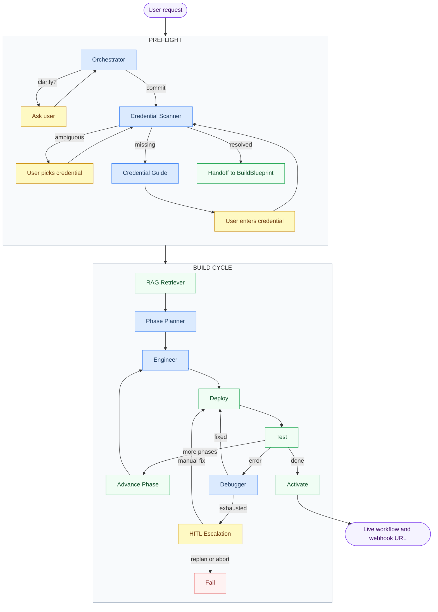
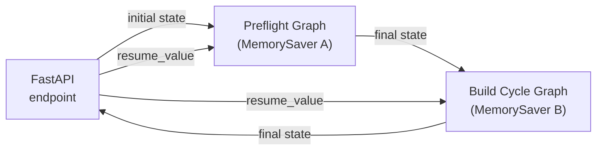

# ARIA Agentic System

Two sequential LangGraph graphs that turn a plain-English request into a live, activated n8n workflow.

---

## End-to-end flow



**🤖 Blue = Agentic (LLM)** · **⏸️ Yellow = Pauses for user** · **🟢 Green = Deterministic / API call**

---

## Two separate graphs, not one

The two phases are compiled as independent LangGraph graphs, each with its own `MemorySaver` checkpointer. They run sequentially via `ARIAPipeline`.



> **Why two graphs?** A single nested graph deadlocks when `interrupt()` fires inside a compiled subgraph. Splitting them fixes this (BUG-6).

---

## Where user interaction happens

| Interrupt | Phase | Trigger | User action |
|---|---|---|---|
| `orchestrator_clarification` | Preflight | Intent is ambiguous | Answer a follow-up question |
| `credential_ambiguity` | Preflight | Multiple matching creds in n8n | Pick which credential to use |
| `credential_request` | Preflight | Credential doesn't exist | Enter API key / OAuth in n8n |
| `fix_exhausted` | Build Cycle | Debugger hit retry limit | Choose: manual fix / replan / abort |

---

## What streams to the UI and when

### Preflight
No token streaming. Updates arrive only at interrupts (the graph pauses and returns a payload).

### Build Cycle
Per-node progress updates via `stream_build_cycle()` → `on_node(name, update)`:

```
rag_retriever   →  "Retrieved 14 templates for 3 nodes"
phase_planner   →  "Linear pipeline → 3 phases: [GitHub Trigger], [IF], [Slack]"
engineer        →  "Phase 0: built 1 node (GitHub Trigger)"
deploy          →  "Deployed workflow wf-abc123"
test            →  "Execution success" / "Execution error: ..."
debugger        →  "Fix applied to Slack: corrected channel parameter format"
advance_phase   →  (internal state update)
engineer        →  "Phase 1: built 1 node (IF)"
...
activate        →  "Activated. Webhook: https://localhost:5678/webhook/xyz"
```

> Individual LLM token streaming (character-by-character) is not used. Each node fires once when complete.

---

## Sub-graph details

| Graph | README |
|---|---|
| Preflight | [preflight/README.md](./preflight/README.md) |
| Build Cycle | [build_cycle/README.md](./build_cycle/README.md) |
