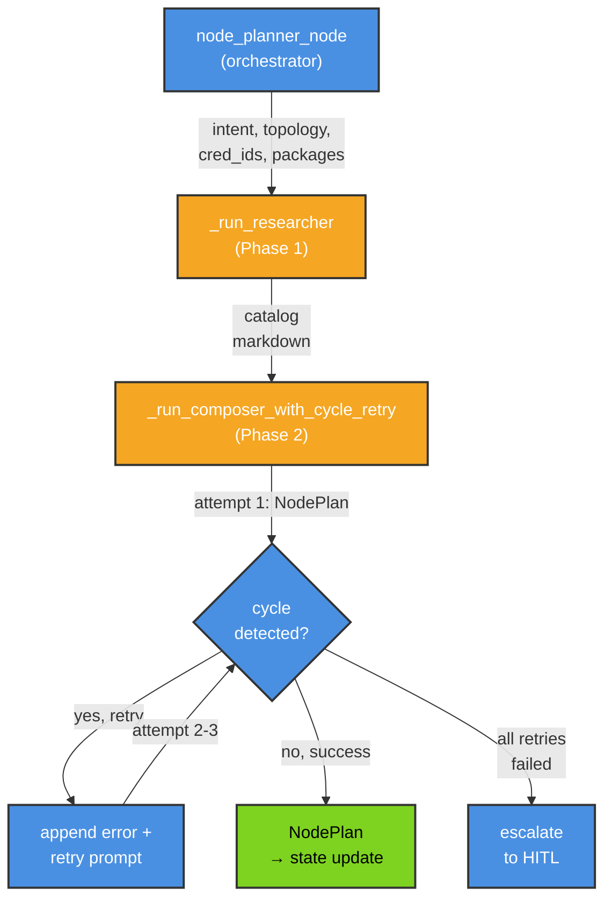

# Build Cycle Graph

Takes the `BuildBlueprint` from the completed Conversation (Phase 0) and incrementally builds, deploys, tests, and activates a live n8n workflow using parallel node workers and fan-in assembly.

> **Upstream dependency:** The build cycle requires `committed=true` AND `credentials_committed=true` in the `conversation:{id}` Redis state. Credentials are resolved dynamically by Phase 0's [5-step credential resolver](../shared/credential_resolver.py) before reaching the build cycle.

---

## Workflow

<!-- mermaid-source-file:.mermaid\README_1772311172_163.mmd-->


**Blue = Agentic (LLM call + tool use)** · **Yellow = Pauses for user input** · **Green = Deterministic / API call**

---

## Node Reference

| Node | Agentic? | Pauses? | What it does |
|---|---|---|---|
| **Node Planner** | Yes (two-phase: Researcher + Composer) | No | **Phase 1 (Researcher):** tool-use agent that searches ChromaDB for node documentation, returns a markdown catalog. **Phase 2 (Composer):** structured-output agent that composes the catalog into a flat `NodePlan` with `NodeSpec` objects and `PlannedEdge` connections. Cycle detection with up to 3 retries on the Composer phase only. MUST ONLY use installed packages — falls back to `httpRequest` or `code` otherwise. |
| **Node Worker** (parallel) | Yes (+ `search_n8n_nodes` tool) | No | Spawned in parallel via Send API. Uses `search_n8n_nodes` tool to look up parameter schemas for its node type, then builds a single n8n node JSON from its `NodeSpec`. Applies credential IDs, generates UUIDs, and calculates canvas position. |
| **Assembler** | Yes | No | Fan-in: collects all `node_build_results`, validates them (short-circuits to debugger if any fail), checks for dangling edges, and merges nodes + connections into final `workflow_json`. |
| **Deploy** | No | No | Creates (POST) or updates (PUT) the workflow in n8n via the REST API. Catches HTTP errors and routes to Debugger instead of crashing. |
| **Test** | No | No | Activates the workflow. Webhook → fire + poll execution. Non-webhook → activation success = pass. |
| **Debugger** | Yes (two-phase: Researcher + Composer) | No | **Phase 1 (DiagnosticResearcher):** tool-use agent that searches ChromaDB for correct node schemas, produces a markdown diagnostic report. **Phase 2 (FixComposer):** structured-output agent that consumes the report and generates a `DebuggerOutput` with full-spectrum fixes: parameter patches on multiple nodes, node type replacements, new node insertions, node removals, or connection rewiring. Pre-flight auth check skips both LLM phases if credentials can be auto-attached. |
| **Activate** | No | No | Permanently activates the workflow, returns the live webhook URL (None for non-webhook). |
| **HITL Escalation** | No | Yes | Fix budget exhausted — generates plain-English explanation, pauses for user: retry / replan / abort. |

---

## RAG Retrieval — Tool-Based (search_n8n_nodes)

Previously, RAG retrieval was a dedicated graph node (`rag_retriever_node`) that pre-fetched all templates into state before planning. This caused two problems:

1. **Context bloat** — all templates were dumped into `ARIAState.node_templates` and carried through every subsequent node
2. **No iterative search** — the planner saw only 12 compressed summaries and couldn't search for alternatives when a node type wasn't installed

Now, RAG retrieval is an on-demand LangChain tool (`search_n8n_nodes`) bound to both the Node Planner and Node Worker agents. The tool wraps `ChromaStore.hybrid_query_n8n_documents()` (BM25 + semantic RRF fusion) and returns up to 5 results per query.

**Tool interface:**
```python
@tool(args_schema=SearchInput)
async def search_n8n_nodes(query: str, doc_type: str | None = "node") -> str:
    """Search the n8n knowledge base for node documentation and parameter templates."""
```

**How agents use it:**
- **Planner:** Searches for each node type before selecting it, verifies it exists in an installed package, searches for alternatives if needed
- **Worker:** Searches for the specific node type it's building to get parameter schemas

**Location:** `src/agentic_system/build_cycle/tools/search_nodes.py`

---

## File Structure

### Core Orchestration
- `nodes/node_planner.py` — REWRITTEN (two-phase): contains `_researcher` and `_composer` module-level agents, `_run_researcher()`, `_run_composer_with_cycle_retry()`, helper functions for cycle detection and prompt assembly

### Prompts (NEW)
- `prompts/node_researcher.py` — NEW: `NODE_RESEARCHER_SYSTEM_PROMPT` (catalog building)
- `prompts/plan_composer.py` — NEW: `PLAN_COMPOSER_SYSTEM_PROMPT` (structured planning with cycle guidance)
- `prompts/diagnostic_researcher.py` — NEW: `DIAGNOSTIC_RESEARCHER_SYSTEM_PROMPT` (error investigation)
- `prompts/fix_composer.py` — NEW: `FIX_COMPOSER_SYSTEM_PROMPT` (full-spectrum fixes)
- `prompts/node_planner.py` — DELETED (old monolithic prompt)

### Schemas
- `schemas/node_plan.py` — MODIFIED: `NodeSpec.parameter_hints` now has `field_validator` for JSON string auto-coercion
- `schemas/debugger_output.py` — NEW: `DebuggerOutput` with support for multi-node patches, node type replacements, new node insertions, node removals, and connection rewiring

### Other Nodes
- `nodes/worker.py`, `nodes/assembler.py`, `nodes/debugger.py`, `nodes/deploy.py`, `nodes/test.py`, `nodes/activate.py` — unchanged

---

## Agent Internals

### Node Planner — Two-Phase Architecture

The Node Planner orchestrates two sequential agents: **Researcher** (RAG search) and **Composer** (structured planning).

#### Phase 1: Node Researcher (Tool-Use Agent)

**Role:** Search ChromaDB for node documentation and build a curated catalog.

**Tools:** `search_n8n_nodes` (queries hybrid BM25 + semantic RRF)

**Input:** Intent, topology (optional), available packages, credentials

**Output:** Markdown catalog with node types, credential requirements, and parameter schemas

**Process:**
1. Identify distinct nodes needed from intent
2. Search ChromaDB for each node type (parallel when possible)
3. Include fallback nodes (`httpRequest`, `code`) if no match
4. Return formatted catalog with parameter details for downstream use

#### Phase 2: Plan Composer (Structured-Output Agent)

**Role:** Compose the catalog into a structured `NodePlan` with retry on cycles.

**Tools:** None (all information in catalog)

**Input:** Catalog (from Researcher), intent, credentials, available packages

**Output:** `NodePlan` with nodes, edges, and workflow name

**Cycle handling:** Attempts up to 3 times. If cycle detected, appends error context to prompt and retries. Escalates if all retries fail.

**Planning rules:**
- Output a flat list of `NodeSpec` objects (no phases)
- MUST ONLY use nodes from the catalog (no additional searches)
- Include conditional branch hints (IF/Switch)
- Preserve all topology edges
- Ensure no cycles in planned edges (`parameter_hints` must be a dict, not a JSON string)

**Output shape:**
```python
NodePlan {
    nodes: [NodeSpec, NodeSpec, ...],       # all nodes to build (parallel)
    edges: [PlannedEdge, PlannedEdge, ...], # all connections
    workflow_name: str,                     # display name for the workflow
}

NodeSpec {
    node_name: str,              # display name
    node_type: str,              # n8n type identifier
    parameter_hints: dict,       # planner-supplied overrides (auto-coerced from JSON strings)
    credential_id: str | None,   # resolved credential UUID
    credential_type: str | None, # credential type name
    position_index: int,         # layout ordering hint
}

PlannedEdge {
    from_node: str,              # source node name
    to_node: str,                # target node name
    branch: str | None,          # conditional branch label (for If/Switch)
}
```

#### Two-Phase Flow Diagram



#### Parameter Hints Validator Safety Net

The `NodeSpec.parameter_hints` field includes a `field_validator` that auto-coerces JSON strings to dicts:
- **Problem:** LLM may output `parameter_hints: '{"key": "value"}'` (JSON string) instead of `parameter_hints: {"key": "value"}` (dict)
- **Solution:** The validator detects and converts JSON strings to dicts automatically
- **Fallback:** Invalid or unparseable strings become `{}`

This prevents validation failures and LLM retry spirals due to formatting mistakes.

**Location:** `src/agentic_system/build_cycle/schemas/node_plan.py:48-60`

---

### Node Worker (parallel)

<!-- mermaid-source-file:.mermaid\README_1772311172_165.mmd-->


**Each worker:**
- Receives one `NodeSpec` and credential IDs
- Uses `search_n8n_nodes` tool to look up parameter schemas on-demand
- Calls LLM to generate complete `parameters`
- Wraps parameters into full n8n node JSON
- Returns a `NodeResult` with pass/fail status
- Runs in parallel with all other workers

---

### Assembler (Fan-In)

<!-- mermaid-source-file:.mermaid\README_1772311172_166.mmd-->


**Validation gate:**
- Checks all `NodeResult` objects for `validation_passed: false`
- Scans `planned_edges` for references to nodes not in `node_build_results`
- Short-circuits to Debugger with `type: "schema"` if any fail
- Otherwise, merges nodes and connections into final workflow JSON

---

### Debugger — Two-Phase Full-Spectrum Fixes

<!-- mermaid-source-file:.mermaid\README_1772311172_167.mmd-->


**Auth fast path:** Before invoking any LLM phase, the debugger checks if the error signature matches an auth issue (`401`, `403`, token expired, `unauthorized`). If so, it attempts to auto-attach or refresh credentials via the n8n API. If successful, both LLM phases are skipped and the fixed workflow is re-deployed immediately.

#### Phase 1: Diagnostic Researcher (Tool-Use Agent)

**Role:** Investigate the error, search for correct node schemas and parameter documentation.

**Tools:** `search_n8n_nodes` (queries hybrid BM25 + semantic RRF)

**Input:** Error message, failed node details, current workflow JSON

**Output:** Markdown diagnostic report with root cause analysis and candidate solutions

**Process:**
1. Parse error message and failed node type
2. Search ChromaDB for correct node documentation
3. Include schema details, credential requirements, and parameter examples
4. Return formatted report with alternative node suggestions (e.g. if unavailable, suggest `httpRequest` or `code`)

#### Phase 2: Fix Composer (Structured-Output Agent)

**Role:** Generate a full-spectrum fix from the diagnostic report.

**Tools:** None (all information in report)

**Input:** Diagnostic report, error context, current workflow JSON

**Output:** `DebuggerOutput` with one or more fixes

**Fix types supported:**
- **Parameter patch:** Modify `parameters` on one or more existing nodes
- **Node replacement:** Change a node's `type` from unavailable to an alternative (e.g. `n8n-nodes-base.httpRequest`)
- **Node insertion:** Add entirely new nodes to the workflow
- **Node removal:** Delete nodes that are causing issues
- **Connection rewiring:** Modify edges between nodes

**Error classification:**
| Signal in error message | Typical causes | Fix approach |
|---|---|---|
| JSON parse errors, missing fields, invalid syntax | `schema` | Parameter patch on named node |
| Wrong values, logic flow, data shape mismatch | `logic` | Parameter patch, sometimes node rewiring |
| 401, 403, token expired, unauthorized | `auth` | Auto-attach credentials (fast path); escalate if not possible |
| 429, rate limit exceeded | `rate_limit` | Retry test (no fix needed) |
| Unknown node type, unrecognized node, package not installed | `missing_node` | Node replacement (e.g. unavailable → `httpRequest`) or node removal |

---

### HITL Escalation

<!-- mermaid-source-file:.mermaid\README_1772311172_168.mmd-->


---

### Test Node (trigger-aware)

<!-- mermaid-source-file:.mermaid\README_1772311172_169.mmd-->


---

## State Flow Summary

```
conversation:{id} (committed + credentials resolved)
    ↓ Build Service      → validate_conversation_for_build(), convert to ARIAState
BuildBlueprint
    ↓ Node Planner Orchestrator
    ├─ Phase 1: Researcher    → search_n8n_nodes tool, catalog (markdown)
    └─ Phase 2: Composer      → NodePlan with nodes[], edges[], workflow_name
                                (cycle retry up to 3x on this phase only)
    ↓ Fan-Out (Send)     → spawn parallel Node Workers
    ↓ Node Workers       → search_n8n_nodes tool, node_build_results[] (parallel)
    ↓ Assembler          → workflow_json (merged + validated), status="building"
    ↓ Deploy             → n8n_workflow_id
    ↓ Test               → execution_result → "done" | "fixing"
    ↓   (fixing)
    ↓ Debugger           → DebuggerOutput (full-spectrum fixes), workflow_json (updated), fix_attempts++
    ↓   (more fixes available)
    ↓ Deploy             → deploy updated workflow → Test
    ↓   (done or out of fixes)
    ↓ Activate | HITL    → webhook_url, status="done" | interrupt for user decision
```

---

## What Streams to the UI

| Event | What the UI sees | Type |
|---|---|---|
| Node Planner fires | `"Strategy: X → N nodes queued: [node], [node]..."` | Per-node update |
| Node Workers fire (parallel) | `"Building NodeA..."`, `"Building NodeB..."` (one per worker) | Per-node update |
| Assembler fires | `"Assembled N nodes into workflow."` | Per-node update |
| Deploy fires | `"Deployed workflow <id>"` | Per-node update |
| Test fires | `"Execution success/error: <exec_id>"` or `"Activation success (non-webhook trigger)"` | Per-node update |
| Debugger fires | `"<type> in '<node>': <message>"` + `"Fix applied: <explanation>"` | Per-node update |
| HITL Escalation fires | interrupt payload with explanation + options | **Interrupt** (graph pauses) |
| Activate fires | `"Workflow live! Webhook: <url>"` or `"Webhook: N/A"` | Per-node update |

> Updates are **per-node**, not token-by-token. Each node fires once when it completes.

---

## Trigger Detection (`nodes/_trigger_utils.py`)

Shared utility used by `test.py`, `activate.py`, and the benchmark runner. Single source of truth.

```python
detect_trigger_type(workflow_json) → "webhook" | "schedule" | "other"
extract_webhook_path(workflow_json) → str   # fallback: "test-webhook"
```

Detection scans `workflow_json.nodes` for known type strings:
- `"webhook"` → type contains `"webhook"` (e.g. `n8n-nodes-base.webhook`)
- `"schedule"` → `n8n-nodes-base.scheduletrigger`, `n8n-nodes-base.cron`, or type contains `"schedule"` / `"cron"`
- `"other"` → anything else

---

## Isolation Test Scripts

```bash
# Run 3 simple fixtures against live n8n (fast, ~3 min)
python scripts/_run_simple_benchmark.py

# Run full 9-fixture benchmark (~30 min)
python scripts/benchmark_build_cycle.py

# Test Deploy → Test → Debug loop against an existing workflow ID
python scripts/test_build_cycle_real.py
```
