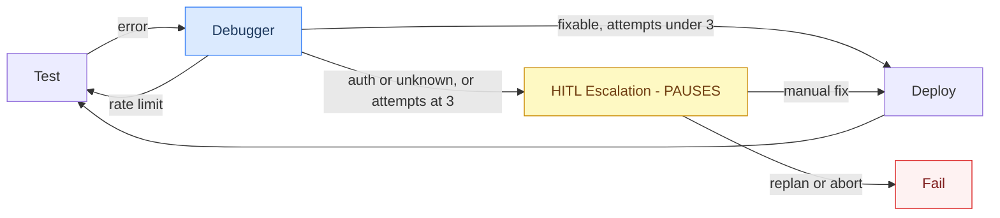

# Build Cycle Graph

Takes the `BuildBlueprint` from Preflight and incrementally builds, deploys, tests, and activates a live n8n workflow.

---

## Workflow


**🤖 Blue = Agentic (LLM call)** · **⏸️ Yellow = Pauses for user input** · **🟢 Green = Deterministic / API call**

---

## Node Reference

| Node | Agentic? | Pauses? | What it does |
|---|---|---|---|
| **RAG Retriever** | No | No | Hybrid BM25 + semantic search over ChromaDB (559 n8n node docs). Returns templates per node type plus workflow-level context. |
| **Phase Planner** | 🤖 Yes | No | Reasons over the full topology, intent, credential boundaries, and RAG summaries to split the workflow into ordered build chunks. Each phase gets a `rationale`. |
| **Engineer** | 🤖 Yes | No | Builds the n8n workflow JSON for the current phase. If phase > 0, merges new nodes into the existing workflow rather than rebuilding from scratch. |
| **Deploy** | No | No | Creates (POST) or updates (PUT) the workflow in n8n via the REST API. |
| **Test** | No | No | Activates the workflow and verifies it. Webhook workflows: fire the webhook + poll execution. Non-webhook (schedule, etc.): activation success alone is the pass condition. |
| **Advance Phase** | No | No | Increments the phase counter and resets per-phase error state so the engineer targets the next chunk. |
| **Debugger** | 🤖 Yes | No | Classifies the execution error (`schema`, `auth`, `rate_limit`, `logic`) and applies a targeted fix to the workflow JSON in a single LLM call. |
| **Activate** | No | No | Permanently activates the completed workflow in n8n and returns the live webhook URL (None for non-webhook workflows). |
| **HITL Escalation** | No | ⏸️ Yes | When fix attempts are exhausted, generates an LLM explanation and presents the user with three options (retry / replan / abort). |

---

## Detailed Node Breakdown

### RAG Retriever
**File:** `nodes/rag_retriever.py`
**Type:** Deterministic — no LLM call
**Inputs from state:** `build_blueprint.intent`, `build_blueprint.required_nodes`

**What it does:**
1. Opens a `ChromaStore` connection to ChromaDB (559 n8n node docs)
2. For each node type in `required_nodes`, runs a **hybrid BM25 + semantic search** (`hybrid_query_n8n_documents`) — fetches up to 3 templates per node type
3. Deduplicates by document content
4. Runs a final intent-level query (up to 5 results) to surface workflow-level context
5. Returns the deduplicated template list

**Writes to state:** `node_templates: list[dict]`
**Why it matters:** The Engineer has no intrinsic knowledge of n8n node schemas. Without RAG templates it hallucinates parameter shapes. Quality templates = fewer debug cycles.

---

### Phase Planner
**File:** `nodes/phase_planner.py`
**Prompt:** `prompts/phase_planner.py`
**Schema:** `schemas/phase_plan.py → PhasePlan`
**Type:** 🤖 Agentic (single LLM call, structured output)
**Inputs from state:** `build_blueprint` (intent + topology + credential_ids), `node_templates`

**What it does:**
1. Builds a prompt from: intent, topology graph (nodes + edges + branch_nodes), available credential IDs, RAG template summaries (capped at 12 to avoid bloat)
2. Calls the LLM with `PhasePlan` structured output schema
3. Converts the plan's `PlannedPhase` list into `PhaseEntry` objects by slicing the topology edges into per-phase internal and cross-phase entry edges
4. Resets `build_phase` to 0

**Planning rules (from prompt):**
- Trigger node is always phase 0 alone
- Never mix nodes from different external services in the same phase
- IF/Switch nodes travel with their service owner
- 1–3 nodes per phase (max 4)
- Merge/fanin nodes get their own phase

**Writes to state:** `phase_node_map: list[PhaseEntry]`, `total_phases: int`, `build_phase: 0`

**`PhaseEntry` shape:**
```python
{
    "nodes": ["Gmail"],               # node names to build this phase
    "internal_edges": [...],          # edges entirely within this phase
    "entry_edges": [...],             # edges crossing in from previous phase
}
```

---

### Engineer
**File:** `nodes/engineer.py`
**Prompt:** `prompts/engineer.py`
**Schema:** `schemas/workflow.py → EngineerOutput`
**Type:** 🤖 Agentic (single LLM call, structured output)
**Inputs from state:** `build_blueprint`, `node_templates`, `resolved_credential_ids`, `build_phase`, `phase_node_map`, `workflow_json` (existing, for phase > 0)

**What it does:**
1. Looks up `phase_node_map[build_phase]` to get the current phase's nodes and edge connections
2. Filters `node_templates` to only those matching the current phase's node types
3. Builds a prompt including: intent, phase number, nodes to add, credential IDs, filtered templates, topology connection map, and (for phase > 0) the full existing workflow JSON
4. Calls the LLM to produce `EngineerOutput` (list of nodes with parameters + connections)
5. Passes output through `to_n8n_payload()` (converts schema → n8n JSON format, injects credential IDs)
6. For phase > 0: merges new nodes into the existing workflow via `merge_into_existing()`

**Trigger rules (from prompt):**
- Phase 0 builds ONLY the trigger node specified in the intent
- Webhook: include `webhookId` UUID + `path` slug
- Schedule: use direct `rule` object (not an expression string)
- Phase 1+: add only the specified nodes, connect to existing chain

**Writes to state:** `workflow_json: dict`

---

### Deploy
**File:** `nodes/deploy.py`
**Type:** Deterministic — n8n REST API call
**Inputs from state:** `workflow_json`, `n8n_workflow_id` (if updating)

**What it does:**
1. Strips the read-only `id` field from the workflow payload (n8n rejects PUT with `id`)
2. If `n8n_workflow_id` exists → `PUT /api/v1/workflows/{id}` (update)
3. Otherwise → `POST /api/v1/workflows` (create)
4. Captures the returned workflow ID

**Writes to state:** `n8n_workflow_id: str`

---

### Test
**File:** `nodes/test.py`
**Type:** Deterministic — n8n REST API calls
**Inputs from state:** `n8n_workflow_id`, `workflow_json`

**What it does — trigger-type aware:**

```
detect_trigger_type(workflow_json)
    ├── "webhook"  → _test_webhook()
    └── "schedule" / "other"  → _test_activation_only()
```

**Webhook path (`_test_webhook`):**
1. `POST /api/v1/workflows/{id}/activate`
2. `POST /webhook/{path}` with `{"test": true}` payload
3. Poll `GET /api/v1/executions?workflowId={id}` until `stoppedAt` is set (30s timeout)
4. Parse execution result — if error, deactivate and return `status: "fixing"`

**Non-webhook path (`_test_activation_only`):**
1. `POST /api/v1/workflows/{id}/activate`
2. Activation success = pass (no manual trigger API available for schedule/other)

**Error handling:**
- `httpx.HTTPStatusError` caught first — extracts `context.nodeName` and `message` from n8n's JSON error body so the Debugger gets a real node name
- Broad `Exception` caught second for network/timeout errors

**Writes to state:** `execution_result: ExecutionResult`, `n8n_execution_id`, `status` ("done" or "fixing")

---

### Debugger
**File:** `nodes/debugger.py`
**Prompt:** `prompts/debugger.py`
**Schema:** `schemas/execution.py → DebuggerOutput`
**Type:** 🤖 Agentic (single LLM call, structured output — classify + fix combined)
**Inputs from state:** `execution_result`, `workflow_json`, `fix_attempts`

**What it does:**
1. Builds a prompt: attempt number, raw error dict, full workflow JSON
2. Single LLM call produces `DebuggerOutput`:
   - `error_type`: `schema | auth | rate_limit | logic`
   - `node_name`: exact node name from runData
   - `fixed_parameters`: updated parameters dict (or null for auth/rate_limit)
   - `explanation`: what was changed and why
3. If `error_type` in `{schema, logic}` and `fixed_parameters` is not null → patches the node in `workflow_json` via `_apply_fix()`
4. Increments `fix_attempts`

**Classification rules:**
| Signal | Type |
|---|---|
| JSON parse errors, missing fields, invalid syntax | `schema` |
| 401, 403, token expired, unauthorized | `auth` |
| 429, rate limit exceeded | `rate_limit` |
| Wrong values, logic flow, data shape | `logic` |

**Fix rules:**
- Can only modify the named node's `parameters`
- Cannot add/remove nodes or connections
- Cannot touch credential IDs
- Auth and rate_limit always produce `fixed_parameters: null` (escalated to human)

**Writes to state:** `classified_error: ClassifiedError`, `fix_attempts: int`, `workflow_json` (patched if fix applied)

**Routing after Debugger** (in `graph.py`):
- `rate_limit` → back to `test` (retry without code change)
- `schema | logic` + budget remaining + fix applied → `deploy`
- Everything else → `hitl_fix_escalation`

---

### Advance Phase
**File:** `graph.py → _advance_phase()`
**Type:** Deterministic — pure state mutation

**What it does:** Increments `build_phase` by 1, resets `fix_attempts` to 0, clears `classified_error` and `execution_result`. The Engineer then picks up `phase_node_map[build_phase]` for the next chunk.

**Writes to state:** `build_phase`, `fix_attempts: 0`, `classified_error: None`, `execution_result: None`

---

### Activate
**File:** `nodes/activate.py`
**Type:** Deterministic — n8n REST API call
**Inputs from state:** `n8n_workflow_id`, `workflow_json`

**What it does:**
1. `POST /api/v1/workflows/{id}/activate` (swallows errors — test node may have already activated it)
2. If the workflow has a webhook trigger → constructs `{n8n_base_url}/webhook/{path}` as the live URL
3. If non-webhook → `webhook_url` is set to `None`

**Writes to state:** `webhook_url: str | None`, `status: "done"`

---

### HITL Escalation
**File:** `nodes/hitl_escalation.py`
**Type:** ⏸️ Pauses graph via LangGraph `interrupt()`
**Inputs from state:** `classified_error`, `fix_attempts`, `n8n_workflow_id`

**What it does:**
1. Calls the `HITLExplainer` LLM agent to generate a 2–3 sentence plain-English explanation of what went wrong (node name, error type, likely cause, what to check)
2. Calls `interrupt()` — this pauses the LangGraph graph and surfaces the payload to the frontend
3. On resume, routes based on `action` field:
   - `"retry"` → reset fix budget, go back to `test`
   - `"replan"` → clear all build state, set `status: "replanning"`
   - `"abort"` → set `status: "failed"`

**Interrupt payload:**
```jsonc
{
    "type": "fix_exhausted",
    "explanation": "...",   // plain English from LLM
    "error": { "type": "schema", "node_name": "Schedule Trigger", "message": "..." },
    "fix_attempts": 3,
    "n8n_url": "http://localhost:5678/workflow/<id>",
    "options": ["retry", "replan", "abort"]
}
```

**Resume payload:**
```jsonc
{ "action": "retry" | "replan" | "abort" }
```

---

## State Flow Summary

```
BuildBlueprint
    ↓ RAG Retriever
node_templates[]
    ↓ Phase Planner
phase_node_map[], total_phases, build_phase=0
    ↓ Engineer (per phase)
workflow_json (built or merged)
    ↓ Deploy
n8n_workflow_id
    ↓ Test
execution_result → "done" | "fixing"
    ↓ (if fixing) Debugger
classified_error, workflow_json (patched), fix_attempts++
    ↓ (if done, more phases) Advance Phase
build_phase++
    ↓ (if done, final phase) Activate
webhook_url, status="done"
```

---

## Debug & Fix Loop Detail



**Fix budget:** 3 attempts per phase. Counter resets on `Advance Phase`.

---

## What Streams to the UI

| Event | What the UI sees | Streamed? |
|---|---|---|
| RAG Retriever fires | `"Retrieved N templates"` status message | Per-node update |
| Phase Planner fires | `"Strategy: X → N phases: [node], [node]..."` | Per-node update |
| Engineer fires | `"Phase N: built M nodes (NodeA, NodeB)"` | Per-node update |
| Deploy fires | `"Deployed workflow <id>"` | Per-node update |
| Test fires | `"Execution success / error"` or `"Activation success (non-webhook)"` | Per-node update |
| Debugger fires | `"Fix applied: <explanation>"` | Per-node update |
| HITL Escalation | ⏸️ interrupt payload (see below) | Interrupt |
| Activate fires | `"Activated. Webhook: https://..."` or `"Webhook: N/A"` | Per-node update |

> Updates are **per-node**, not token-by-token. Each node fires once when it completes.

---

## Trigger Detection (`_trigger_utils.py`)

Shared utility used by `test.py`, `activate.py`, and the benchmark runner.

```python
detect_trigger_type(workflow_json) → "webhook" | "schedule" | "other"
extract_webhook_path(workflow_json) → str  # returns "test-webhook" if none found
```

Detection scans `workflow_json.nodes` for known type strings:
- `"webhook"` → any node whose type contains `"webhook"`
- `"schedule"` → `n8n-nodes-base.scheduletrigger`, `n8n-nodes-base.cron`, or type containing `"schedule"` / `"cron"`
- `"other"` → anything else

---

## Phase Planner Output Example

For a "Gmail → Gemini → Telegram" workflow the planner produces:

```
Phase 0  [Schedule Trigger]   "Entry trigger, always standalone"
Phase 1  [Gmail]              "Credential boundary — Gmail OAuth"
Phase 2  [Google Gemini]      "Credential boundary — Gemini API key"
Phase 3  [Telegram]           "Credential boundary — Telegram Bot"
```

Each phase is built, deployed, and tested independently before the next begins.

---

## Known Issues

### Issue 1 — Engineer JSON output truncation on large workflows
**Symptom:** `Failed to parse structured output for EngineerOutput: Expecting ',' delimiter: line 1 column 119549` — the LLM's response exceeds the structured output parser's buffer. Happens when the phase prompt includes a large existing workflow JSON + large RAG templates.
**Workaround:** The benchmark skips this automatically (classified as FAIL, not a crash). The fix is to trim the existing workflow JSON passed to the Engineer (strip `position` fields and deduplicate connections before including it in the prompt).

### Issue 2 — detect_trigger_type scans all nodes, not just the entry trigger
**Symptom:** A workflow with a Schedule Trigger followed by a Webhook Response node may be misclassified as `"webhook"`.
**Fix:** Restrict detection to the entry node only (available via `build_blueprint.topology.entry_node`).

---

## Isolation Test Scripts

```bash
# Run the 3 simple fixtures against live n8n
python scripts/_run_simple_benchmark.py

# Run full 9-fixture benchmark
python scripts/benchmark_build_cycle.py

# Test Deploy → Test → Debug loop against an existing workflow ID
python scripts/test_build_cycle_real.py
```
