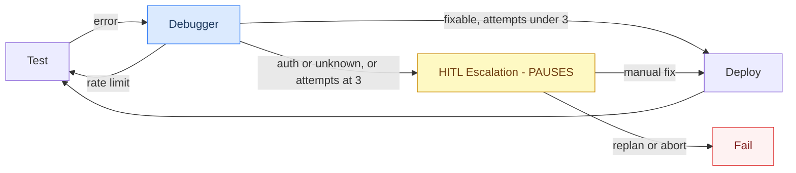

# Build Cycle Graph

Takes the `BuildBlueprint` from Preflight and incrementally builds, deploys, tests, and activates a live n8n workflow.

---

## Workflow


**🤖 Blue = Agentic (LLM call)** · **⏸️ Yellow = Pauses for user input** · **🟢 Green = Deterministic / API call**

---

## Node Reference

| Node | Agentic? | Pauses? | What it does |
|---|---|---|---|
| **RAG Retriever** | No | No | Hybrid BM25 + semantic search over ChromaDB (559 n8n node docs). Returns templates per node type plus workflow-level context. |
| **Phase Planner** | 🤖 Yes | No | Reasons over the full topology, intent, credential boundaries, and RAG summaries to split the workflow into ordered build chunks. Each phase gets a `rationale`. |
| **Engineer** | 🤖 Yes | No | Builds the n8n workflow JSON for the current phase. If phase > 0, merges new nodes into the existing workflow rather than rebuilding from scratch. |
| **Deploy** | No | No | Creates (POST) or updates (PUT) the workflow in n8n via the REST API. |
| **Test** | No | No | Activates the workflow, fires the webhook trigger, polls for execution result, deactivates on failure. |
| **Advance Phase** | No | No | Increments the phase counter and resets per-phase error state so the engineer targets the next chunk. |
| **Debugger** | 🤖 Yes | No | Classifies the execution error (`schema`, `auth`, `rate_limit`, `logic`) and applies a targeted fix to the workflow JSON in a single LLM call. |
| **Activate** | No | No | Permanently activates the completed workflow in n8n and returns the live webhook URL. |
| **HITL Escalation** | No | ⏸️ Yes | When fix attempts are exhausted, pauses and presents the user with three options. |

---

## Debug & fix loop detail



---

## What streams to the UI

The Build Cycle is the interactive phase of ARIA. Updates arrive via `stream_build_cycle()`:

| Event | What the UI sees | Streamed? |
|---|---|---|
| RAG Retriever fires | `"Retrieved N templates"` status message | Per-node update |
| Phase Planner fires | `"Strategy: X → N phases: [node], [node]..."` | Per-node update |
| Engineer fires | `"Phase N: built M nodes (NodeA, NodeB)"` | Per-node update |
| Deploy fires | `"Deployed workflow <id>"` | Per-node update |
| Test fires | `"Execution success / error"` | Per-node update |
| Debugger fires | `"Fix applied: <explanation>"` | Per-node update |
| HITL Escalation | ⏸️ interrupt payload (see below) | Interrupt |
| Activate fires | `"Activated. Webhook: https://..."` | Per-node update |

> Updates are **per-node**, not token-by-token. Each node fires once when it completes. The API calls `on_node(node_name, update)` for each.

---

## Interrupt payload (HITL Escalation)

```jsonc
{
    "type": "fix_exhausted",
    "error": { "type": "schema", "node_name": "Slack", "message": "..." },
    "fix_attempts": 3,
    "workflow_id": "abc-123",
    "options": ["manual_fix", "replan", "abort"],
    "message": "Automated fix failed after 3 attempts. How would you like to proceed?"
}
```

---

## Resume call

```python
# User chose an option from HITL Escalation
resume_build_cycle("manual_fix", config)   # user fixed it in n8n → redeploy
resume_build_cycle("replan", config)       # restart from preflight
resume_build_cycle("abort", config)        # stop entirely
```

---

## Phase Planner output example

For a "GitHub PR → Slack" workflow the planner might produce:

```
Phase 0  [GitHub Trigger]          "Entry trigger, always standalone"
Phase 1  [IF node]                 "Branch logic tied to trigger output"
Phase 2  [Slack]                   "Separate credential context — Slack API"
```

Each phase is then built, deployed, and tested independently before the next begins.
