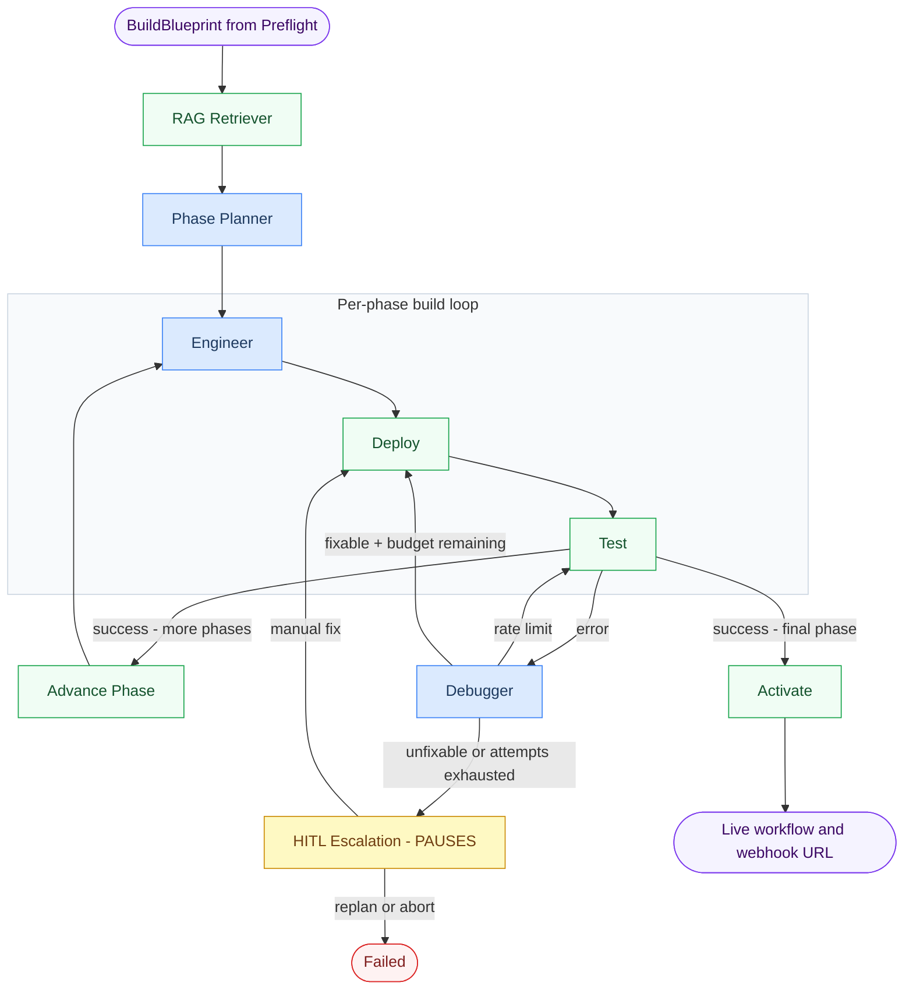
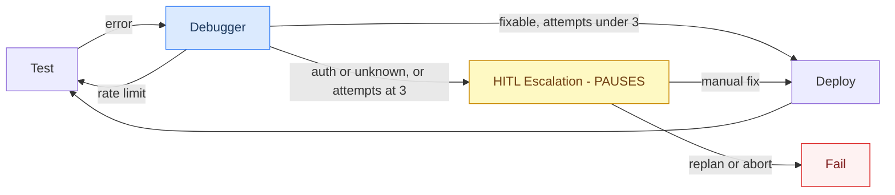

# Build Cycle Graph

Takes the `BuildBlueprint` from Preflight and incrementally builds, deploys, tests, and activates a live n8n workflow.

---

## Workflow



**🤖 Blue = Agentic (LLM call)** · **⏸️ Yellow = Pauses for user input** · **🟢 Green = Deterministic / API call**

---

## Node Reference

| Node | Agentic? | Pauses? | What it does |
|---|---|---|---|
| **RAG Retriever** | No | No | Hybrid BM25 + semantic search over ChromaDB (559 n8n node docs). Returns templates per node type plus workflow-level context. |
| **Phase Planner** | 🤖 Yes | No | Reasons over the full topology, intent, credential boundaries, and RAG summaries to split the workflow into ordered build chunks. Each phase gets a `rationale`. |
| **Engineer** | 🤖 Yes | No | Builds the n8n workflow JSON for the current phase. If phase > 0, merges new nodes into the existing workflow rather than rebuilding from scratch. |
| **Deploy** | No | No | Creates (POST) or updates (PUT) the workflow in n8n via the REST API. |
| **Test** | No | No | Activates the workflow, fires the webhook trigger (if present), polls for execution result, deactivates on failure. |
| **Advance Phase** | No | No | Increments the phase counter and resets per-phase error state so the engineer targets the next chunk. |
| **Debugger** | 🤖 Yes | No | Classifies the execution error (`schema`, `auth`, `rate_limit`, `logic`) and applies a targeted fix to the workflow JSON in a single LLM call. |
| **Activate** | No | No | Permanently activates the completed workflow in n8n and returns the live webhook URL. |
| **HITL Escalation** | No | ⏸️ Yes | When fix attempts are exhausted, generates an LLM explanation and presents the user with three options (retry / rebuild / abort). |

---

## Debug & fix loop detail



---

## What streams to the UI

| Event | What the UI sees | Streamed? |
|---|---|---|
| RAG Retriever fires | `"Retrieved N templates"` status message | Per-node update |
| Phase Planner fires | `"Strategy: X → N phases: [node], [node]..."` | Per-node update |
| Engineer fires | `"Phase N: built M nodes (NodeA, NodeB)"` | Per-node update |
| Deploy fires | `"Deployed workflow <id>"` | Per-node update |
| Test fires | `"Execution success / error"` | Per-node update |
| Debugger fires | `"Fix applied: <explanation>"` | Per-node update |
| HITL Escalation | ⏸️ interrupt payload (see below) | Interrupt |
| Activate fires | `"Activated. Webhook: https://..."` | Per-node update |

> Updates are **per-node**, not token-by-token. Each node fires once when it completes.

---

## Interrupt payload (HITL Escalation)

```jsonc
{
    "type": "fix_exhausted",
    "explanation": "The Schedule Trigger node failed because its interval rule was formatted as an expression string instead of a direct object. Open the node and set the interval using the dropdown before retrying.",
    "error": { "type": "schema", "node_name": "Schedule Trigger", "message": "..." },
    "fix_attempts": 3,
    "n8n_url": "http://localhost:5678/workflow/<id>",
    "options": ["retry", "replan", "abort"]
}
```

---

## Resume call

```
retry   — user manually fixed the node in n8n → redeploy and retest
replan  — restart from preflight with new intent
abort   — stop entirely
```

---

## Phase Planner output example

For a "Gmail → Gemini → Telegram" workflow the planner produces:

```
Phase 0  [Schedule Trigger]   "Entry trigger, always standalone"
Phase 1  [Gmail]              "Credential boundary — Gmail OAuth"
Phase 2  [Google Gemini]      "Credential boundary — Gemini API key"
Phase 3  [Telegram]           "Credential boundary — Telegram Bot"
```

Each phase is built, deployed, and tested independently before the next begins.

---

## Known Bugs

### BUG 1 — Engineer always assumes Webhook as Phase 0 trigger
**File:** `prompts/engineer.py:23`
**Symptom:** The system prompt hard-codes `"Phase 0: workflow MUST start with a Webhook node"`. When the user requests a Schedule Trigger, Cron, or any other non-webhook entry trigger, the Engineer either ignores the instruction and produces a malformed Schedule Trigger, or overrides the intent and adds a Webhook that was never requested.
**Evidence:** `Workflow failed to activate due to malformed Schedule Trigger parameters. The interval rule is incorrectly formatted as an expression string instead of a direct object.`
**Fix:** Remove the Webhook-only rule. Replace with: `"Phase 0: build the trigger node specified in the intent. For Webhook triggers include a webhookId UUID. For Schedule Triggers use a direct rule object (not an expression)."` Add a Schedule Trigger example to the prompt showing the correct `rule` object shape.

---

### BUG 2 — Test node crashes on activation failure and loses the real error
**File:** `nodes/test.py:18-27`
**Symptom:** `activate_workflow()` raises `httpx.HTTPStatusError` (n8n returns `400 Bad Request`) when the workflow has malformed parameters. This exception is caught by the broad `except Exception as e` on line 25, which converts it to `_error_result(str(e))`. That result sets `node_name: "unknown"` and discards the actual n8n error body (the JSON response that says exactly which parameter is wrong).
**Consequence:** The Debugger receives `node_name: "unknown"` and a generic HTTP error string — it cannot identify which node to fix, so it guesses wrong or sets `fixed_parameters: null`, exhausting all 3 fix attempts without ever applying a useful fix.
**Fix:** Catch `httpx.HTTPStatusError` separately before the broad handler. Extract the response body (`exc.response.json()`) and surface the `message` field as the error. Set `node_name` from the n8n error payload rather than hardcoding `"unknown"`.

```python
except httpx.HTTPStatusError as exc:
    await _safe_deactivate(client, workflow_id)
    body = exc.response.json() if exc.response else {}
    return _error_result(
        body.get("message", str(exc)),
        node_name=body.get("context", {}).get("nodeName", "unknown"),
    )
```

---

### BUG 3 — Test node always triggers a webhook even for non-webhook workflows
**File:** `nodes/test.py:20`, `nodes/test.py:68-73`
**Symptom:** After activation, `test_node` unconditionally calls `trigger_webhook(webhook_path)`. For Schedule Trigger workflows there is no webhook — `_extract_webhook_path` returns the fallback `"test-webhook"`, and the POST to `/webhook/test-webhook` returns `404 Not Found`. This 404 is then treated as a test failure and enters the debug loop, wasting all 3 fix attempts on a non-existent problem.
**Fix:** Detect the trigger type from `workflow_json.nodes` before deciding how to test:
- **Webhook trigger** → activate + trigger webhook + poll (current behaviour)
- **Schedule/Cron trigger** → activate + poll for the next scheduled execution, or use the n8n manual execution API (`POST /api/v1/workflows/{id}/run`) to fire it immediately without a webhook
- **Other triggers (Gmail, etc.)** → skip the trigger call entirely; just verify activation succeeds and the workflow is syntactically valid

---

## Isolation Test Script

To debug any single node without running the full pipeline:

```bash
# Test the Engineer node in isolation against a real n8n credential set
python scripts/test_engineer_isolation.py

# Test the full Deploy → Test → Debug loop against an existing workflow ID
python scripts/test_build_cycle_real.py
```
