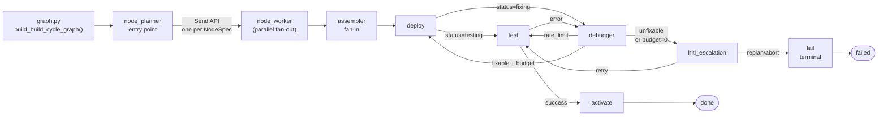
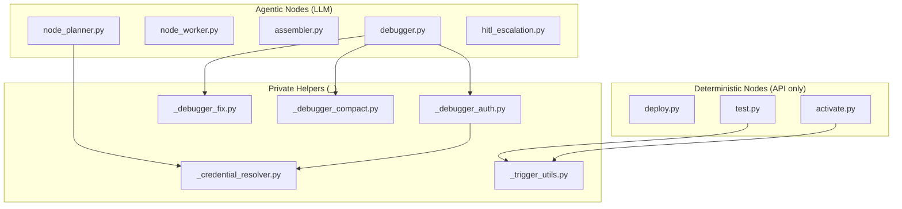
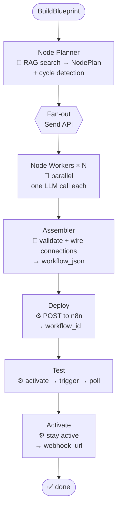
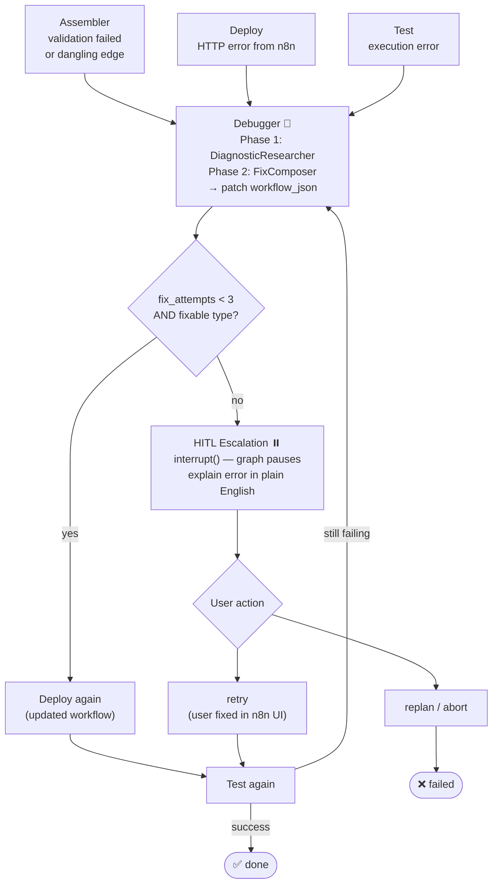
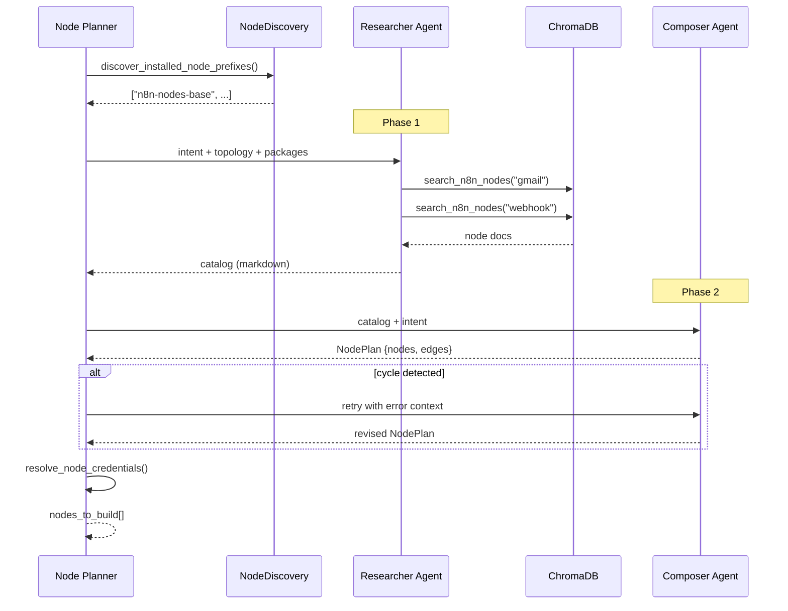
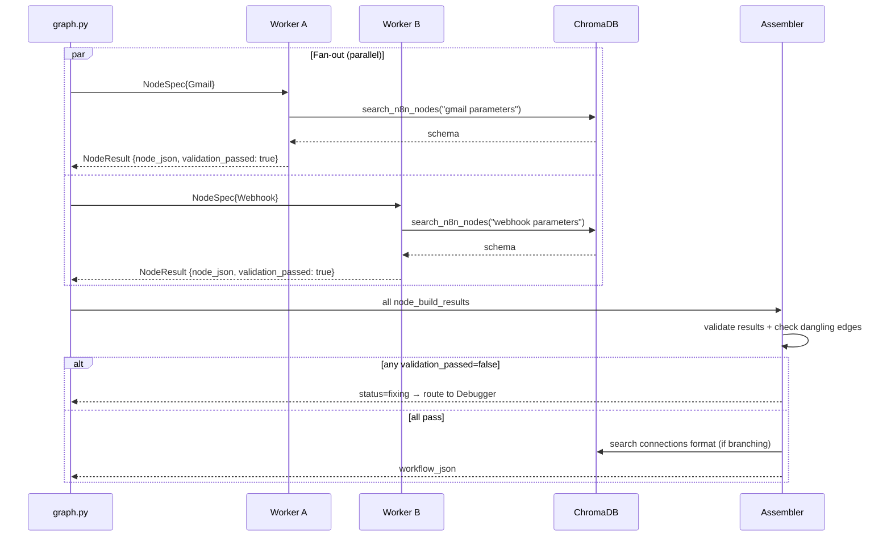
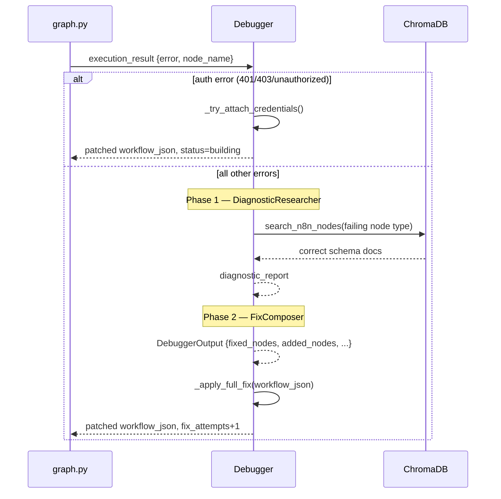
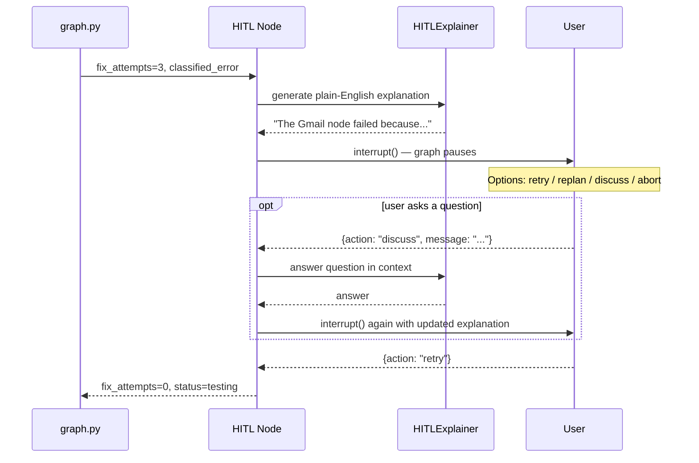
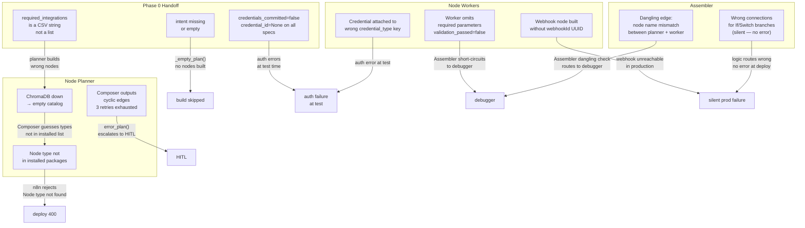

# Build Cycle — Reference

The Build Cycle takes the committed `BuildBlueprint` from Phase 0 and turns it into a **live, tested, activated n8n workflow**. It runs as a LangGraph subgraph.

> **Upstream requirement:** `conversation:{id}` Redis key must have `committed=true` AND `credentials_committed=true` before the build cycle starts.

---

## 1. Component Map — Orchestration Layer

What `graph.py` owns and how the 8 nodes relate to each other at the routing level.

---

## 2. Component Map — Node Internals

What each node file imports and depends on.

---

## 4. Workflow — Build Path (Happy)

The path when everything works first time.

---

## 5. Workflow — Fix / Debug Path

The path when something goes wrong after assembly.

---

## 6. Sequence — Node Planner (Two-Phase)

What happens inside the planner before any workers fire.

---

## 7. Sequence — Workers + Assembler (Fan-Out / Fan-In)

---

## 8. Sequence — Debugger (Two-Phase Fix)

---

## 9. Sequence — HITL Escalation

---

## 10. Failure Map — Build Time

Failures that happen before the workflow reaches n8n.

---

## 11. Failure Map — Runtime (Deploy → Test → Debug)

Failures that happen once the workflow reaches n8n.

```mermaid
graph TD
    subgraph Z4["Deploy"]
        A["n8n_workflow_id=None\nafter network error"]
        B["workflow references\nmissing credential"]
        C["'id' field sent\non PUT update\n(read-only)"]
    end

    subgraph Z5["Test"]
        D["webhook path not set\n→ extract returns 'test-webhook'\n→ poll finds no execution"]
        E["poll_execution\ntimes out at 30s"]
        F["delayed errors\nnot detected\n(list_executions not implemented)"]
    end

    subgraph Z6["Debugger"]
        G["auth fast-path loops:\ncredential attached\nbut still wrong"]
        H["FixComposer patches\nwrong node\n(name mismatch)"]
        I["workflow grows with\neach debug loop\nprompt too large"]
    end

    subgraph Z7["HITL"]
        J["frontend doesn't call\nPOST /jobs/id/resume\n→ job hangs forever"]
        K["user retries without\nfixing anything\n→ 3 more identical failures"]
    end

    A -->|"test crashes\nKeyError: n8n_workflow_id"| CRASH["runtime crash"]
    B -->|"n8n 400\nat deploy"| DBG["debugger"]
    C -->|"n8n 400\nat update"| DBG

    D -->|"false failure\nstarts debug loop"| DBG
    E -->|"false timeout error\nto debugger"| DBG
    F -->|"workflow reported done\nbut broken in prod"| PROD["silent prod failure"]

    G -->|"3 fix attempts consumed\non auth alone"| HITL["HITL escalation"]
    H -->|"fix does nothing\nnext test fails again"| LOOP["debug loop waste"]
    I -->|"LLM truncates prompt\nbad fix generated"| LOOP

    J -->|"job stuck\npaused_for_input=True"| HANG["hung job"]
    K -->|"hits HITL again\nimmediately"| HITL
```

### Top Failures — Ranked by Impact

| # | Zone | What goes wrong | How to spot it |
|---|---|---|---|
| 1 | Phase 0 handoff | `required_integrations` is `"Gmail, Slack"` not `["Gmail", "Slack"]` | Check `build_blueprint.topology` in state dump |
| 2 | Test | `webhook_path` not set → poll finds no execution → false failure | `workflow_json.nodes[0].parameters.path` is empty |
| 3 | Deploy | `n8n_workflow_id=None` after network error → test crashes | `KeyError: n8n_workflow_id` in logs |
| 4 | Workers | Node type not installed → n8n rejects deploy | Planner logs `[unknown_nodes_error]` |
| 5 | Debugger | Auth fast-path attaches credential that's still invalid → loops | `fix_attempts` hits 3 with all `type: "auth"` |
| 6 | HITL | Frontend never calls `/resume` → job hangs | Job status frozen at `hitl_escalation` |
| 7 | Assembler | Wrong `If`/`Switch` connections — no error raised | Inspect `workflow_json.connections` manually |
| 8 | Test | Delayed errors not detected (`list_executions` not implemented) | Check n8n execution logs after activation |

---

## 12. Node Reference

| Node | File | Agentic? | Pauses? | Plain English |
|---|---|---|---|---|
| **Node Planner** | `nodes/node_planner.py` | Yes — 2 LLM phases | No | Phase 1 searches ChromaDB for node docs. Phase 2 turns those docs into a structured build plan (nodes + connections). Detects cycles, retries up to 3×. |
| **Node Worker** | `nodes/node_worker.py` | Yes — 1 LLM + tool | No | One per node, all run in parallel. Looks up node schema in ChromaDB, fills in all parameters, returns a complete n8n node JSON. |
| **Assembler** | `nodes/assembler.py` | Yes — 1 LLM + tool | No | Waits for all workers. Validates results. If any failed → Debugger. Otherwise builds the connections between nodes and produces the final `workflow_json`. |
| **Deploy** | `nodes/deploy.py` | No | No | POST (new) or PUT (fix) the workflow to n8n. Captures the workflow ID. |
| **Test** | `nodes/test.py` | No | No | Webhook: activate → fire test request → poll for result. Non-webhook: activation = pass. |
| **Debugger** | `nodes/debugger.py` | Yes — 2 LLM phases | No | Auth fast-path skips LLM if it's a missing credential. Otherwise: Phase 1 researches the error, Phase 2 generates a structured fix (patch params, swap node type, add/remove nodes, rewire connections). |
| **Activate** | `nodes/activate.py` | No | No | Permanently activates the workflow. Returns the live webhook URL. |
| **HITL Escalation** | `nodes/hitl_escalation.py` | Yes — explanation only | **Yes** | Generates plain-English error explanation. Pauses graph via `interrupt()`. User decides: retry / replan / discuss / abort. |

---

## 13. Routing Logic

All routing lives in `graph.py`. Each function reads one or two state keys.

| Router | Key read | Routes to |
|---|---|---|
| `fan_out_nodes` (line 23) | `nodes_to_build` | `node_worker` × N via Send API |
| `_route_deploy_result` (line 62) | `state.status` | `test` or `debugger` |
| `_route_test_result` (line 38) | `execution_result.status` | `activate` or `debugger` |
| `_route_debugger_result` (line 46) | `classified_error.type` + `fix_attempts` | `test`, `deploy`, or `hitl_fix_escalation` |
| `_route_hitl_decision` (line 69) | `state.status` after resume | `deploy`, `test`, or `fail` |

**Fix budget:** `MAX_FIX_ATTEMPTS = 3` (`graph.py:19`). Debugger increments before routing — when `fix_attempts == 3` the router sends to HITL.

**Fixable types:** `{"schema", "logic", "missing_node", "auth"}` (`graph.py:20`). Any other type → HITL immediately regardless of budget.
