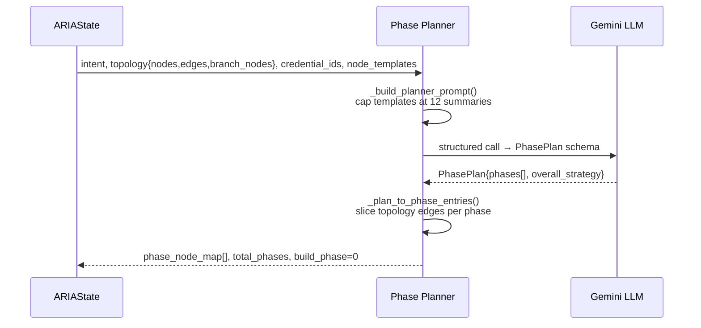
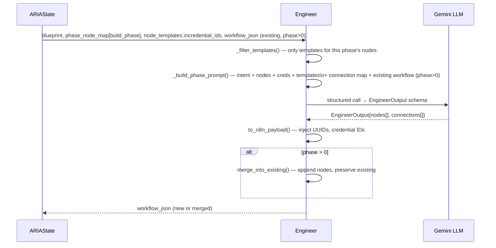
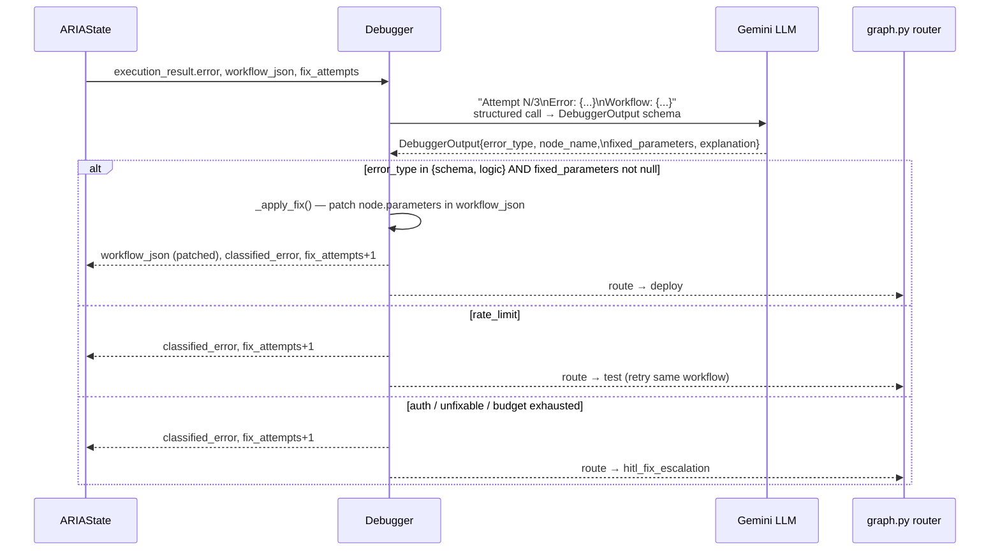
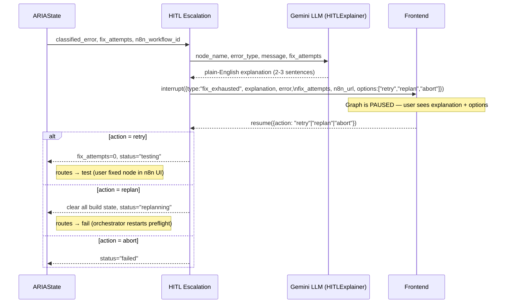
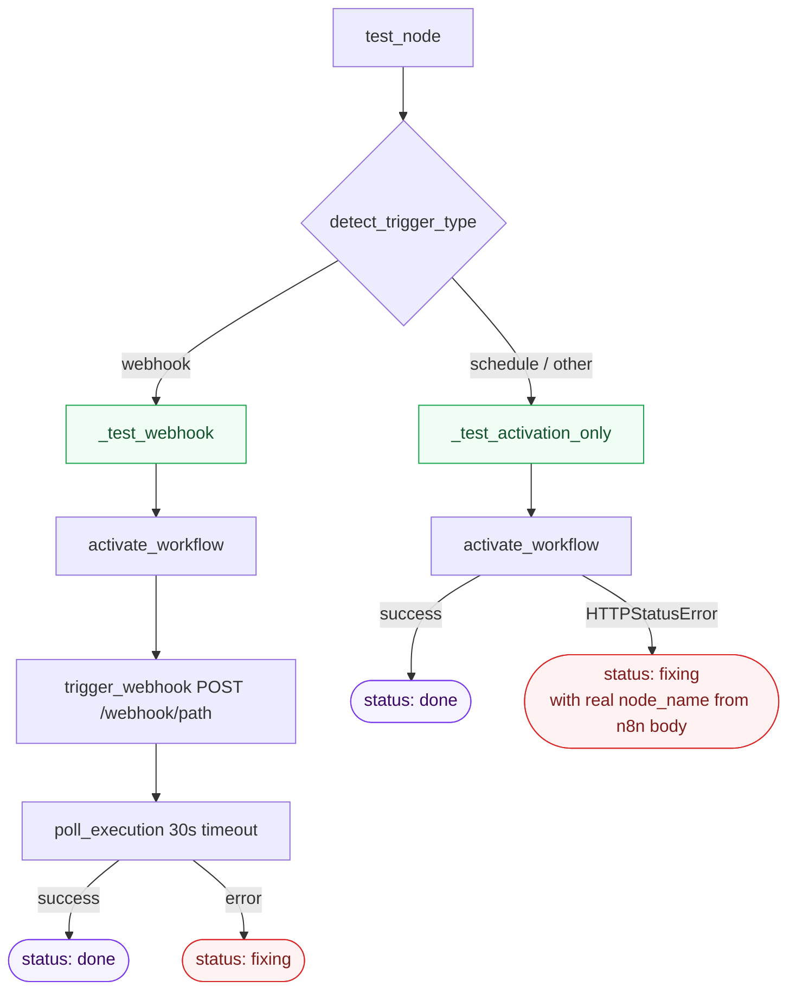

# Build Cycle Graph

Takes the `BuildBlueprint` from Preflight and incrementally builds, deploys, tests, and activates a live n8n workflow.

---

## Workflow


**🤖 Blue = Agentic (LLM call)** · **⏸️ Yellow = Pauses for user input** · **🟢 Green = Deterministic / API call**

---

## Node Reference

| Node | Agentic? | Pauses? | What it does |
|---|---|---|---|
| **RAG Retriever** | No | No | Hybrid BM25 + semantic search over ChromaDB (559 n8n node docs). Returns templates per node type plus workflow-level context. |
| **Phase Planner** | 🤖 Yes | No | Reasons over the full topology, intent, credential boundaries, and RAG summaries to split the workflow into ordered build chunks. |
| **Engineer** | 🤖 Yes | No | Builds the n8n workflow JSON for the current phase. Phase > 0 merges new nodes into the existing workflow. |
| **Deploy** | No | No | Creates (POST) or updates (PUT) the workflow in n8n via the REST API. |
| **Test** | No | No | Activates the workflow. Webhook → fire + poll execution. Non-webhook → activation success = pass. |
| **Advance Phase** | No | No | Increments phase counter, resets per-phase error state. |
| **Debugger** | 🤖 Yes | No | Classifies the error (`schema`, `auth`, `rate_limit`, `logic`) and applies a targeted fix in one LLM call. |
| **Activate** | No | No | Permanently activates the workflow, returns the live webhook URL (None for non-webhook). |
| **HITL Escalation** | No | ⏸️ Yes | Fix budget exhausted — generates plain-English explanation, pauses for user: retry / replan / abort. |

---

## Agent Internals

### Phase Planner



**Planning rules:**
- Phase 0 is always the trigger node alone
- Never mix nodes from different external services in one phase
- IF/Switch nodes travel with their service owner
- 1–3 nodes per phase (max 4)
- Merge/fanin nodes get their own phase after all feeding branches

**Output shape per phase:**
```python
PhaseEntry {
    nodes: ["Gmail"],           # node names to build
    internal_edges: [...],      # edges entirely within this phase
    entry_edges: [...],         # edges crossing in from the previous phase
}
```

---

### Engineer



**Trigger rules (phase 0):**
- Build ONLY the trigger specified in the intent — never default to Webhook
- Webhook → include `webhookId` UUID + short `path` slug
- Schedule → use a direct `rule` object (not an expression string): `{"interval": [{"field": "minutes", "minutesInterval": 15}]}`
- Other triggers → follow the RAG template exactly

---

### Debugger



**Error classification:**
| Signal in error message | `error_type` | Auto-fixed? |
|---|---|---|
| JSON parse errors, missing fields, invalid syntax | `schema` | Yes |
| Wrong values, logic flow, data shape mismatch | `logic` | Yes |
| 401, 403, token expired, unauthorized | `auth` | No — escalate |
| 429, rate limit exceeded | `rate_limit` | No — retry test |

**Fix constraints:** can only change the named node's `parameters`. Cannot add/remove nodes, connections, or touch credential IDs.

---

### HITL Escalation



---

### Test Node (trigger-aware)



---

## State Flow Summary

```
BuildBlueprint
    ↓ RAG Retriever      → node_templates[]
    ↓ Phase Planner      → phase_node_map[], total_phases, build_phase=0
    ↓ Engineer           → workflow_json (built or merged)
    ↓ Deploy             → n8n_workflow_id
    ↓ Test               → execution_result → "done" | "fixing"
    ↓   (fixing)
    ↓ Debugger           → classified_error, workflow_json (patched), fix_attempts++
    ↓   (done, more phases)
    ↓ Advance Phase      → build_phase++
    ↓   (done, final phase)
    ↓ Activate           → webhook_url, status="done"
```

---

## What Streams to the UI

| Event | What the UI sees | Type |
|---|---|---|
| RAG Retriever fires | `"Retrieved N templates for M nodes via hybrid search"` | Per-node update |
| Phase Planner fires | `"Strategy: X → N phases: [node], [node]..."` | Per-node update |
| Engineer fires | `"Phase N: built M nodes (NodeA, NodeB)"` | Per-node update |
| Deploy fires | `"Deployed workflow <id>"` | Per-node update |
| Test fires | `"Execution success/error: <exec_id>"` or `"Activation success (non-webhook trigger)"` | Per-node update |
| Debugger fires | `"<type> in '<node>': <message>"` + `"Fix applied: <explanation>"` | Per-node update |
| HITL Escalation fires | interrupt payload with explanation + options | **Interrupt** (graph pauses) |
| Activate fires | `"Workflow live! Webhook: <url>"` or `"Webhook: N/A"` | Per-node update |

> Updates are **per-node**, not token-by-token. Each node fires once when it completes.

---

## Trigger Detection (`nodes/_trigger_utils.py`)

Shared utility used by `test.py`, `activate.py`, and the benchmark runner. Single source of truth.

```python
detect_trigger_type(workflow_json) → "webhook" | "schedule" | "other"
extract_webhook_path(workflow_json) → str   # fallback: "test-webhook"
```

Detection scans `workflow_json.nodes` for known type strings:
- `"webhook"` → type contains `"webhook"` (e.g. `n8n-nodes-base.webhook`)
- `"schedule"` → `n8n-nodes-base.scheduletrigger`, `n8n-nodes-base.cron`, or type contains `"schedule"` / `"cron"`
- `"other"` → anything else

---

## Bugs Fixed (2026-02-27)

### Bug 1 — Engineer always assumed Webhook as Phase 0 trigger
**File:** `prompts/engineer.py`
**Root cause:** System prompt hard-coded `"Phase 0: workflow MUST start with a Webhook node"`, causing the LLM to override Schedule Trigger intent or produce malformed Schedule nodes.
**Fix:** Replaced with trigger-type-aware instructions. Phase 0 now says "build the trigger specified in the intent". Added explicit Webhook and Schedule Trigger examples showing the correct parameter shapes (especially the Schedule `rule` object vs expression string).

---

### Bug 2 — Test node swallowed activation errors, losing the real node name
**File:** `nodes/test.py`
**Root cause:** `activate_workflow()` raises `httpx.HTTPStatusError` (n8n 400) when a workflow has malformed parameters. This was caught by a broad `except Exception` which set `node_name: "unknown"` and discarded n8n's JSON error body. The Debugger received no useful signal and exhausted all 3 fix attempts without ever targeting the right node.
**Fix:** Added a specific `except httpx.HTTPStatusError` handler before the broad catch. Extracts `response.json()` from n8n's error body and reads `context.nodeName` and `message` to populate the error result with the real failing node.

---

### Bug 3 — Test node always fired a webhook, even for Schedule Trigger workflows
**File:** `nodes/test.py`
**Root cause:** After activation, the test unconditionally called `trigger_webhook(webhook_path)`. For Schedule Trigger workflows there is no webhook — `_extract_webhook_path` returned the fallback `"test-webhook"`, the POST to `/webhook/test-webhook` returned 404, and all 3 fix attempts were burned on a non-existent problem.
**Fix:** Test node now calls `detect_trigger_type()` first and branches:
- Webhook → `_test_webhook()`: activate + POST to webhook path + poll execution
- Schedule/other → `_test_activation_only()`: activate only — a clean activation is the pass condition

---

## What's Next

### 1. Engineer prompt overflow on large workflows (active issue)
**Symptom:** `Failed to parse structured output: Expecting ',' delimiter at char 119548` — the LLM's response overflows the JSON parser when the phase prompt includes a large existing workflow + many RAG templates.
**Fix needed:** Before passing `workflow_json` to the Engineer in phase > 0, strip cosmetic fields (`position`, redundant `typeVersion`) and deduplicate connections. Also cap `node_templates` tokens rather than just count.

### 2. `detect_trigger_type` scans all nodes, not just the entry trigger
**Symptom:** A workflow containing a Webhook Response node after a Schedule Trigger will be misclassified as `"webhook"`.
**Fix needed:** Use `build_blueprint.topology.entry_node` to restrict detection to the trigger node only, rather than scanning all nodes.

### 3. Medium and large fixture coverage
The benchmark currently passes 2/3 simple fixtures. Next step is to run the medium tier (3–4 node workflows with branching) and fix failures as they appear. Large fixtures (6–8 nodes, merge nodes) come after medium is stable.

### 4. Webhook Echo needs `responseMode` fix
**Symptom:** A single-node Webhook Echo workflow fails on first run because the Engineer defaults to `responseMode: "responseNode"`, which requires a "Respond to Webhook" node that doesn't exist. The Debugger fixes it on retry 3.
**Fix needed:** Add an explicit example to the Engineer prompt showing that a standalone Webhook node should use `responseMode: "onReceived"`.

---

## Isolation Test Scripts

```bash
# Run 3 simple fixtures against live n8n (fast, ~3 min)
python scripts/_run_simple_benchmark.py

# Run full 9-fixture benchmark (~30 min)
python scripts/benchmark_build_cycle.py

# Test Deploy → Test → Debug loop against an existing workflow ID
python scripts/test_build_cycle_real.py
```
