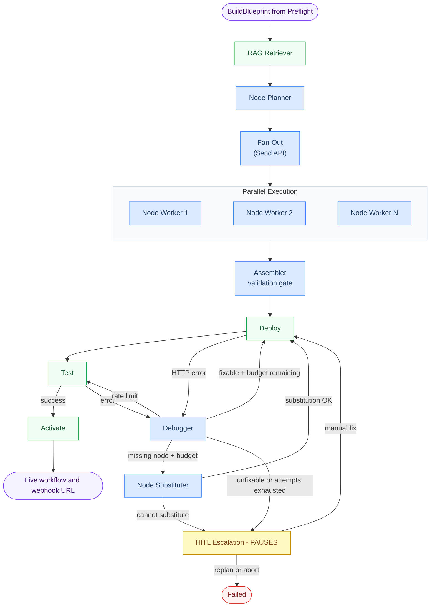
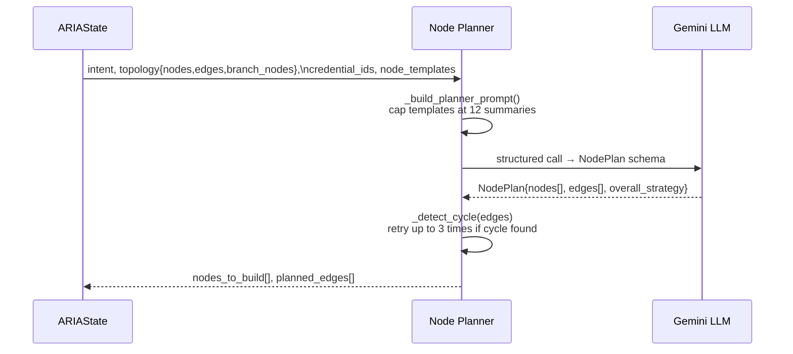
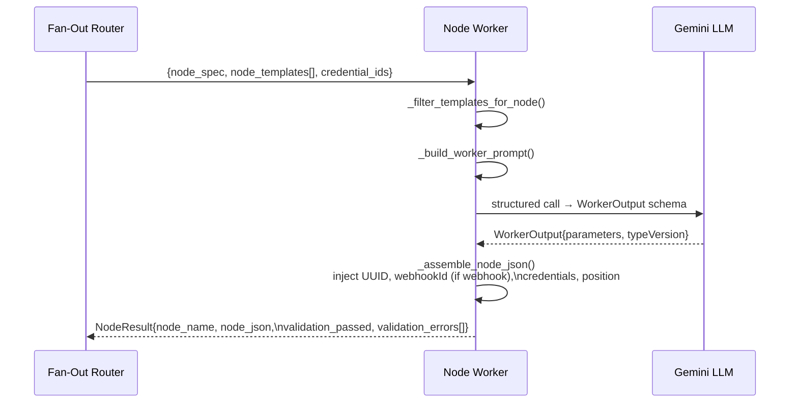
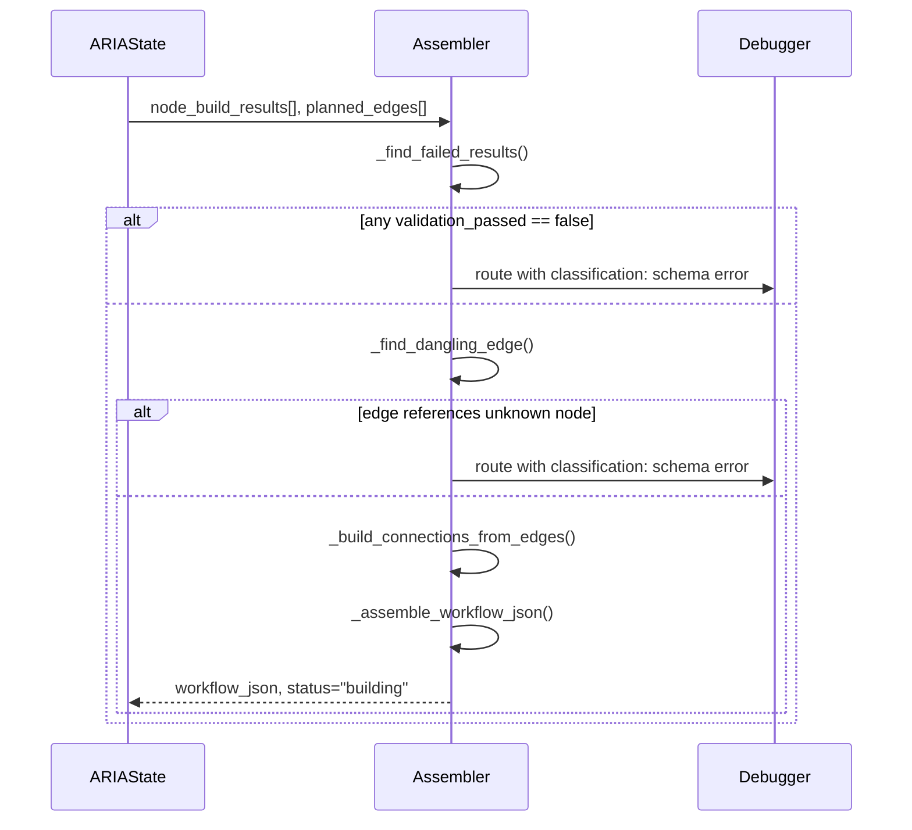
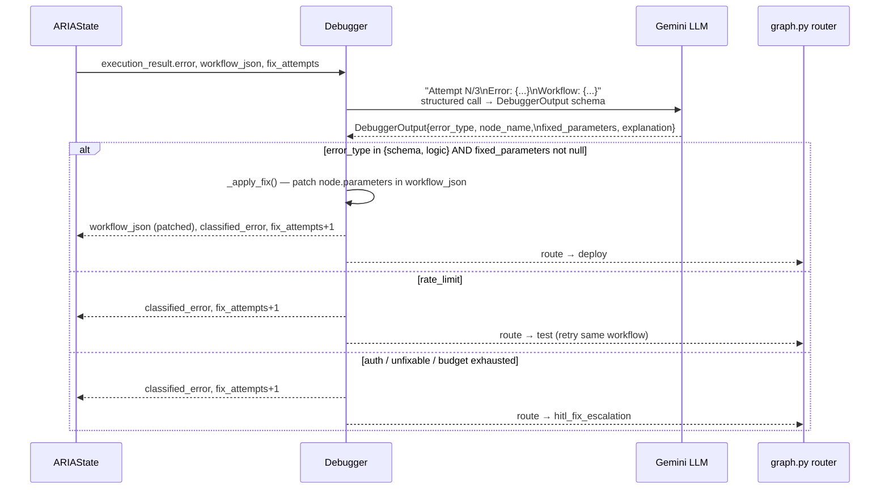
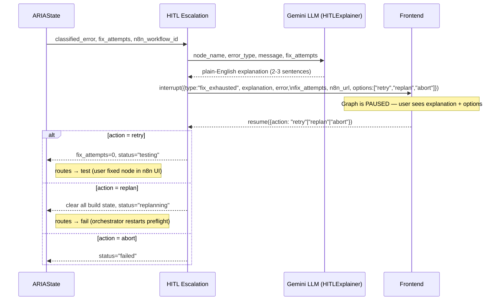

# Build Cycle Graph

Takes the `BuildBlueprint` from Preflight and incrementally builds, deploys, tests, and activates a live n8n workflow using parallel node workers and fan-in assembly.

---

## Workflow



**🤖 Blue = Agentic (LLM call)** · **⏸️ Yellow = Pauses for user input** · **🟢 Green = Deterministic / API call**

---

## Node Reference

| Node | Agentic? | Pauses? | What it does |
|---|---|---|---|
| **RAG Retriever** | No | No | Hybrid BM25 + semantic search over ChromaDB (559 n8n node docs). Returns templates per node type plus workflow-level context. Also discovers installed n8n packages via introspection or config fallback. |
| **Node Planner** | 🤖 Yes | No | Reasons over the full topology, intent, credential boundaries, and RAG summaries to produce a flat `NodePlan` with a list of `NodeSpec` objects and `PlannedEdge` connections. Detects and corrects cycles. |
| **Node Worker** (parallel) | 🤖 Yes | No | Spawned in parallel via Send API. Builds a single n8n node JSON from its `NodeSpec`, applies credential IDs, generates UUIDs, and calculates canvas position. |
| **Assembler** | 🤖 Yes | No | Fan-in: collects all `node_build_results`, validates them (short-circuits to debugger if any fail), checks for dangling edges, and merges nodes + connections into final `workflow_json`. |
| **Deploy** | No | No | Creates (POST) or updates (PUT) the workflow in n8n via the REST API. Catches HTTP errors and routes to Debugger instead of crashing. |
| **Test** | No | No | Activates the workflow. Webhook → fire + poll execution. Non-webhook → activation success = pass. |
| **Debugger** | 🤖 Yes | No | Classifies the error (`schema`, `auth`, `rate_limit`, `logic`, `missing_node`) and applies a targeted fix in one LLM call. Routes `missing_node` to the Node Substituter. |
| **Node Substituter** | 🤖 Yes | No | LLM-powered recovery for unavailable node types. Replaces missing nodes with `n8n-nodes-base.*` built-in alternatives (typically `httpRequest` or `code`). Escalates to HITL if no substitution is possible. |
| **Activate** | No | No | Permanently activates the workflow, returns the live webhook URL (None for non-webhook). |
| **HITL Escalation** | No | ⏸️ Yes | Fix budget exhausted — generates plain-English explanation, pauses for user: retry / replan / abort. For `missing_node` errors, provides deterministic install instructions instead of LLM-generated explanation. |

---

## Agent Internals

### Node Planner



**Planning rules:**
- Output a flat list of `NodeSpec` objects (no phases)
- Never mix nodes from different external services
- Include conditional branch hints (IF/Switch)
- Preserve all topology edges
- Ensure no cycles in planned edges

**Output shape:**
```python
NodePlan {
    nodes: [NodeSpec, NodeSpec, ...],       # all nodes to build (parallel)
    edges: [PlannedEdge, PlannedEdge, ...], # all connections
    overall_strategy: "...",                # one-sentence explanation
}

NodeSpec {
    node_name: str,              # display name
    node_type: str,              # n8n type identifier
    parameter_hints: dict,       # planner-supplied overrides
    credential_id: str | None,   # resolved credential UUID
    credential_type: str | None, # credential type name
    position_index: int,         # layout ordering hint
}

PlannedEdge {
    from_node: str,              # source node name
    to_node: str,                # target node name
    branch: str | None,          # conditional branch label (for If/Switch)
}
```

---

### Node Worker (parallel)



**Each worker:**
- Receives one `NodeSpec` and relevant RAG templates
- Calls LLM once to generate complete `parameters`
- Wraps parameters into full n8n node JSON
- Returns a `NodeResult` with pass/fail status
- Runs in parallel with all other workers

---

### Assembler (Fan-In)



**Validation gate:**
- Checks all `NodeResult` objects for `validation_passed: false`
- Scans `planned_edges` for references to nodes not in `node_build_results`
- Short-circuits to Debugger with `type: "schema"` if any fail
- Otherwise, merges nodes and connections into final workflow JSON

---

### Debugger



**Error classification:**
| Signal in error message | `error_type` | Auto-fixed? |
|---|---|---|
| JSON parse errors, missing fields, invalid syntax | `schema` | Yes |
| Wrong values, logic flow, data shape mismatch | `logic` | Yes |
| 401, 403, token expired, unauthorized | `auth` | No — escalate |
| 429, rate limit exceeded | `rate_limit` | No — retry test |
| Unknown node type, unrecognized node, package not installed | `missing_node` | No — route to Node Substituter |

**Fix constraints:** can only change the named node's `parameters`. Cannot add/remove nodes, connections, or touch credential IDs.

---

### HITL Escalation



---

### Test Node (trigger-aware)


---

## State Flow Summary

```
BuildBlueprint
    ↓ RAG Retriever      → node_templates[], available_node_packages[]
    ↓ Node Planner       → nodes_to_build[], planned_edges[] (prefers installed packages)
    ↓ Fan-Out (Send)     → spawn parallel Node Workers
    ↓ Node Workers       → node_build_results[] (parallel)
    ↓ Assembler          → workflow_json (merged + validated), status="building"
    ↓ Deploy             → n8n_workflow_id
    ↓ Test               → execution_result → "done" | "fixing"
    ↓   (fixing)
    ↓ Debugger           → classified_error, workflow_json (patched), fix_attempts++
    ↓   (missing_node)
    ↓ Node Substituter   → workflow_json (node replaced with built-in), status="building" → Deploy
    ↓   (done)
    ↓ Activate           → webhook_url, status="done"
```

---

## What Streams to the UI

| Event | What the UI sees | Type |
|---|---|---|
| RAG Retriever fires | `"Retrieved N templates for M nodes via hybrid search"` | Per-node update |
| Node Planner fires | `"Strategy: X → N nodes queued: [node], [node]..."` | Per-node update |
| Node Workers fire (parallel) | `"Building NodeA..."`, `"Building NodeB..."` (one per worker) | Per-node update |
| Assembler fires | `"Assembled N nodes into workflow."` | Per-node update |
| Deploy fires | `"Deployed workflow <id>"` | Per-node update |
| Test fires | `"Execution success/error: <exec_id>"` or `"Activation success (non-webhook trigger)"` | Per-node update |
| Debugger fires | `"<type> in '<node>': <message>"` + `"Fix applied: <explanation>"` | Per-node update |
| HITL Escalation fires | interrupt payload with explanation + options | **Interrupt** (graph pauses) |
| Activate fires | `"Workflow live! Webhook: <url>"` or `"Webhook: N/A"` | Per-node update |

> Updates are **per-node**, not token-by-token. Each node fires once when it completes.

---

## Trigger Detection (`nodes/_trigger_utils.py`)

Shared utility used by `test.py`, `activate.py`, and the benchmark runner. Single source of truth.

```python
detect_trigger_type(workflow_json) → "webhook" | "schedule" | "other"
extract_webhook_path(workflow_json) → str   # fallback: "test-webhook"
```

Detection scans `workflow_json.nodes` for known type strings:
- `"webhook"` → type contains `"webhook"` (e.g. `n8n-nodes-base.webhook`)
- `"schedule"` → `n8n-nodes-base.scheduletrigger`, `n8n-nodes-base.cron`, or type contains `"schedule"` / `"cron"`
- `"other"` → anything else

---

## Bugs Fixed (2026-02-27)

### Bug 1 — Phase-based sequential loop → Parallel fan-out/fan-in refactor
**Files:** `graph.py`, `nodes/node_planner.py`, `nodes/node_worker.py`, `nodes/assembler.py`
**Root cause:** Previous architecture split workflows into sequential phases (Phase 0, Phase 1, etc.), requiring an Engineer to build all nodes in a phase, then Advance Phase, then repeat. This serialized build time and was inflexible when node dependencies were lightweight.
**Fix:** Replaced phase planner with flat Node Planner that produces a DAG of all nodes + edges (with cycle detection). Use LangGraph's Send API to spawn parallel Node Workers for each node, then Fan-In with Assembler to validate and merge results before Deploy.

---

### Bug 2 — Test node swallowed activation errors, losing the real node name
**File:** `nodes/test.py`
**Root cause:** `activate_workflow()` raises `httpx.HTTPStatusError` (n8n 400) when a workflow has malformed parameters. This was caught by a broad `except Exception` which set `node_name: "unknown"` and discarded n8n's JSON error body. The Debugger received no useful signal and exhausted all 3 fix attempts without ever targeting the right node.
**Fix:** Added a specific `except httpx.HTTPStatusError` handler before the broad catch. Extracts `response.json()` from n8n's error body and reads `context.nodeName` and `message` to populate the error result with the real failing node.

---

### Bug 3 — Test node always fired a webhook, even for Schedule Trigger workflows
**File:** `nodes/test.py`
**Root cause:** After activation, the test unconditionally called `trigger_webhook(webhook_path)`. For Schedule Trigger workflows there is no webhook — `_extract_webhook_path` returned the fallback `"test-webhook"`, the POST to `/webhook/test-webhook` returned 404, and all 3 fix attempts were burned on a non-existent problem.
**Fix:** Test node now calls `detect_trigger_type()` first and branches:
- Webhook → `_test_webhook()`: activate + POST to webhook path + poll execution
- Schedule/other → `_test_activation_only()`: activate only — a clean activation is the pass condition

---

## What's Next

### 1. `detect_trigger_type` scans all nodes, not just the entry trigger
**Symptom:** A workflow containing a Webhook Response node after a Schedule Trigger will be misclassified as `"webhook"`.
**Fix needed:** Use `build_blueprint.topology.entry_node` to restrict detection to the trigger node only, rather than scanning all nodes.

### 2. Node Worker prompt tuning for large workflows
**Symptom:** Parallel workers may struggle with large parameter sets or ambiguous node types when RAG templates are insufficient.
**Fix needed:** Enhance Node Worker prompt with multi-shot examples and fallback strategies for rare or undocumented node types.

### 3. Medium and large fixture coverage
The benchmark currently passes 2/3 simple fixtures. Next step is to run the medium tier (3–4 node workflows with branching) and fix failures as they appear. Large fixtures (6–8 nodes, merge nodes) come after medium is stable.

### 4. Cycle detection stress testing
**Symptom:** Node Planner detects cycles but only retries LLM up to 3 times.
**Fix needed:** Consider increasing retry budget or adding a fallback heuristic (e.g., topological sort with cycle-breaking) if LLM persistently produces cyclic plans.

---

## Isolation Test Scripts

```bash
# Run 3 simple fixtures against live n8n (fast, ~3 min)
python scripts/_run_simple_benchmark.py

# Run full 9-fixture benchmark (~30 min)
python scripts/benchmark_build_cycle.py

# Test Deploy → Test → Debug loop against an existing workflow ID
python scripts/test_build_cycle_real.py
```
