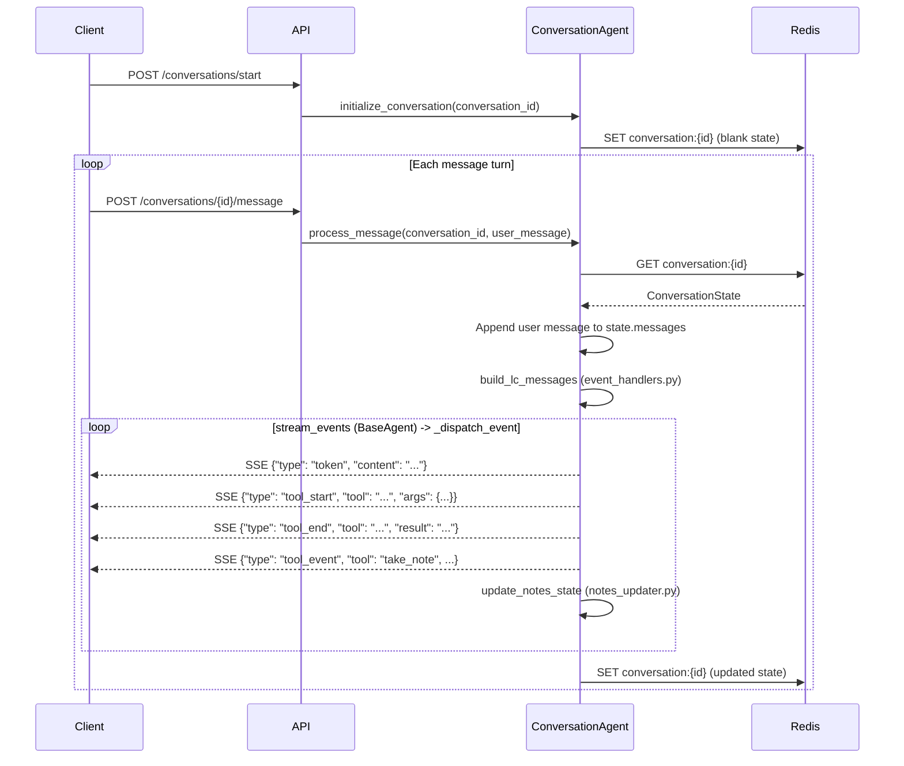

# conversation — Phase 0 Requirements Gathering Agent

**Phase 0** is the first stage of ARIA's two-phase pipeline. Before any workflow is built, this module conducts a structured multi-turn conversation with the user to extract automation requirements. The gathered notes are committed as a `ConversationNotes` object that seeds Phase 1 (preflight + build cycle).

The agent does not build, deploy, or write code. Its only job is to ask the right questions and record what it hears.

---

## Module Structure

| File | Responsibility |
|------|----------------|
| `agent.py` | `ConversationAgent` — orchestration, SSE event dispatch, state lifecycle |
| `event_handlers.py` | Message construction, tool-state updates, AI/tool message capture |
| `notes_updater.py` | Notes mutation logic: `update_notes_state`, `_delete_note`, `_set_note` |
| `state.py` | `ConversationState` model, Redis persistence, in-memory fallback |
| `schemas.py` | Pydantic models: `ConversationNotes`, `TakeNoteInput`, `CommitNotesInput` |
| `tools.py` | LangChain `@tool` definitions: `take_note`, `commit_notes` |
| `prompts.py` | `PHASE_0_SYSTEM_PROMPT` — granular note taxonomy, probing rules, commit gate |

---

## SSE Event Types

All events are yielded by `ConversationAgent.process_message()` as `Dict[str, Any]`.

| `type` | Shape | When emitted |
|--------|-------|--------------|
| `token` | `{"type": "token", "content": "..."}` | Each streamed text chunk from the LLM |
| `tool_start` | `{"type": "tool_start", "tool": "take_note", "args": {"key": "...", "value": "..."}}` | When the agent begins calling a tool |
| `tool_end` | `{"type": "tool_end", "tool": "take_note", "result": "Action recorded: ..."}` | When a tool finishes executing |
| `tool_event` | `{"type": "tool_event", "tool": "take_note", "data": {"key": "...", "value": "..."}}` | After state mutation from `take_note` |
| `tool_event` | `{"type": "tool_event", "tool": "commit_notes", "data": {"summary": "..."}}` | After `commit_notes` executes |
| `error` | `{"type": "error", "content": "..."}` | On any unhandled exception during the stream |

Event order per tool call: `tool_start` -> (tool executes) -> `tool_end` -> `tool_event` (state update).

The `error` event does not terminate the generator — state is always saved in the `finally` block regardless.

---

## State Lifecycle



State is written to Redis in the `finally` block of `process_message` — it is saved even if the stream errors mid-turn.

---

## ConversationNotes Schema

Defined in `schemas.py`. All fields default to empty; none are required at construction time.

### Legacy Fields (backward-compatible)

| Field | Type | Required for commit | Description |
|-------|------|---------------------|-------------|
| `summary` | `str` | Yes (set by `commit_notes`) | One-line workflow intent summary |
| `trigger` | `str` | Yes | Event or system that starts the workflow |
| `destination` | `str` | Yes | Final outcome or target system |
| `constraints` | `List[str]` | Yes (min 1) | Rules, filters, or conditions |
| `data_transform` | `Optional[str]` | No | Data modification between trigger and destination |
| `required_integrations` | `List[str]` | No | Third-party services involved |
| `raw_notes` | `Dict[str, str]` | No | Flat key-value store of all notes taken |

### Granular Sub-Key Fields (added 2026-02-25)

| Field | Type | Description |
|-------|------|-------------|
| `trigger_type` | `Optional[str]` | One of: schedule, webhook, email_poll, manual, event |
| `trigger_service` | `Optional[str]` | Which service triggers (e.g., "Gmail", "Stripe") |
| `trigger_schedule` | `Optional[str]` | Exact timing if scheduled (e.g., "Every day at 8 AM") |
| `trigger_event` | `Optional[str]` | Event name if event-based (e.g., "new_payment") |
| `transform` | `Optional[str]` | Data transformation description (e.g., "Summarize 10 emails") |
| `destination_service` | `Optional[str]` | Target service (e.g., "Telegram") |
| `destination_action` | `Optional[str]` | What to do at destination (e.g., "Send summary message") |
| `destination_format` | `Optional[str]` | Output format (e.g., "plain text", "JSON") |

These fields are set directly via `take_note("trigger_type", "schedule")`. Dynamic keys like `action_1`, `action_2` go to `raw_notes`.

---

## Note-Taking Taxonomy

The system prompt instructs the LLM to use **specific sub-keys** when recording notes:

**Trigger:** `trigger_type`, `trigger_service`, `trigger_schedule`, `trigger_event`
**Actions:** `action_1`, `action_2`, `action_3` (dynamic, stored in `raw_notes`)
**Transform:** `transform`
**Destination:** `destination_service`, `destination_action`, `destination_format`
**Lists:** `constraint` (appends), `required_integrations` (appends)

### Probing Rules

The prompt instructs the agent to ask follow-up questions when details are vague:
- Schedule mentions ("daily", "every morning") require exact time/timezone
- Action mentions ("read my emails") require quantity, folder, and filter details
- Destination mentions ("send to Telegram") require bot/channel and format

---

## Tool Contract

### `take_note(key: str, value: Optional[str])`

CRUD operations on `ConversationNotes`. The tool itself is stateless — it returns a confirmation string. State mutation happens in `notes_updater.py:update_notes_state`.

| `value` | Effect on state |
|---------|----------------|
| `str` | Sets `raw_notes[key]`. If `key` maps to a known field, also sets that field (or appends for list fields). |
| `None` | Deletes `raw_notes[key]`. Resets the corresponding typed field: `[]` for list fields, `None` for `Optional[str]` fields, `""` for required `str` fields. |

The LLM may call `take_note` multiple times per turn. The agent accumulates all calls before saving state.

### `commit_notes(summary: str)`

Finalizes Phase 0. Sets `state.notes.summary` and flips `state.committed = True`.

The LLM is instructed not to call this tool unless all gate conditions are satisfied (see below). The tool itself has no runtime guard — enforcement lives in the system prompt.

---

## Commit Gate

Before calling `commit_notes`, the LLM must have recorded:

```
[ ] trigger_type      — recorded
[ ] trigger_schedule  — recorded (if type is "schedule")
[ ] action_N          — at least one action
[ ] destination_service + destination_action — both recorded
[ ] constraint        — at least one entry
[ ] required_integrations — all services listed
```

If any are missing, the system prompt instructs the agent to ask a clarifying question instead of committing. There is no programmatic enforcement; the gate is prompt-level only.

---

## State Persistence

`state.py` manages all Redis I/O.

| Detail | Value |
|--------|-------|
| Redis key format | `conversation:{conversation_id}` |
| Serialization | `ConversationState.model_dump_json()` / `model_validate_json()` |
| TTL | None (no expiry set — unlike `job:{id}` which has 24h TTL) |
| Fallback | `_FALLBACK_CACHE: Dict[str, str]` in-process dict |

On `RedisError`, both `save_state` and `get_state` fall back to `_FALLBACK_CACHE` transparently. When Redis recovers, the next successful write removes the entry from the fallback cache.

---

## Extension Points

**Add a new note key**
Add a typed field to `ConversationNotes` in `schemas.py`. For `Optional[str]` fields, add the key to `_OPTIONAL_FIELDS` in `notes_updater.py`. For list fields, add the key to `_LIST_FIELDS`. The `update_notes_state` function uses `hasattr` to detect known fields — new fields are picked up automatically.

**Add a new tool**
Define the tool in `tools.py` using `@tool` with an `args_schema`. Register it in `ConversationAgent.__init__` by appending to the `tools` list. Handle its `on_tool_end` event in `event_handlers.py:handle_tool_end_state`.

**Swap the LLM**
`ConversationAgent` inherits from `BaseAgent` (`src/agentic_system/shared/base_agent.py`). Model construction and retry logic live there. Change the model in `BaseAgent.__init__` to affect all agents, or override in `ConversationAgent.__init__` by passing model kwargs to `super().__init__`.

**Change conversation style or commit rules**
Edit `PHASE_0_SYSTEM_PROMPT` in `prompts.py`. The note taxonomy, probing rules, and commit gate are all prompt-controlled.

---

## Changelog (2026-02-25)

### Granular Note Extraction
- **Problem:** Agent recorded vague notes like `trigger: "Gmail inbox"`, losing schedule details ("8 AM daily"), transformation specifics ("summarize 10 emails"), and destination config.
- **Fix:** Rewrote system prompt with explicit sub-key taxonomy (`trigger_type`, `trigger_schedule`, `action_1`, `transform`, `destination_service`, etc.) and probing rules that force follow-up questions when details are vague.
- **Files:** `prompts.py`, `schemas.py` (8 new Optional fields), `tools.py` (updated descriptions)

### Module Split for 150-Line Limit
- **Problem:** `agent.py` grew to 203 lines with new event yields.
- **Fix:** Extracted into three focused modules:
  - `agent.py` (132 lines) — orchestration only
  - `event_handlers.py` (127 lines) — message construction, tool state updates, AI/tool message capture
  - `notes_updater.py` (57 lines) — notes mutation with `_OPTIONAL_FIELDS` / `_LIST_FIELDS` constants

### Agent Observability Events
- **Problem:** Frontend had no visibility into agent tool calls in progress.
- **Fix:** Added `tool_start` and `tool_end` SSE events in `_dispatch_event`. Event order: `tool_start` -> `tool_end` -> `tool_event`.

### Frontend Markdown Rendering
- **Problem:** AI messages rendered as plain text (raw `**bold**` shown literally).
- **Fix:** `AiBubble` in `ChatPanel.tsx` now uses `react-markdown` + `remark-gfm` with `.prose-aria` styles. Extended `index.css` with heading, list, code block, table, and blockquote styles.

### Frontend Agent Activity Bar
- **New component:** `AgentActivityBar.tsx` — compact horizontal bar between chat and input showing tool calls as animated chips (orange spinner -> green checkmark). Integrated into `ChatPanel` and wired via `useConversation` hook.

---

## Relationship to Phase 1

When `state.committed` is `True`, `ConversationNotes` contains a complete requirements snapshot. The API layer reads this flag and passes the notes to the Phase 1 entry point (preflight agent), which uses the granular fields (`trigger_type`, `trigger_schedule`, `destination_service`, `action_N`, etc.) plus legacy fields to:

1. Verify credentials for all required integrations (preflight)
2. Generate a RAG query to find relevant n8n node templates (build cycle)
3. Engineer, deploy, test, and iteratively fix the live workflow

Phase 0 has no knowledge of Phase 1. The handoff is purely data — `ConversationNotes` is a plain Pydantic model with no pipeline dependencies.
