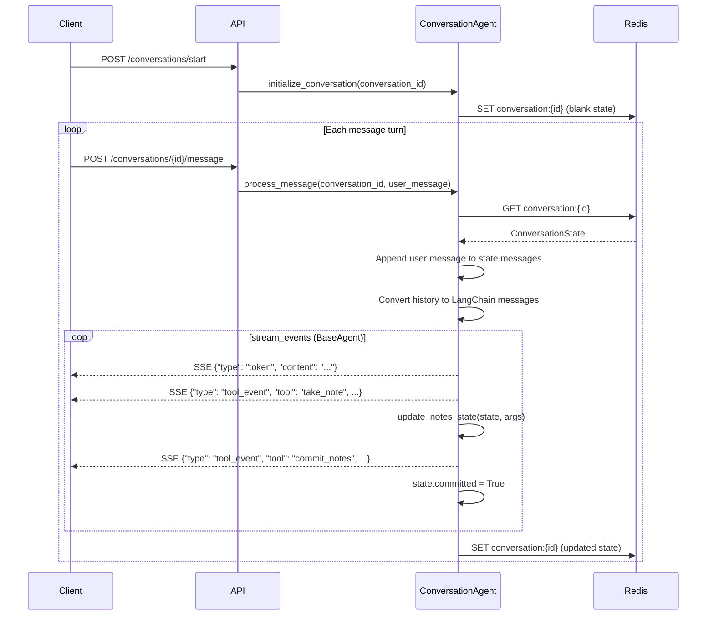

# conversation — Phase 0 Requirements Gathering Agent

**Phase 0** is the first stage of ARIA's two-phase pipeline. Before any workflow is built, this module conducts a structured multi-turn conversation with the user to extract automation requirements. The gathered notes are committed as a `ConversationNotes` object that seeds Phase 1 (preflight + build cycle).

The agent does not build, deploy, or write code. Its only job is to ask the right questions and record what it hears.

---

## Module Structure

| File | Responsibility |
|------|----------------|
| `agent.py` | `ConversationAgent` — main loop, SSE event generation, state mutation |
| `state.py` | `ConversationState` model, Redis persistence, in-memory fallback |
| `schemas.py` | Pydantic models: `ConversationNotes`, `TakeNoteInput`, `CommitNotesInput` |
| `tools.py` | LangChain `@tool` definitions: `take_note`, `commit_notes` |
| `prompts.py` | `PHASE_0_SYSTEM_PROMPT` — LLM instruction set and commit gate rules |

---

## SSE Event Types

All events are yielded by `ConversationAgent.process_message()` as `Dict[str, Any]`.

| `type` | Shape | When emitted |
|--------|-------|--------------|
| `token` | `{"type": "token", "content": "..."}` | Each streamed text chunk from the LLM |
| `tool_event` | `{"type": "tool_event", "tool": "take_note", "data": {"key": "...", "value": "..."}}` | After each `take_note` execution |
| `tool_event` | `{"type": "tool_event", "tool": "commit_notes", "data": {"summary": "..."}}` | After `commit_notes` executes |
| `error` | `{"type": "error", "content": "..."}` | On any unhandled exception during the stream |

Token events stream before tool events within a single turn. The `error` event does not terminate the generator — state is always saved in the `finally` block regardless.

---

## State Lifecycle



State is written to Redis in the `finally` block of `process_message` — it is saved even if the stream errors mid-turn (`agent.py:159-161`).

---

## ConversationNotes Schema

Defined in `schemas.py:22`. All fields default to empty; none are required at construction time.

| Field | Type | Required for commit | Description |
|-------|------|---------------------|-------------|
| `summary` | `str` | Yes (set by `commit_notes`) | One-line workflow intent summary |
| `trigger` | `str` | Yes | Event or system that starts the workflow |
| `destination` | `str` | Yes | Final outcome or target system |
| `constraints` | `List[str]` | Yes (min 1) | Rules, filters, or conditions |
| `data_transform` | `Optional[str]` | No | Data modification between trigger and destination |
| `required_integrations` | `List[str]` | No | Third-party services involved |
| `raw_notes` | `Dict[str, str]` | No | Flat key-value store of all notes taken |

`constraints` and `required_integrations` are append-only lists: calling `take_note` with the same key appends a new entry rather than overwriting (`agent.py:185-187`).

---

## Tool Contract

### `take_note(key: str, value: Optional[str])`

CRUD operations on `ConversationNotes`. The tool itself is stateless — it returns a confirmation string. State mutation happens in `agent.py:_update_notes_state`.

| `value` | Effect on state |
|---------|----------------|
| `str` | Sets `raw_notes[key]`. If `key` maps to a known field, also sets that field (or appends for list fields). |
| `None` | Deletes `raw_notes[key]`. Resets the corresponding typed field to its zero value (`""`, `[]`, or `None`). |

The LLM may call `take_note` multiple times per turn. The agent accumulates all calls before saving state.

### `commit_notes(summary: str)`

Finalizes Phase 0. Sets `state.notes.summary` and flips `state.committed = True`.

The LLM is instructed not to call this tool unless all gate conditions are satisfied (see below). The tool itself has no runtime guard — enforcement lives in the system prompt.

---

## Commit Gate

Before calling `commit_notes`, the LLM must have recorded all three required fields:

```
[ ] trigger      — non-empty
[ ] destination  — non-empty
[ ] constraints  — at least one entry
```

If any are missing, the system prompt (`prompts.py:21-26`) instructs the agent to ask a clarifying question instead of committing. There is no programmatic enforcement; the gate is prompt-level only.

When `commit_notes` fires, `process_message` emits a `tool_event` SSE and sets `state.committed = True`. The API layer uses this flag to determine that Phase 0 is complete and Phase 1 can begin.

---

## State Persistence

`state.py` manages all Redis I/O.

| Detail | Value |
|--------|-------|
| Redis key format | `conversation:{conversation_id}` |
| Serialization | `ConversationState.model_dump_json()` / `model_validate_json()` |
| TTL | None (no expiry set — unlike `job:{id}` which has 24h TTL) |
| Fallback | `_FALLBACK_CACHE: Dict[str, str]` in-process dict |

On `RedisError`, both `save_state` and `get_state` fall back to `_FALLBACK_CACHE` transparently. When Redis recovers, the next successful write removes the entry from the fallback cache (`state.py:42-43`).

---

## Extension Points

**Add a new note key**
Add a typed field to `ConversationNotes` in `schemas.py`. The `_update_notes_state` method in `agent.py` uses `hasattr` to detect known fields — new fields are picked up automatically. For list fields, add the key name to the `["constraints", "required_integrations"]` check at `agent.py:174`.

**Add a new tool**
Define the tool in `tools.py` using `@tool` with an `args_schema`. Register it in `ConversationAgent.__init__` by appending to the `tools` list (`agent.py:24`). Handle its `on_tool_end` event in the `process_message` streaming loop.

**Swap the LLM**
`ConversationAgent` inherits from `BaseAgent` (`src/agentic_system/shared/base_agent.py`). Model construction and retry logic live there. Change the model in `BaseAgent.__init__` to affect all agents, or override in `ConversationAgent.__init__` by passing model kwargs to `super().__init__`.

**Change conversation style or commit rules**
Edit `PHASE_0_SYSTEM_PROMPT` in `prompts.py`. The commit gate, question cadence, and note-taking behavior are all prompt-controlled.

---

## Relationship to Phase 1

When `state.committed` is `True`, `ConversationNotes` contains a complete requirements snapshot. The API layer reads this flag and passes the notes to the Phase 1 entry point (preflight agent), which uses `trigger`, `destination`, `constraints`, `required_integrations`, and `summary` to:

1. Verify credentials for all required integrations (preflight)
2. Generate a RAG query to find relevant n8n node templates (build cycle)
3. Engineer, deploy, test, and iteratively fix the live workflow

Phase 0 has no knowledge of Phase 1. The handoff is purely data — `ConversationNotes` is a plain Pydantic model with no pipeline dependencies.
