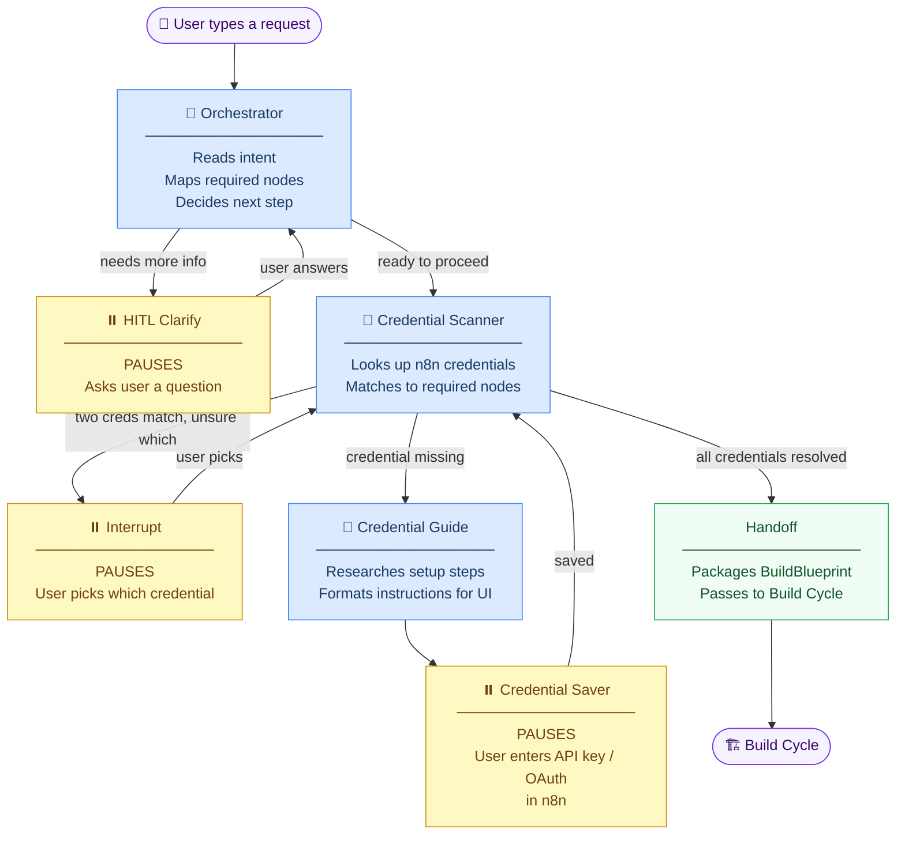

# Preflight Graph

Collects everything ARIA needs before building: **what the user wants** and **which credentials exist in n8n**.

---

## Workflow



**🤖 Blue = Agentic (LLM call)** · **⏸️ Yellow = Pauses for user input** · **🟢 Green = Deterministic logic**

---

## Node Reference

| Node | Agentic? | Pauses? | What it does |
|---|---|---|---|
| **Orchestrator** | 🤖 Yes | No | Reads the user's request, determines which n8n nodes are needed, decides whether to ask a follow-up question or proceed. Max 3 clarification rounds. |
| **HITL Clarify** | No | ⏸️ Yes | Surfaces the orchestrator's question to the user. Graph freezes until the user replies. |
| **Credential Scanner** | 🤖 Yes | ⏸️ Sometimes | Queries n8n for existing credentials. If two match and it can't pick one, pauses and asks. |
| **Credential Guide** | 🤖 Yes | No | Researches the exact setup steps for a missing credential (OAuth scopes, where to find the API key, etc.) |
| **Credential Saver** | No | ⏸️ Yes | Displays the setup guide and waits while the user enters credentials in n8n. Loops back to scanner once saved. |
| **Handoff** | No | No | Packages `BuildBlueprint` — intent, node list, credential IDs, topology — and hands off to Build Cycle. |

---

## Interrupt payloads (what the UI receives)

```jsonc
// 1. Orchestrator needs clarification
{ "type": "orchestrator_clarification", "question": "What should trigger this workflow?" }

// 2. Multiple credentials match, user must pick
{ "type": "credential_ambiguity", "ambiguous": { "slack": ["Workspace A", "Workspace B"] } }

// 3. Credential doesn't exist yet, user must create it
{ "type": "credential_request", "pending_types": ["slack"], "guide": { "steps": [...] } }
```

> **No token streaming in preflight.** All LLM calls are single `invoke()` — the interactivity is entirely from the three interrupt points above.

---

## Resume calls (API → graph)

```python
# After clarification answer
resume_preflight(answer_string, config)

# After credential selection
resume_preflight({ "slack": "cred-id-abc" }, config)

# After credential saved in n8n
resume_preflight({}, config)
```

---

## Output: BuildBlueprint

```python
{
    "intent":          "Send a Slack message when a GitHub PR is merged",
    "required_nodes":  ["githubTrigger", "slack"],
    "credential_ids":  { "slack": "cred-abc", "github": "cred-def" },
    "topology": {
        "nodes":        ["GitHub Trigger", "Slack"],
        "edges":        [{ "from_node": "GitHub Trigger", "to_node": "Slack", "branch": None }],
        "entry_node":   "GitHub Trigger",
        "branch_nodes": []
    }
}
```
