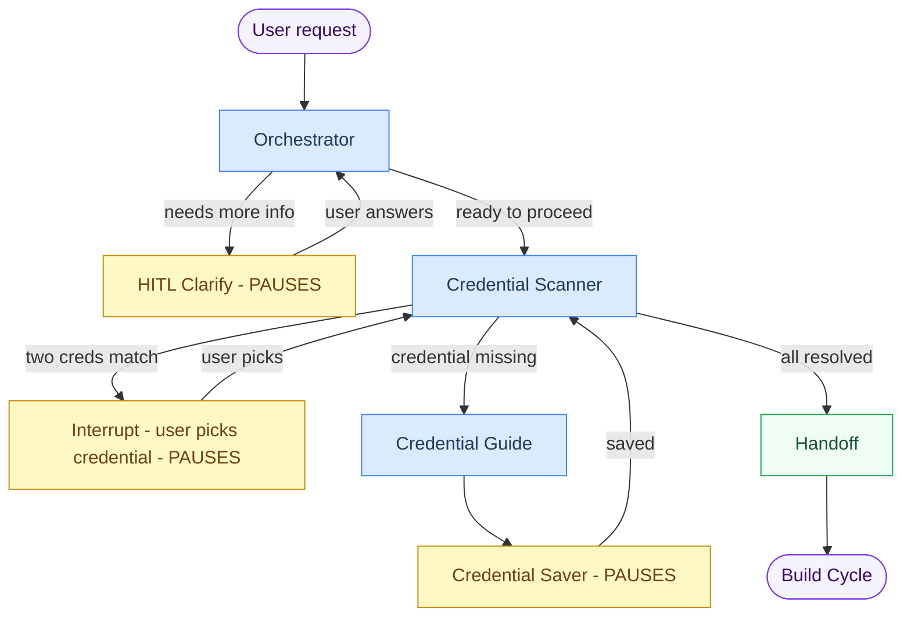

# Preflight Graph

Collects everything ARIA needs before building: **what the user wants** and **which credentials exist in n8n**.

---

## Workflow



**Blue = Agentic (LLM call)** | **Yellow = Pauses for user input** | **Green = Deterministic logic**

---

## Node Reference

| Node | Agentic? | Pauses? | What it does |
|---|---|---|---|
| **Orchestrator** | Yes | No | Reads the user's request, determines which n8n nodes are needed, decides whether to ask a follow-up question or proceed. Max 3 clarification rounds. |
| **HITL Clarify** | No | Yes | Surfaces the orchestrator's question to the user. Graph freezes until the user replies. |
| **Credential Scanner** | Yes | Sometimes | Queries n8n for existing credentials. If two match and it can't pick one, pauses and asks. |
| **Credential Guide** | Yes | No | Deterministically fetches n8n credential schemas, injects them into the LLM prompt as ground truth, then validates/patches the output. LLM only generates prose (setup steps, help URLs). See [Credential Guide -- Reliability](#credential-guide--reliability). |
| **Credential Saver** | No | Yes | Displays the setup guide and waits while the user enters credentials in n8n. Loops back to scanner once saved. |
| **Handoff** | No | No | Packages `BuildBlueprint` -- intent, node list, credential IDs, topology -- and hands off to Build Cycle. |

---

## Credential Guide -- Reliability

The credential guide uses a 3-step **fetch-inject-validate** pattern to guarantee field accuracy regardless of LLM output quality.

| Step | What happens | Owner |
|---|---|---|
| **1. Fetch** | `N8nClient.get_credential_schema()` called for each pending credential type _before_ the LLM runs. | `_fetch_schemas()` |
| **2. Inject** | Raw n8n field schemas are serialized into the LLM prompt as ground-truth JSON. The LLM is instructed to use only these fields and to focus on prose: `how_to_obtain`, `help_url`, `service_description`. | `_build_prompt()` |
| **3. Validate** | `_validate_and_patch()` iterates pending types. Missing entries get a deterministic fallback. All entries have their `fields` list **overridden** with ground-truth data from n8n -- even if the LLM got them right. | `_validate_and_patch()` |

**Tool list**: The agent only has `search_n8n_nodes` (for service context). `get_credential_schema` was removed from the tool list because schemas are pre-fetched deterministically.

**Enum options**: Fields with enum constraints in n8n (e.g., `region` for Google Service Account) flow through as `options: list[str]` on `CredentialFieldInfo`. The frontend renders a `<select>` dropdown instead of a free-text input.

```
n8n schema (enum list)
  -> response_parser (preserves "enum" key)
  -> _fields_from_schema (maps enum -> options)
  -> CredentialFieldInfo.options
  -> SSE -> frontend CredentialField.options
  -> <select> dropdown
```

Key file: `src/agentic_system/preflight/nodes/credential_guide.py`

---

## Interrupt payloads (what the UI receives)

```jsonc
// 1. Orchestrator needs clarification
{ "type": "orchestrator_clarification", "question": "What should trigger this workflow?" }

// 2. Multiple credentials match, user must pick
{ "type": "credential_ambiguity", "ambiguous": { "slack": ["Workspace A", "Workspace B"] } }

// 3. Credential doesn't exist yet, user must create it
{
  "type": "credential_request",
  "pending_types": ["googleSheetsOAuth2Api"],
  "guide": {
    "entries": [
      {
        "credential_type": "googleSheetsOAuth2Api",
        "display_name": "Google Sheets OAuth2",
        "service_description": "Access Google Sheets via OAuth2.",
        "how_to_obtain": "1. Go to Google Cloud Console...",
        "help_url": "https://developers.google.com/sheets/api/quickstart",
        "fields": [
          { "name": "clientId", "label": "Client Id", "description": "OAuth2 client ID", "required": true, "options": null },
          { "name": "clientSecret", "label": "Client Secret", "description": "OAuth2 client secret", "required": true, "options": null },
          { "name": "region", "label": "Region", "description": "GCP region", "required": false, "options": ["us-central1", "europe-west1", "..."] }
        ]
      }
    ],
    "summary": "You need to create Google Sheets OAuth2 credentials."
  }
}
```

> **No token streaming in preflight.** All LLM calls are single `invoke()` -- the interactivity is entirely from the three interrupt points above.

---

## n8n API Quirks

### Credential save requires schema backfill

n8n's `POST /api/v1/credentials` rejects payloads that omit schema fields, even optional ones. But not all fields can be safely defaulted:

| Field type | Backfill strategy | Why |
|---|---|---|
| `string` | `""` (empty string) | Safe default, passes validation |
| `notice` | `""` (empty string) | Informational field, no real value needed |
| `boolean` | **Omit** | Triggers `allOf`/`if-then` conditional branches in n8n's JSON Schema validation |
| `enum` | **Omit** | Empty string is not a valid enum member; n8n rejects it |

This is handled by `_backfill_credential_data()` in `src/boundary/n8n/client.py:164`. The `save_credential()` method fetches the schema first, then calls the backfill before POSTing.

### Response parser preserves enums and notice fields

`parse_credential_schema` in `src/boundary/n8n/_internals/response_parser.py`:
- Preserves `enum` lists in the parsed output (needed by the guide's `_fields_from_schema` to populate `options`)
- Includes `notice`-type fields (n8n's `allOf` validation may require them)

---

## Resume calls (API -> graph)

```python
# After clarification answer
resume_preflight(answer_string, config)

# After credential selection
resume_preflight({ "slack": "cred-id-abc" }, config)

# After credential saved in n8n
resume_preflight({}, config)
```

---

## Output: BuildBlueprint

```python
{
    "intent":          "Send a Slack message when a GitHub PR is merged",
    "required_nodes":  ["githubTrigger", "slack"],
    "credential_ids":  { "slack": "cred-abc", "github": "cred-def" },
    "topology": {
        "nodes":        ["GitHub Trigger", "Slack"],
        "edges":        [{ "from_node": "GitHub Trigger", "to_node": "Slack", "branch": None }],
        "entry_node":   "GitHub Trigger",
        "branch_nodes": []
    }
}
```
